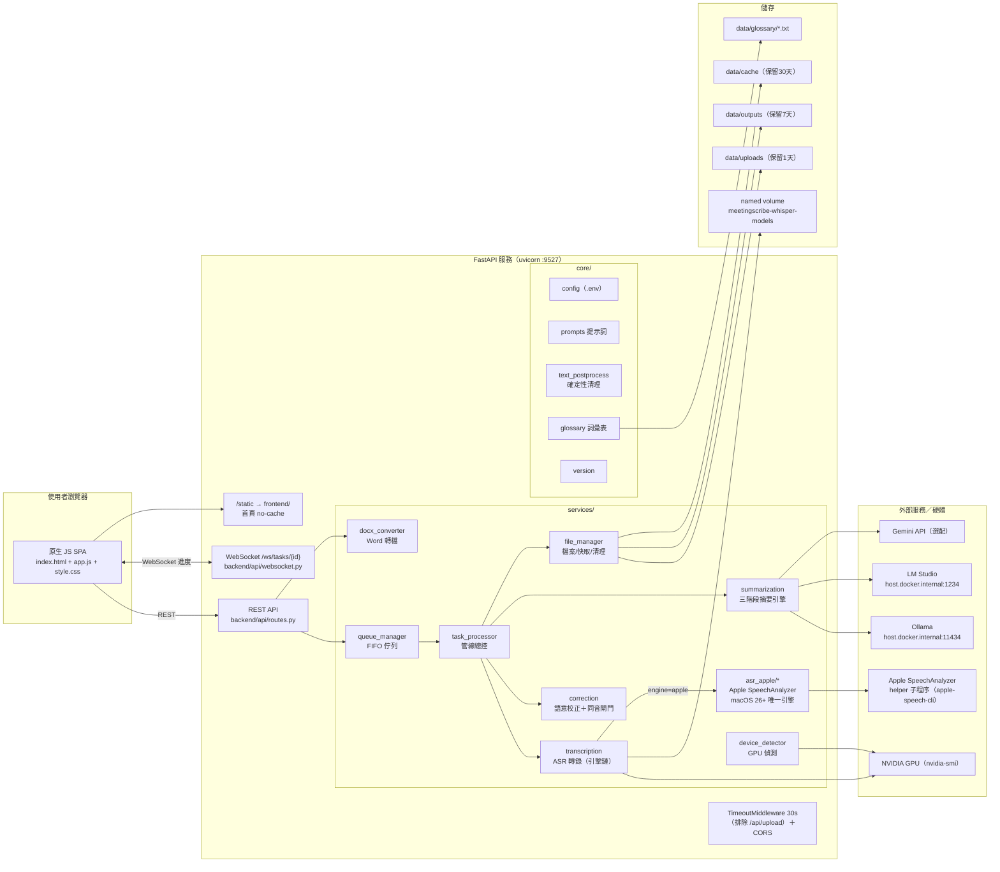
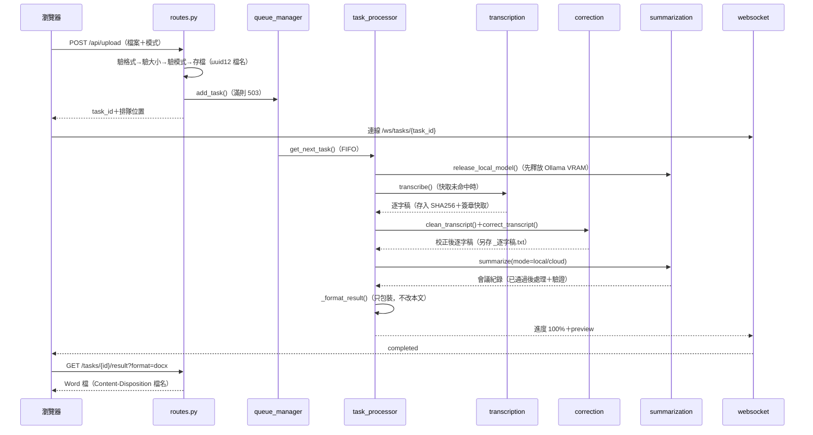
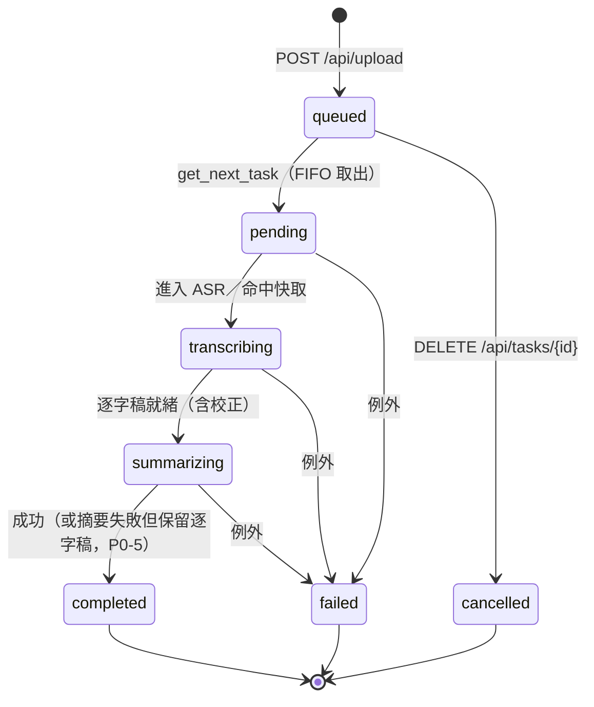
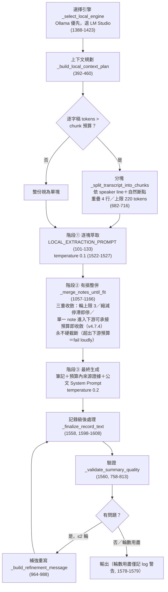
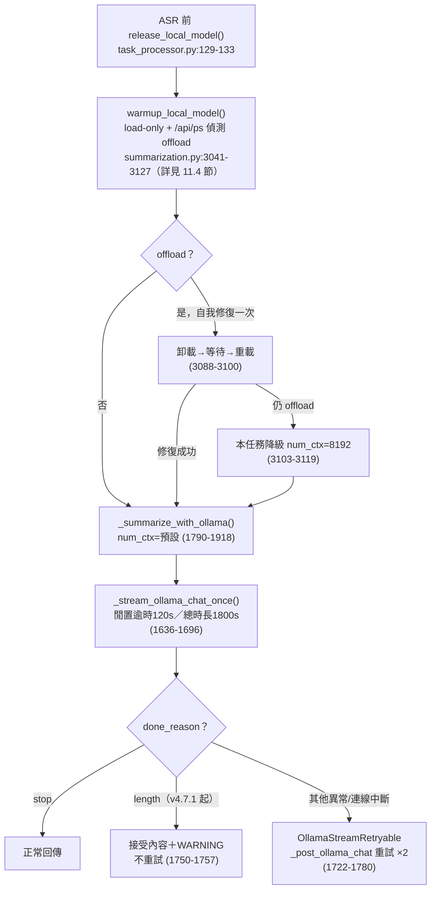
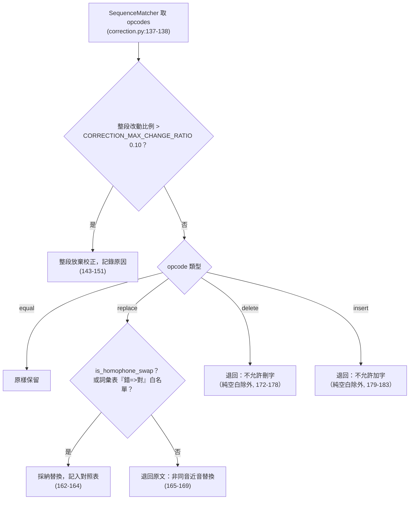
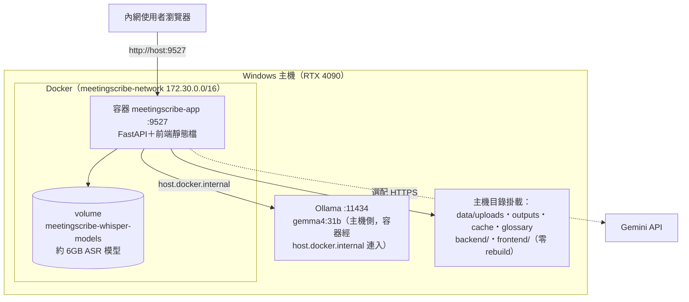

# 政府智慧會議紀錄生成系統 — 系統架構與程式設計書

| 項目 | 內容 |
| :--- | :--- |
| 文件版本 | v4.7.3 |
| 文件日期 | 2026-09-14 |
| 系統版本 | 4.7.3（唯一來源：根目錄 `VERSION` 檔，經 `backend/core/version.py:15-26` 讀取） |
| 適用讀者 | 開發者、維護工程師 |
| 專案根目錄 | `D:\dev\convert` |

> 本文件所有技術細節均附 `檔案:行號` 引用。**2026-09-13 文件同步**已對照 commit `f7626e8` 完成兩件事：(a) **T20260912-2242-01**（Apple SpeechAnalyzer ASR；macOS 26+／Apple Silicon 唯一引擎、永不 fallback）在第 2.3、3.1、3.2、4.3、4.4、5.2、5.4、9.1、10.2、11.3、12、13.4、14、15（ADR-10）、16 節的敘述與行號核對；(b) 補正 **2026-08-27 系列變更**（T20260827-1127-01、`5be217c` 等；`summarization.py` 由 2,047 行增至 3,177 行）造成的行號位移，涵蓋 2.1、2.2、4.1、4.2、4.5、5.2、5.3、6.1–6.4、7.3、8.2、8.4、8.5、9.2、11.2、11.4、15（ADR-8）與 16 節全表。
> 未列入上段的章節（例如 6.5 會議模板系統、10.1 設定優先序、13.1–13.3、13.5 部署細節）沿用各自新增／最後核對當下的版本，未在本次同步中重新保證行號新鮮度。
> v4.4.0 會議模板系統、v4.5.0 科務會議模板與附件、v4.6.0 ISMS 月工作會議模板與表單式 DOCX、v4.6.1 DOCX 章節白名單修復均見第 6.5 節（該節內容已是最新、行號以各自新增當下版本為準）。
> v4.6.2–v4.7.1「地端管線韌性機制」（空白會議紀錄根因與根治）見第 6.4、11.4 節；v4.7.2「地端公文段落編號階層」修復見 `CHANGELOG.md`（只動共用提示詞與領域模板規則，第 8.1 節提示詞層敘述仍適用）。
> v4.7.3 雲端三項變更（2026-09-14）——預設單次萃取（分段改為可選回退）、發言來源標註（限科務會議模板）、會議日期（年份）依據防線——見第 6.2 節；地端流程完全不變。
> 已知不一致：`pyproject.toml:15` 的 `version = "4.2.0"` 未同步更新；系統實際版本一律以 `VERSION` 檔為準。

---

## 目錄

1. [文件目的與範圍](#1-文件目的與範圍)
2. [系統總覽](#2-系統總覽)
3. [整體架構圖與目錄結構](#3-整體架構圖與目錄結構)
4. [模組職責詳解](#4-模組職責詳解)
5. [處理管線資料流](#5-處理管線資料流)
6. [摘要生成引擎：萃取式三階段](#6-摘要生成引擎萃取式三階段)
7. [逐字稿語意校正與同音閘門](#7-逐字稿語意校正與同音閘門)
8. [防杜撰與品質驗證機制](#8-防杜撰與品質驗證機制)
9. [API 規格](#9-api-規格)
10. [設定系統](#10-設定系統)
11. [GPU 資源管理](#11-gpu-資源管理)
12. [前端設計](#12-前端設計)
13. [部署架構](#13-部署架構)
14. [測試策略](#14-測試策略)
15. [重要設計決策記錄（ADR）](#15-重要設計決策記錄adr)
16. [附錄：file:line 速查表](#16-附錄fileline-速查表)

---

## 1. 文件目的與範圍

本文件是「政府智慧會議紀錄生成系統」的權威技術設計書，目的：

- 讓新進開發者能在不逐行讀碼的情況下，掌握系統的整體架構、模組邊界與資料流。
- 讓維護工程師遇到問題時，能循 `檔案:行號` 引用直接定位到對應程式碼。
- 記錄關鍵設計決策（第 15 章 ADR），避免後人「不明就裡地改回去」。

**範圍**：涵蓋後端（`backend/`）、前端（`frontend/`）、部署（`docker/`、`scripts/`）、測試（`tests/`）與設定系統。舊版 CLI（根目錄 `main.py`、`src/`）與封存目錄（`archive/`、`Faster-Whisper-XXL/`）不在本文件範圍內，僅在與後端有互動處（如 `config.yaml` 的歸屬）提及。

---

## 2. 系統總覽

### 2.1 系統目標

公務機關同仁上傳會議錄音（或影片）後，系統自動產出：

1. **逐字稿**（純文字 `.txt`，經確定性清理與語意校正）。
2. **符合臺灣公文格式的會議紀錄**（Markdown `.md` 與 Word `.docx`），欄位含會議名稱／時間／地點／主席／出席與列席人員／報告事項／討論事項（案由、說明、各單位意見、決議）／主席裁示事項（主辦單位、辦理期程），格式由系統提示詞強制（`backend/core/prompts.py:41-63`）。

核心價值主張是「**有憑有據、不杜撰**」：凡逐字稿未明確提及的人名、單位、日期、數字，一律標示「（待確認）」或「逐字稿未提及」，嚴禁推測補寫（`backend/core/prompts.py:18-21`）。

### 2.2 兩大設計堅持

| 設計堅持 | 落實機制 | 主要程式位置 |
| :--- | :--- | :--- |
| **忠於逐字稿＋防杜撰** | 提示詞層忠實性規則、萃取式三階段摘要（先抽事實再組稿）、14 區塊結構驗證＋待辦召回檢查、語意校正的同音驗證閘門（非同音近音替換一律退回） | `prompts.py:13-21`、`summarization.py:1470-1596`、`summarization.py:758-813`、`correction.py:130-186` |
| **可離線、保隱私** | 預設本地模式（Ollama／LM Studio 本地 LLM＋本地 ASR），資料不出主機；雲端模式（Gemini API）為選配，未設 API Key 時前端雲端卡自動停用 | `config.py:128`（`DEFAULT_MODE=local`）、`routes.py:160`、`app.js:138-145` |

### 2.3 技術棧

| 層次 | 技術 | 版本／設定依據 |
| :--- | :--- | :--- |
| Web 框架 | FastAPI ＋ uvicorn（埠 9527） | `backend/main.py:138-143`、`backend/main.py:191-198` |
| 前端 | 原生 JavaScript SPA（無框架）、單一 HTML＋CSS＋JS | `frontend/index.html`、`frontend/js/app.js`（1,104 行）、`frontend/css/style.css`（385 行） |
| ASR | macOS 26+／Apple Silicon：**Apple SpeechAnalyzer 唯一引擎**（`auto`＝`apple`；顯式 `transformers`／`faster_whisper`／`mlx_whisper` 一律拒絕；fail-closed、永不 fallback，T20260912-2242-01）。Windows/Linux：Transformers 路徑 MediaTek-Research/Breeze-ASR-26（revision 鎖定 `949c87b…`）；回滾路徑 faster-whisper ＋ Breeze-ASR-25（顯式 `mlx_whisper` 值亦保留） | `platform_config.py:18-20`、`platform_config.py:58-85`、`asr_model_resolver.py:72-128`、`asr_apple/dispatcher.py:29-52`、`transcription.py:575-648`、`config.py:237-247` |
| 本地 LLM | Ollama（預設 `gemma4:31b`）優先，LM Studio（OpenAI 相容 API）備援 | `config.py:49-61`、`summarization.py:1388-1423` |
| 雲端 LLM | Gemini API（OpenAI 相容端點，預設 `gemini-3.5-flash-lite`） | `config.py:119` |
| 語意校正 | pypinyin 同音比對＋OpenCC s2twp 簡繁正規化 | `correction.py:75-78`、`text_postprocess.py:37-49` |
| 文件輸出 | python-docx（Markdown → 公文格式 Word） | `docx_converter.py` |
| 部署 | Docker Compose（標準版／Windows GPU 版）＋ named volume 模型持久化 | `docker/docker-compose.yml`、`docker/docker-compose-windows-gpu.yml` |
| 設定 | pydantic-settings（環境變數 / `.env`） | `config.py:22-447`（`Settings`） |

---

## 3. 整體架構圖與目錄結構

### 3.1 整體架構圖



### 3.2 目錄結構

```text
D:\dev\convert
├── VERSION                     # 版本唯一來源（4.7.3）
├── backend/                    # 後端服務（本文件主要範圍）
│   ├── main.py                 # FastAPI 進入點、lifespan、中間件、路由掛載
│   ├── api/
│   │   ├── routes.py           # 12 個 REST 端點（prefix=/api）
│   │   └── websocket.py        # WebSocket 進度推播、ConnectionManager
│   ├── core/
│   │   ├── config.py           # pydantic-settings 設定（僅讀環境變數/.env）
│   │   ├── prompts.py          # 公文格式系統提示詞、校正提示詞
│   │   ├── text_postprocess.py # 確定性清理、記錄級後處理
│   │   ├── glossary.py         # 機關詞彙表（hotwords/白名單/校正 few-shot）
│   │   ├── asr_model_resolver.py # ASR 後端推斷（含平台閘門）、引擎鏈解析、revision 鎖定、快取簽章
│   │   ├── platform_config.py  # 平台偵測＋ASR 平台閘門（Apple-only）；config.yaml 僅供舊版 CLI／legacy tooling 讀取
│   │   ├── logger.py           # loguru 日誌
│   │   └── version.py          # VERSION 檔讀取
│   ├── middleware/
│   │   └── timeout.py          # 30 秒請求逾時中間件
│   ├── models/
│   │   └── schemas.py          # TaskStatus 8 狀態、ProgressMessage 等
│   └── services/
│       ├── task_processor.py   # 管線總控（轉錄→校正→摘要→組稿）
│       ├── queue_manager.py    # FIFO 佇列
│       ├── transcription.py    # ASR 業務入口（引擎鏈：apple／transformers／faster_whisper／mlx_whisper）
│       ├── asr_apple/          # Apple SpeechAnalyzer 引擎（macOS 專用；唯一 Mac ASR）
│       │   ├── contract.py     # 凍結契約：engine 名、helper 離場碼、8 個穩定錯誤碼、segment 型別
│       │   ├── dispatcher.py   # 引擎鏈路由（Mac：auto＝apple、顯式 Whisper 值拒絕）
│       │   ├── apple.py        # provider：probe→transcribe、ffmpeg 前處理、暫存檔衛生、13 鍵 metadata
│       │   └── apple_cli.py    # helper 執行邊界：執行檔探索、逾時／取消、schema 1.0 驗證、CJK 正規化
│       ├── correction.py       # 語意校正＋同音閘門
│       ├── summarization.py    # 摘要引擎（3,177 行，系統核心）
│       ├── file_manager.py     # 上傳/快取/輸出/排程清理
│       ├── device_detector.py  # GPU 偵測（存在 vs 忙碌）
│       └── docx_converter.py   # Markdown → 公文格式 Word
├── frontend/                   # 原生 JS SPA
│   ├── index.html              # 單頁（三步驟流程列＋狀態列＋三張卡）
│   ├── css/style.css           # 政府藍設計系統
│   └── js/app.js               # 全部前端邏輯（1,104 行）
├── docker/
│   ├── Dockerfile              # 標準版（python:3.11-slim）
│   ├── Dockerfile.gpu          # GPU 版（nvidia/cuda:12.3.2-cudnn9）
│   ├── docker-compose.yml      # 標準版 compose
│   ├── docker-compose-windows-gpu.yml  # Windows GPU 版 compose
│   └── docker-compose.override.yml     # 開發熱重載（標準版自動載入）
├── data/
│   ├── glossary/               # 機關詞彙表 *.txt
│   ├── uploads/ outputs/ cache/  # 執行期資料（volume 掛載）
├── scripts/                    # 啟停/部署/驗證腳本（windows/ macos/）
├── apple_speech_cli/           # Swift helper（apple-speech-cli；macOS 26+ 建置產物，不在 Docker 路徑）
├── tests/                      # pytest 測試（643 個 test 函式）
├── doc/                        # 文件（操作手冊、規格與設計）
├── config.yaml                 # ⚠️ 僅供舊版 CLI；後端服務不讀取（config.yaml:1-10）
├── main.py / src/              # 舊版 CLI（不在本文件範圍）
├── requirements.txt / requirements-correction.txt
├── pyproject.toml / uv.lock    # 開發機環境（uv）
└── .github/                    # 僅 copilot/agent 說明文件（instructions.md、copilot-instructions.md）；無 workflows/（無 CI）
```

---

## 4. 模組職責詳解

### 4.1 backend/main.py — 服務進入點

| 職責 | 說明 | 位置 |
| :--- | :--- | :--- |
| lifespan 啟動 | 依序：裝置偵測＋ASR 設定 fail-closed 檢查 `device_detector.detect_best_device()` / `infer_asr_backend()` → 背景啟動 `task_processor.start()` → 啟動檔案清理排程 `file_manager.start_cleanup_scheduler()` → 啟動即清理一次過期檔案 | `backend/main.py:35-39`、`backend/main.py:60`、`backend/main.py:63`、`backend/main.py:66` |
| 啟動日誌明示生效設定 | P0-3(c)：啟動時完整列出「實際生效」的 ASR/LLM/校正參數，並明示來源為「環境變數 / .env，非 config.yaml」，杜絕改 `config.yaml` 不生效的除錯黑洞 | `backend/main.py:81-117` |
| 逾時中間件 | `TimeoutMiddleware` 30 秒，排除 `/api/upload`（大檔上傳不受限） | `backend/main.py:145-150`、`middleware/timeout.py:17-83` |
| CORS | 預設 `*`（內網部署），此時依規範停用 credentials；生產以 `ALLOWED_ORIGINS` 指定 | `backend/main.py:152-162`、`config.py:396-403` |
| WebSocket 端點 | `/ws/tasks/{task_id}` 轉交 `websocket_endpoint` | `backend/main.py:167-171` |
| 靜態檔與首頁 | `/static` → `frontend/`；`GET /` 回傳 `index.html` 並加 `Cache-Control: no-cache, must-revalidate`（改版免 Ctrl+F5） | `backend/main.py:174`、`backend/main.py:177-188` |
| 監聽 | uvicorn `0.0.0.0:9527` | `backend/main.py:191-198` |
| 關閉收尾 | 停清理排程 → 停任務處理器 → 取消背景 task | `backend/main.py:119-134` |

### 4.2 backend/api/ — 對外介面

- **routes.py**：12 個 REST 端點（`prefix=/api`，`routes.py:31`），詳見第 9 章。
- **websocket.py**：
  - `STATUS_LABELS`：8 個任務狀態的中文標籤（v4.3.2 起推送給使用者的狀態一律中文，`websocket.py:19-28`）。
  - `ConnectionManager`：以 `task_id` 分組管理連線、送訊息、清理失效連線、廣播排隊更新（`websocket.py:59-129`）。
  - `websocket_endpoint`：連上先推當前狀態（完成任務附結果預覽）→ 迴圈中 30 秒逾時就推最新狀態 → `ping`/`pong` 心跳 → 任務進終態（completed/failed/cancelled）即關閉（`websocket.py:136-227`）。

### 4.3 backend/services/ — 業務核心

| 模組 | 職責 | 關鍵位置 |
| :--- | :--- | :--- |
| `task_processor.py` | 管線總控：把「轉錄→確定性清理→語意校正→摘要→組稿存檔」串成完整流程並推播進度；摘要失敗不偽裝成功（P0-5） | `_process_task`：`task_processor.py:189-292` |
| `queue_manager.py` | FIFO 佇列：`deque`＋`asyncio.Lock`＋`asyncio.Event`；佇列滿回 `None`；`MAX_CONCURRENT_TASKS`（預設 1）序列化保護單卡 | `queue_manager.py:24-30`、`queue_manager.py:48-52`、`queue_manager.py:90-93` |
| `transcription.py` | ASR 業務入口：`transcribe_detailed` 依 `resolve_engine_chain` 分派引擎鏈（Mac 恆為 `("apple",)` 且 fail-closed；legacy 三後端行為原封不動搬入 `_transcribe_with_legacy_engine`）、VRAM 檢查、GPU 失敗自動降級 CPU 重試（僅 legacy）、hotwords 注入 | `transcription.py:575-616`（`transcribe_detailed`）、`transcription.py:618-648`（Apple 鏈）、`transcription.py:708-757`（legacy 路徑＋降級重試） |
| `asr_apple/` | Apple SpeechAnalyzer 引擎（macOS 26+／Apple Silicon 唯一 ASR）：`dispatcher` 純函式路由（Mac＋`auto`＝`apple`、Mac 上顯式 Whisper 值 `ValueError` 拒絕；非 Mac 永不出現 `apple`）、`apple` provider（probe→transcribe、ffmpeg 前處理、24h 暫存檔回收）、`apple_cli` helper 執行邊界（逾時／取消／schema 1.0 驗證）、`contract` 凍結錯誤碼（詳見 `doc/apple-speech-analyzer-operations.md`） | `asr_apple/dispatcher.py:29-52`、`asr_apple/apple.py:1-693`、`asr_apple/apple_cli.py:1-1027`、`asr_apple/contract.py:1-131` |
| `correction.py` | 逐字稿選擇性 LLM 校正＋同音驗證閘門（第 7 章） | `correction.py:105-186` |
| `summarization.py` | 摘要引擎（3,177 行）：本地三階段、雲端兩段式、品質驗證與補強、Ollama VRAM 釋放、模型名智能解析（第 6、8、11 章） | `summarization.py:95-3173`（`SummarizationService`） |
| `file_manager.py` | 上傳驗證（防路徑遍歷/空字節）、UUID 檔名、SHA256＋簽章之 ASR 快取、逐字稿/結果儲存、每日 3:00 排程清理（uploads 1 天 / outputs 7 天 / cache 30 天） | `file_manager.py:43-46`、`file_manager.py:56-81`、`file_manager.py:137-151`、`file_manager.py:348-380` |
| `device_detector.py` | GPU 偵測：「存在」與「忙碌」分離（第 11 章） | `device_detector.py:43-147`、`device_detector.py:179-241` |
| `docx_converter.py` | Markdown → Word：公文結構辨識、表格完整框線、CJK 字型 | `docx_converter.py:40-41`、`docx_converter.py:288-306`、`docx_converter.py:521-549` |

### 4.4 backend/core/ — 共用基礎

| 模組 | 職責 | 關鍵位置 |
| :--- | :--- | :--- |
| `config.py` | pydantic-settings 全域設定（第 10 章）；檔頭即聲明 config.yaml 對後端無效 | `config.py:4-5`、`config.py:310-313` |
| `prompts.py` | `MEETING_RECORD_SYSTEM_PROMPT` 公文格式＋防杜撰提示詞（`prompts.py:7-63`）；`TRANSCRIPT_CORRECTION_SYSTEM_PROMPT` 只修同音近音（`prompts.py:79-96`）；`build_correction_user_message` 組校正訊息（`prompts.py:99-107`） | — |
| `text_postprocess.py` | 確定性清理（OpenCC s2twp、幻覺黑名單、重複去重、公務用字白名單）與記錄級後處理（英文清理、結構補全）；一律在「驗證前」執行（P1-9） | `text_postprocess.py:219-248`、`text_postprocess.py:346-398` |
| `glossary.py` | 機關詞彙表：`data/glossary/*.txt`、一行一詞、`#` 註解、支援「錯=>對」已知誤辨；排序即 hotwords 優先序；`english_protected_terms()` 保護 AI/API/Ollama 等英文專名不被英文清理誤刪 | `glossary.py:46-86`、`glossary.py:89-102`、`glossary.py:105-108` |
| `asr_model_resolver.py` | ASR 後端推斷（`infer_asr_backend`，auto 時依模型名判斷）、`resolve_engine_chain`（Mac 平台閘門：`auto`＝`("apple",)`；Mac 上顯式 `transformers`／`faster_whisper`／`mlx_whisper` 丟穩定 `ValueError`；Mac＋`auto` 不回傳 Whisper 模型＝`""`）、Breeze-ASR-26 revision 自動鎖定 `949c87bca9dbe90e160cf739460cc765e80805f3`、快取簽章 `sha256(backend::model::revision::language::initial_prompt::beam_size::vad)[:16]`、safetensors 安全下載白名單 | `asr_model_resolver.py:72-95`、`asr_model_resolver.py:98-128`、`asr_model_resolver.py:131-147`、`asr_model_resolver.py:150-174`、`asr_model_resolver.py:22-23` |
| `platform_config.py` | 平台偵測（macos/windows/docker）＋ASR 平台閘門：`SUPPORTED_ASR_BACKENDS`／`APPLE_PLATFORM_ASR_BACKENDS`（`auto`／`apple`）、`resolve_platform_asr_backend`（非 Mac 顯式 `apple` 拒絕、Mac 僅回 `apple`）；讀取 `config.yaml`＋`config.{platform}.yaml`——**僅**供舊版 CLI 使用（LM Studio 參數 YAML 覆蓋路徑已於 T20260827-1127-01 移除） | `platform_config.py:18-20`、`platform_config.py:58-85`、`platform_config.py:162-203` |
| `version.py` | 讀根目錄 `VERSION` 檔，失敗回退 `0.0.0` | `version.py:15-26` |

### 4.5 backend/models/schemas.py — 資料模型

- `TaskStatus`：8 狀態 enum（`schemas.py:15-24`）。
- `ProcessingMode`：`local` / `cloud`（`schemas.py:27-30`）。
- `TaskInfo`／`QueueStatus`／`UploadResponse`／`HealthStatus`／`ProgressMessage`（欄位見第 9 章）。

### 4.6 frontend/ — 前端

單一頁面應用，無建置工具、無外部 CDN；詳見第 12 章。

---

## 5. 處理管線資料流

### 5.1 端對端流程



### 5.2 管線步驟與進度百分比區間表

| 進度 | 階段（前端顯示訊息） | TaskStatus | 程式位置 |
| :--- | :--- | :--- | :--- |
| 5% | 準備處理 | PENDING | `task_processor.py:197` |
| 10% | 載入 Whisper 模型…／本次引擎鏈首個引擎為 `apple` 時改顯示「Apple 本機轉錄中…」（`_asr_stage_message`；文案屬 UX 層，解析失敗一律回退 Whisper 文案，不得成為轉錄的新失敗點） | TRANSCRIBING | `task_processor.py:39-52`、`task_processor.py:133` |
| 5% / 15% / 60% | 轉錄服務內部回報（載入模型→開始轉錄→轉錄完成，原值透傳） | TRANSCRIBING | `transcription.py:720-738`（legacy 5/15/60）、`transcription.py:697-698`（Apple 路徑 60） |
| 60% | 快取命中：使用快取逐字稿（直接跳 60） | TRANSCRIBING | `task_processor.py:125` |
| 62% | 語意校正逐字稿（同音錯字/專有名詞）… | TRANSCRIBING | `task_processor.py:170` |
| 65% | 生成摘要 | SUMMARIZING | `task_processor.py:231`、`summarization.py:335` |
| 68→80%（本地） | 萃取逐字稿重點 i/n（68 + (i−1)/n × 12） | SUMMARIZING | `summarization.py:1519-1521` |
| 68→82%（雲端） | 萃取逐字稿重點（雲端，單次呼叫）…；分段模式為（雲端）i/n（68 + 完成比 × 14） | SUMMARIZING | `summarization.py:2460-2463` |
| 75→84%（本地） | 整併萃取筆記 第 r 輪（min(84, 75+組序)） | SUMMARIZING | `summarization.py:1135-1139` |
| 86%（本地）/ 84%（雲端） | 整理最終會議記錄… | SUMMARIZING | `summarization.py:1546`、`summarization.py:2513` |
| 86→94%（雲端） | 雲端回應接收中…（串流每 5 個 chunk 前進，86 + min(chunks/10, 8)） | SUMMARIZING | `summarization.py:2626-2630` |
| 88+n%（本地）/ 94%（雲端） | 補強摘要完整性（第 n 輪）…（雲端固定 94% 防倒退） | SUMMARIZING | `summarization.py:1564`、`summarization.py:2533-2537` |
| 95% | 摘要生成完成 | SUMMARIZING | `summarization.py:351` |
| 100% | 完成（或「完成（⚠️ 僅逐字稿，會議紀錄生成失敗）」） | COMPLETED | `task_processor.py:270-276` |

### 5.3 任務 8 狀態機

狀態定義於 `schemas.py:15-24`，中文標籤於 `websocket.py:19-28`：

| 狀態 | 中文標籤 | 進入時機 |
| :--- | :--- | :--- |
| `queued` | 排隊等候中 | 上傳成功入列（`queue_manager.py:61-75`） |
| `pending` | 準備處理中 | 從佇列取出（`queue_manager.py:99-107`） |
| `uploading` | 檔案上傳中 | enum 保留值；目前後端管線不主動設定（上傳於入列前同步完成），僅供顯示層對照 |
| `transcribing` | 語音轉錄中 | 進入 ASR／快取階段（`task_processor.py:117-133`） |
| `summarizing` | 生成會議紀錄中 | 進入摘要階段（`task_processor.py:231`） |
| `completed` | 處理完成 | `complete_task(success=True)`（`queue_manager.py:116-135`） |
| `failed` | 處理失敗 | 管線任一步驟拋出未捕捉例外（`task_processor.py:283-290`） |
| `cancelled` | 已取消 | 使用者取消（僅限排隊中，`queue_manager.py:137-160`） |



> 注意：**摘要失敗 ≠ 任務失敗**。摘要引擎拋錯時任務仍走向 `completed`，但輸出標題改為「逐字稿（會議紀錄生成失敗）」並冠上 `SUMMARY_FAILED_BANNER` 顯著警告（banner 定義：`task_processor.py:33-36`；例外捕捉＋`task.summary_failed=True`：`task_processor.py:249-255`；標題／警告組裝：`task_processor.py:344-352`）。只有轉錄等前置步驟失敗才進 `failed`。

### 5.4 ASR 快取

- 快取鍵：檔案內容 SHA256（`file_manager.py:129-135`）＋ `cache_signature`（`sha256("backend::model::revision::language::initial_prompt::beam_size::vad_enabled")[:16]`，`asr_model_resolver.py:150-174`；由 `file_manager.get_asr_cache_signature` 帶入現行設定，`file_manager.py:137-151`）。換模型、換後端、換 revision，或調整語言／initial prompt／beam size／VAD 都會自然失效，不會誤用舊設定的逐字稿。
- 命中：直接推進到 60%，跳過 ASR（`task_processor.py:117-127`）。
- 未命中：先呼叫 `summarization_service.release_local_model()` 請 Ollama 卸載模型騰出 VRAM，再載入 ASR（`task_processor.py:128-130`，見第 11 章）。

---

## 6. 摘要生成引擎：萃取式三階段

`backend/services/summarization.py`（3,238 行）是系統核心。設計哲學：**先萃取事實、再組合成公文**，而非把整份逐字稿直接生成公文——地端因上下文限制採分塊萃取（ADR-1）；雲端 v4.7.3 起預設單次呼叫整份逐字稿萃取、分段為可選回退（ADR-2）。

### 6.1 本地路徑：`_summarize_with_local_pipeline`（`summarization.py:1470-1596`）



最終生成與補強會依選定地端實例的有效上下文預算加入來源證據：完整逐字稿安全可容納時優先使用完整來源，否則只加入完整且與筆記相關的來源區塊；不會靜默截短來源。若沒有任何完整來源區塊能安全放入，明確退回筆記-only 分支。這只改變地端最終生成／補強的輸入，不改雲端路徑、萃取設定或驗證門檻。分支名稱與摘錄數量可供 opt-in 隱私安全診斷追查；內容不進入 redacted manifest。

地端萃取筆記進入整併前會附上去除相鄰 chunk 重疊行後的原文依據，讓整併階段能核對萃取內容；最終生成時，完整逐字稿或預算內的來源摘錄置於筆記之前，並明示補回來源支持但筆記遺漏的重要關係。這些是來源可追溯與輸入排序機制，不構成語意正確保證；忠實度仍須以固定素材 E2E 與盲測驗收。

**上下文預算規劃**（`summarization.py:392-460`，`_build_local_context_plan`）：

| 預算 | 公式 | 位置 |
| :--- | :--- | :--- |
| `chunk_input_budget` | `min(max(1200, ctx − output − extraction_overhead), 3200)`；ctx＝`LOCAL_LLM_EFFECTIVE_CONTEXT_TOKENS`（預設 8192），output＝`LOCAL_LLM_RESERVED_OUTPUT_TOKENS`（預設 3072） | `summarization.py:413-414` |
| `merge_input_budget` | `max(LOCAL_LLM_MERGE_VISIBLE_TARGET_TOKENS=900, ctx − provider 輸出保留 − merge prompt 開銷)`；**P0-6／T20260827-1127-01**：整併前先做 budget preflight（不可行即 `LOCAL_LLM_CONTEXT_BUDGET_EXCEEDED` fail loudly），否則最終步驟輸入超過 `num_ctx` 會被 Ollama **靜默截斷** | `summarization.py:426-445` |
| `merge_visible_target`／`merge_feasible_input`（v4.7.4） | 由 `_resolve_merge_targets` 推導：`final_stage_input_budget = ctx − 2×輸出保留 − 最終提示詞開銷`（最終生成 1 份輸出＋補強輪回帶的當前摘要 1 份）；`merge_feasible_input = max(900, 上式)`＝**硬性**下游可承接上限；`merge_visible_target = min(合計, 4096)`＝軟性壓縮目標（`LOCAL_LLM_MERGE_VISIBLE_TARGET_CEILING_TOKENS`）。**根因（T20260922-1349-01）**：固定 900 是在 `num_ctx=8192` 假設下校準的常數，當已載入 instance 實際提供 32K/128K 時，900 與真實預算脫鉤，整併收斂到單一 note 後再無分組可壓縮 → 必然拋 `LOCAL_LLM_MERGE_NOT_CONVERGED` → 整份紀錄被 veto 成逐字稿 fallback（實測 1 份筆記、1754 tokens） | `_resolve_merge_targets`、`_merge_notes_until_fit`：`summarization.py` |
| 規劃 `ctx` 的權威來源（v4.7.4） | LM Studio 路徑以「本次選定 loaded instance 的 `context_length`」為權威（`context_window_source=lmstudio_instance`）；無 selection 時才退回 `LOCAL_LLM_EFFECTIVE_CONTEXT_TOKENS`。舊行為 `min(settings, instance)` 會讓 settings 預設 8192 在模型提供 32K/128K 時反向成為瓶頸（規劃過度切塊、merge 分組預算過小 → 呼叫放大） | `_summarize_with_local_pipeline`：`summarization.py` |

token 估算 `_estimate_tokens` 為中英混合保守估計（CJK 每字 1 token、拉丁詞 ×1.2，`summarization.py:369-380`）。

**Ollama 呼叫細節**（`_summarize_with_ollama`，`summarization.py:1790-1918`；請求/串流/重試層見第 6.4 節，不在此重複）：

- `keep_alive` 採設定值（預設 `30m`，v4.7.0 由 `10m` 調高，`config.py:145-148`）：三階段流程連續呼叫十數次，`keep_alive=0` 會導致每階段重載 20GB 模型（P0-7 註解：`summarization.py:1847-1849`）。v4.7.0/v4.7.1 起呼叫鏈全面串流化＋可重試分類＋`done_reason=length` 接受路徑＋`num_predict` 自動擴大，詳見第 6.4 節。
- gemma4 是思考型模型，thinking 會吃光 `num_predict` 導致正文為空 → 預設帶 `think: false`；模型不支援該參數回 400 時，自動改以不帶 `think` 欄位重送（`summarization.py:1833-1837`、`summarization.py:1740-1746`）。
- 空回應自動重試一次並升溫（`temperature → max(t, 0.3)`，`summarization.py:1851-1852`、`summarization.py:1878-1882`）。
- 404（模型不存在）時列出主機可用模型與 `ollama pull` 建議指令（`summarization.py:1890-1907`、`summarization.py:2822-2836`）。
- 模型名智能解析 `_resolve_compatible_model`：4 個策略（正規化量化後綴同名 → 同家族前綴 → 同家族 `:latest` → 任一同家族），設定 `gemma4:31b` 而主機裝 `gemma4:31b-it-q4_K_M` 時自動對上（`summarization.py:2751-2813`）；生效名經 `get_effective_local_model()` 提供給 `/api/config` 供前端顯示（`summarization.py:2852-2854`、`routes.py:554`）。

### 6.2 雲端路徑：`_summarize_with_gemini`（`summarization.py:2681-2755`，v4.7.3 起預設單次萃取）

歷史根因（v4.3.2 實測雲端仍輸給地端）：整份逐字稿「單發萃取」會被模型壓成一頁筆記——LLM 輸出長度不隨輸入等比放大；第二段生成又只看筆記，第一段丟失的立場、理由、數據永遠救不回來（`summarization.py:2514-2521`）。v4.3.3 曾以三個手段根治（分段併發萃取＋雙輸入生成＋動態長度下限）；**2026-09-14 使用者決策（v4.7.3）**：選雲端模型時**預設不再分段**——地端分段的原始動機（記憶體不足、小模型注意力集中度低）在雲端不存在，且逐字稿規模遠低於雲端上下文上限，單次呼叫即可完成萃取；v4.3.3 分段機制保留為**可選回退**（`CLOUD_LLM_SEGMENTED_EXTRACTION=true`）。現行實作：

1. **萃取** `_extract_notes_with_gemini`（`summarization.py:2437-2502`）：
   - 預設 `chunks=[transcript]`（`summarization.py:2457-2458`）：整份逐字稿**單次呼叫**，進度文案「萃取逐字稿重點（雲端，單次呼叫）...」。
   - 分段回退：`CLOUD_LLM_SEGMENTED_EXTRACTION=true` 時沿用地端實證分塊密度 `CLOUD_LLM_CHUNK_TOKENS=3200`（`summarization.py:2453-2456`、`config.py:175-178`）切塊，`asyncio.Semaphore(CLOUD_LLM_MAX_CONCURRENT_REQUESTS=3)` 併發限流（`summarization.py:2465`、`config.py:179-182`），分段筆記**零損串接**（`"\n\n---\n\n".join`，`summarization.py:2501`）。
   - 提示詞用 `CLOUD_EXTRACTION_PROMPT`＝本地萃取規則＋雲端豐富度強制規則（各方立場/理由/數據/實例必留、嚴禁壓縮成單句、筆記長度無上限）（`summarization.py:139-144`）。
   - 任一段失敗重試一次（`summarization.py:2474-2483`）；`asyncio.gather(..., return_exceptions=True)` 讓失敗時其餘協程收尾後才拋首個例外，避免 unretrieved exception 與 API 配額浪費（`summarization.py:2492-2500`）。
2. **雙輸入生成** `_build_cloud_summary_message`（`summarization.py:990-1015`）：最終生成同時餵「萃取筆記（涵蓋度檢查表）＋原始逐字稿（細節來源）」；補強輪也附逐字稿（`_build_cloud_refinement_message`，`summarization.py:1017-1034`）——「內容過短」這類豐富度問題必須回原文找細節才補得回來。
3. **動態長度下限** `_estimate_cloud_min_summary_chars`（`summarization.py:2419-2428`）：`min_chars = max(250, min(2000, transcript_tokens // 15))`。校準依據 0708 實測：103 分鐘會議 ≈ 1.8 萬 tokens → 下限約 1,200 字，恰可攔截曾發生的 855 字過薄輸出；上限 2000 避免灌水要求，下限 250 維持防空底線。
4. **發言來源標註（2026-09-14）**：模板 `speaker_traceability=True`（`templates.py:169` 宣告；目前僅科務會議 `:384`）時，生成與補強訊息另注入 `CLOUD_SPEAKER_TRACEABILITY_RULE`（`summarization.py:109-117`；注入點 `1165`／`1197`），要求正文每項指示／裁示／交辦／他人意見句末保留「（發言者N，00:12:04）」或「（科長，00:12:04）」來源標註；並以確定性絆索 `_validate_cloud_speaker_traceability`（`summarization.py:870-903`）檢查——正文（排除開頭欄位與表格列）完全沒有來源標註即併入補強問題，交由既有補強輪處理（fail-soft，不讓任務失敗）。地端路徑不注入、不檢查。
5. **會議日期依據防線（2026-09-14）**：常數 `CLOUD_DATE_GROUNDING_RULE`（`summarization.py:130-138`；注入點 `1175`／`1199`）要求紀錄中的年份必須是逐字稿真的出現過的內容（逐字稿只用「今年／明年／去年／今年度」等相對說法時，年份一律寫「（待確認）」）；**月份與日期同理，但只靠提示詞要求、不做硬攔**。並以確定性絆索 `_validate_cloud_date_grounding`（`summarization.py:944-966`）把關——紀錄與逐字稿各自以 `_extract_year_tokens`（`summarization.py:906-921`；阿拉伯數字與國字如「一一三」「一百一十三」正規化後等價，「90 年代」不算年份）抽出年份集合取差集，逐字稿沒有、紀錄卻出現的年份即併入補強問題（fail-soft，輪數用盡僅記 log，不讓任務失敗）。**只檢查年份**：月份與日期在逐字稿常以相對說法（「這個月」「月底」）出現，硬攔會誤判合法表達。僅雲端流程（檢查點 `summarization.py:2720`／`2747`：生成後與每輪補強後各一次）；地端完全不呼叫。實測根因：逐字稿全篇沒有任何年份（只說「生效日期是今年的 11 月 1 號」），Gemini 仍寫入「中華民國113年…」「生效日期為113年11月1日」；加上本防線後雲端 E2E（任務 `c7619708`）紀錄中的年份全部有逐字稿依據、無杜撰年份（同場 28 組句末發言來源標註）。

6. **範本骨架佔位符修復（2026-09-14）**：生成與每輪補強後的收尾改走雲端專用包裝 `_finalize_cloud_record_text`（`summarization.py:1778-1794`）——在共用記錄級後處理之後追加 `normalize_unfilled_placeholders`（`text_postprocess.py:379-416`），把模型「照抄提示詞骨架」留下的佔位符（`（年）`／`（月）`／`（日）`／`（星期）`／`（時分）`／`（次）`／`（民國年）`／`（機關及科別）`）換回官方規定的「（待確認）」。只處理開頭欄位與標題行（含模板宣告的欄位樣式），正文一個字都不動；只拿掉沒有資訊的佔位符、不新增任何事實，故不違反忠實性原則。實測根因：逐字稿沒提日期時，Gemini 吐出「時間：中華民國（年）年（月）月（日）日（星期）（時分）」，欄位看似填了、其實沒有任何可用資訊（2026-09-14 雲端 E2E `c7619708`／`c49ecde9` 兩次皆如此；前者早於本修復、後者為修復前版本）。**僅雲端**：地端仍走 `_finalize_record_text`（`summarization.py:1767-1777`），行為完全不變。修復後雲端 E2E（任務 `bed317d6`）頭欄位為「時間：中華民國（待確認）年（待確認）月（待確認）日（待確認）」，全篇再無任何骨架佔位符。

`_gemini_chat`（`summarization.py:2556-2593`）：AsyncOpenAI 相容客戶端、串流接收、串流進度區間 86–94%（v4.3.3 起，避免與萃取階段 68–84% 進度倒退衝突，`summarization.py:2626-2630`）。

### 6.3 本地 vs 雲端路徑完整對照

| 面向 | 本地（Ollama / LM Studio） | 雲端（Gemini） |
| :--- | :--- | :--- |
| 入口 | `_summarize_with_local_pipeline`（`summarization.py:1470-1596`） | `_summarize_with_gemini`（`summarization.py:2681-2755`） |
| 分塊依據 | 動態預算 `chunk_input_budget`（1200–3200 tokens，`summarization.py:413-414`） | 預設**不分塊**（單次整份萃取）；分段回退時固定 `CLOUD_LLM_CHUNK_TOKENS=3200`（`summarization.py:2453-2458`） |
| 萃取方式 | 逐塊**循序**（單卡 GPU 序列化） | 預設**單次呼叫**；分段回退時逐塊**併發**（Semaphore=3，`summarization.py:2465`） |
| 萃取提示詞 | `LOCAL_EXTRACTION_PROMPT`（`summarization.py:101-133`） | `CLOUD_EXTRACTION_PROMPT`＝本地版＋豐富度強制規則（`summarization.py:139-144`） |
| 筆記整併 | **有損整併** `_merge_notes_until_fit`（輪上限 3、停滯偵測、硬截斷，`summarization.py:1057-1186`） | **零損串接** join（分段回退時；`summarization.py:2501`） |
| 最終生成輸入 | 僅整併後筆記（context 有限，`summarization.py:1547-1552`） | 筆記＋**原始逐字稿**雙輸入（`summarization.py:2513-2521`） |
| 長度下限 | 固定 250 字（`summarization.py:762`） | 動態 `max(250, min(2000, tokens//15))`（`summarization.py:2419-2428`） |
| 補強輪 | ≤ `LOCAL_LLM_MAX_REFINEMENT_ROUNDS`（2），輸入＝筆記（`summarization.py:1563-1575`） | 同上限 2 輪，輸入＝筆記＋逐字稿（`summarization.py:2530-2545`） |
| 進度區間 | 萃取 68–80、整併 75–84、生成 86、補強 88+n | 萃取 68–82、生成 84、串流 86–94、補強固定 94 |
| 失敗處理 | 空回應重試＋升溫、404 列可用模型（`summarization.py:1838-1912`） | 單塊重試一次、gather 收尾後拋例外（`summarization.py:2461-2486`） |

共通不變式：**後處理（`_finalize_record_text`）永遠在驗證之前執行；驗證通過後任何流程不得再改寫本文**（P1-9，`summarization.py:1598-1608`、`task_processor.py:302-310`）。

### 6.4 地端管線韌性機制（v4.6.2–v4.7.4）

**背景**（詳見文件頭與 CLAUDE.md 記憶，此處僅列技術對策）：地端排程任務曾產出「空白會議紀錄」（fallback 逐字稿文件）。根因鏈：①單卡 VRAM 交接設計使 ASR 後第一個 LLM 呼叫必為冷啟動，重載 ~20GB 模型貼近 VRAM 上限；②貼近上限＋VRAM 殘留 → Ollama 部分層 offload 至 CPU、推理崩跌；③`stream:false` 下 600s read timeout 在長生成期間變成「總時長硬上限」，`httpx.ReadTimeout` 的 `str()` 為空使診斷資訊全失；④管線 12+ 次連續 LLM 呼叫全無重試，單一逾時毀掉整份紀錄。以下為 v4.6.2–v4.7.1 的完整對策鏈：



| 機制 | 說明 | 位置 |
| :--- | :--- | :--- |
| 例外訊息保底 | `describe_exception(e)`：`str(e)` 為空時（httpx 逾時類例外的常見行為）回退帶出例外類別名稱，避免「失敗原因」整行消失（穩定錯誤碼常數位於同檔 `12-20`） | `backend/core/errors.py:32-35` |
| Ollama 呼叫全面串流化 | `stream:false` 改 `stream:true`；httpx read timeout 降級為 chunk 間「閒置」逾時（`LOCAL_LLM_STREAM_IDLE_TIMEOUT=120s`），另以 `asyncio.timeout` 作總時長上限（`LOCAL_LLM_REQUEST_TIMEOUT=1800s`，寧可等待不截斷） | `_stream_ollama_chat_once`：`summarization.py:1636-1696` |
| 串流可重試例外分類 | `OllamaStreamRetryable`：中途 error chunk／結束無 done／`done_reason` 異常（非 stop、非 length）才可重試 | 類別定義：`summarization.py:45-56`；判定：`summarization.py:1672-1694` |
| `done_reason=length` 接受路徑（v4.7.1） | 撞到 `num_predict` 上限是**確定性結果**，重試 2 次必然停在同一截斷點；不再拋可重試例外，直接回傳已完整累積內容，呼叫端記 WARNING（含 `eval_count`/`num_predict`）後接受繼續 | 串流層判斷：`summarization.py:1688-1694`；呼叫端警告：`summarization.py:1750-1757` |
| 瞬時錯誤重試 | `_post_ollama_chat`：timeout/連線中斷/串流層可重試失敗才重試，`LOCAL_LLM_TRANSIENT_RETRIES=2` 次、線性退避 `LOCAL_LLM_RETRY_BACKOFF_SECONDS=5.0`；HTTP 4xx/5xx 與總時長超限非瞬時，不重試 | `summarization.py:1722-1780` |
| 生成指標觀測 | 每次生成記錄 `load_duration`／`tokens/s`／`prompt_eval_count`（v4.7.1 新增）；吞吐低於 `LOCAL_LLM_MIN_TOKENS_PER_SECOND=5.0` 即警告疑似 offload | `_log_generation_metrics`：`summarization.py:1698-1720` |
| `num_predict` 自動擴大（v4.7.1） | 依 context 餘裕自動擴大輸出預算（`max(保留值, num_ctx − 估算prompt − 256)`），從源頭降低撞牆機率；整併呼叫 `_merge_notes_until_fit` 明確傳 `expand_output_budget=False` 維持「整併必縮小」的收斂保證 | `_summarize_with_ollama`：`summarization.py:1815-1823`；整併停用理由註解：`summarization.py:1153-1158` |
| 任務級 num_ctx 生效順序 | 顯式覆蓋 > warmup 降級值 > settings 預設 | `_effective_context_tokens`：`summarization.py:1782-1788` |
| Warmup 自我修復＋降級 | load-only 預熱→`/api/ps` 偵測 offload→自我修復一次（卸載/等待/重載）→仍失敗則本任務降級 `num_ctx=LOCAL_LLM_DEGRADED_CONTEXT_TOKENS`（8192） | `warmup_local_model`：`summarization.py:3041-3127`（詳見第 11.4 節） |
| KV 量化生效 heuristic | `/api/tags` 磁碟大小 vs `/api/ps` 載入大小之差 ≈ KV cache＋compute overhead；依 2026-08-19 正式機實測校準門檻（q8 生效 @16K overhead≈2.7GB） | `_check_kv_quantization_heuristic`：`summarization.py:3019-3039` |
| ASR 子程序隔離 | 每次轉錄改在獨立子程序執行，程序退出保證 CUDA context／分配器殘留完全釋回（faster-whisper#992 實測長駐程序每次殘留 ~312MB） | `backend/services/asr_subprocess.py:120-228`、`backend/workers/asr_worker.py:38-88`（詳見第 11.2 節） |

**v4.7.4（T20260922-1349-01）LM Studio 深度紀錄失敗對策鏈**：實測 task `3ae2d9ec`
（`0903-科務會議.m4a`、LM Studio `qwen3.8-27b-splash` 載入為 32K 視窗）任務「完成」但
`summary_failed=true`，輸出檔為 `20260922134904_逐字稿(會議紀錄生成失敗).docx`（只有失敗
橫幅＋逐字稿、0 張表格）。三個根因與對策：

| 根因 | 觀察事實 | 對策 | 位置 |
| :--- | :--- | :--- | :--- |
| RC-1b 固定 900 可見目標＝與 context 無關的硬性 gate | 失敗原因字串：`LOCAL_LLM_MERGE_NOT_CONVERGED：…（目前 1 份筆記、1754 tokens > 目標 900 tokens）` | 可見目標改由「最終生成階段的輸入預算」推導（900 下限／4096 品質上限），並新增硬性 `merge_feasible_input`：單一 note 只要在下游預算內即視為已收斂（僅記 warning），真的超出仍 fail loudly；CORE merge 永不硬截斷 | `_resolve_merge_targets`、`_merge_notes_until_fit` |
| RC-2 `LOCAL_LLM_DISABLE_THINKING` 只實作在 Ollama 路徑 | 11 次 LM Studio 呼叫中 1 次 `finish_reason=length`、`content=0` 字元（`LMSTUDIO_NO_FINAL_CONTENT` 觸發語意校正熔斷，45 段 0 段修正）；生成階段佔全任務 87.5%（1246s／1422s） | LM Studio 以 OpenAI 相容 `reasoning_effort="none"` 關閉思考（`openai==1.12.0` 無具名參數，經 `extra_body` 傳遞）；端點不支援該欄位（HTTP 400）時降級為不帶欄位重送一次，與 Ollama 的 `think` 相容降級同語意 | `_lmstudio_chat_request` |
| RC-3 規劃視窗被 settings 預設夾住 | `本地摘要上下文規劃：context_window=8192`，但 instance 實測提供 32000／128000 | 規劃 `ctx` 改以選定 loaded instance 的 `context_length` 為權威（`min()` 移除），並在 log 標示來源 | `_summarize_with_local_pipeline` |

實測對照（同一 prompt、同一模型）：`reasoning_effort="none"` → 1.8s／`reasoning_chars=0`／
`completion_tokens=18`；關閉該欄位 → 6.2s／`reasoning_chars=234`／`completion_tokens=181`。

**v4.7.1 正式機驗證**：以 gemma4:31b、RTX 4090、真實長會議錄音完整跑通，log 出現「Ollama 輸出達 num_predict 上限被截斷（eval_count=2048, num_predict=2048）——內容已保留，接受並繼續」WARNING，未觸發任何瞬時失敗重試，任務正常完成，下載 DOCX 為 44 段結構完整的正常會議紀錄。

### 6.5 會議模板系統（v4.4.0）

紀錄格式自 v4.4.0 起由**會議模板註冊表**（`backend/core/templates.py`）驅動，
取代原先分散寫死在四個檔案的公文格式常數。設計參考姊妹專案 `D:\dev\local`
的「domain 知識模組」模式：prompt 知識與程式端偵測共用同一組常數，永不漂移。

**`MeetingTemplate`（frozen dataclass）欄位一覽**：

| 欄位 | 用途 | 消費端 |
| :--- | :--- | :--- |
| `system_prompt` | 生成系統提示詞（`None`＝延遲讀取 `settings.DEFAULT_SYSTEM_PROMPT`，env 覆寫仍生效） | `summarize()` |
| `extraction_prompt_extra` | 萃取階段增補規則（附加於 LOCAL/CLOUD 共用基底之後） | `_local/_cloud_extraction_prompt()` |
| `generation_message_extra` | 最終生成／補強訊息增補 | 各 message builder |
| `required_section_patterns`／`extra_field_patterns` | 結構驗證：缺少即列入補強問題 | `_validate_summary_quality()` |
| `forbidden_patterns` | **機敏洩漏檢查**：命中即觸發補強重寫 | 同上 |
| `record_header_fields`／`record_sections` | 記錄級骨架補全（缺漏補「（待確認）」） | `text_postprocess.ensure_record_structure()` |
| `docx_section_pattern`／`docx_label_pattern` | Word 公文層次辨識。章節 pattern 須採**章節名白名單**（v4.6.1）：寬鬆的「^中文數字、」會把「一、二、三、」編號條列項目誤判為章節而整段粗體放大；dataclass 預設值為永不匹配，新模板必須明確宣告 | `docx_converter.convert(template_id=…)` |
| `glossary_terms`／`glossary_corrections` | 領域術語表（**僅注入 LLM 校正層**，不進 ASR hotwords 以免污染逐字稿快取簽章） | `correction.correct_transcript(extra_glossary_block=…)` |
| `local_only` | 機敏會議強制本地：前端鎖定雲端卡＋後端 upload 400 | `routes.py` upload、前端 `selectTemplate()` |
| `attachment`（v4.5.0） | 附件定義（`AttachmentSpec`）：由本文 md 確定性建構第二份 docx | `routes.py` result 端點 `doc=attachment`、前端附件按鈕 |
| `form_layout`（v4.6.0） | 表單式 DOCX 版面（`FormLayoutSpec`）：宣告式描述官方表格版面，由本文 md 確定性抽欄位組表 | `docx_converter.convert()` 表單分支 |

**內建模板**：
1. `general`——現行公文格式，預設值；所有樣式自 v4.3.3 常數原樣搬入，行為
   byte-identical（`tests/test_templates.py` golden 回歸把關）。
2. `procurement_evaluation`——採購評選會（`backend/core/prompt_templates/procurement.py`）：
   - 結構對齊工程會「最有利標簽辦文件範例 6-3」（壹～拾陸），欄位符合
     採購評選委員會審議規則 §11 法定 12 款記載事項
   - 委員匿名（「委員提問」）／廠商實名；詢答「委員提問：／廠商答詢：」成對記載
   - 機敏防護：個別委員評分（最有利標評選辦法 §20）、底價（採購法 §34）
     不入紀錄；`forbidden_patterns` 掃描數字洩漏，命中即補強重寫
   - `local_only=True`：僅限本地 GPU 處理
3. `section_meeting`——科務會議（v4.5.0，`backend/core/prompt_templates/section_meeting.py`）：
   - 格式逐段對齊使用者提供之官方範本：開頭欄位（時間／地點／主持人＋紀錄
     ／出席人員）→ 歷次列管案件 → 決議事項辦理情形彙整表（Markdown 四欄
     表格：案由及承辦單位｜辦理情形｜解除列管｜繼續列管）→ 三層條列
     （一、→（一）→1.）→ 散會
   - 交辦事項每項一列入彙整表；「辦理情形」欄只填承辦股／同仁名＋全形冒號；
     指示來源辨識（科長本人 vs 轉述局長／副局長／局務會議）；人名實名照逐字稿
   - **附件輸出**：`attachment=AttachmentSpec(label=列管資料)`——
     `build_tracking_attachment()` 由本文 md 抽出兩張列管表格組成附件
     （程式確定性抽取、不靠 LLM 二次生成，保證本文與附件一致；
     缺段補「（待確認）」骨架＋warning，永不拋例外）
4. `isms_monthly`——ISMS 月工作會議（v4.6.0，`backend/core/prompt_templates/isms_meeting.py`）：
   - 格式逐段對齊使用者提供之官方範本（機關「會議記錄表」表格式版面）：
     置中標題＋勾選行（■月工作會議）→ 主表格八列（專案名稱／會議議題／
     地點·主席／日期·記錄／參加人員／內容／追蹤事項／決議事項＋臨時動議
     同格）→ 簽到表（機關科室｜廠商公司＋簽名空列）
   - LLM 輸出十四個標籤欄位的標籤式 Markdown（好生成、好驗證、好補骨架）；
     `extract_form_fields()` 確定性抽出欄位 dict（容錯全形空白標籤與全半形
     冒號、水平線後逐字稿附錄不吞入欄位、缺漏填「（待確認）」、永不拋例外）
   - **表單式 DOCX**（`form_layout=FormLayoutSpec`）：`docx_converter`
     依宣告式 spec 渲染官方表格版面（固定欄格線 `tblLayout fixed`、XML 框線、
     span 水平合併、簽名列最小列高）；`applicability_pattern` 未命中本文
     （如摘要失敗 result 為逐字稿）或渲染例外時退回一般段落渲染，
     convert 永不因表單版面拋例外
   - 人名／廠商實名照逐字稿；日期採民國點分＋週別（例：115.07.28（二））；
     `local_only=False`（會議本身即有外部廠商顧問參與）

**請求路徑**：前端選單（`/api/config` 的 `meeting_templates` 動態渲染）→
`POST /api/upload` 的 `meeting_template` Form 參數（驗證＋local_only 強制）→
`TaskInfo.template_id` → `task_processor` → `summarize(template_id=…)`。

**附件下載路徑**（v4.5.0）：`GET /api/tasks/{id}/result?format=docx&doc=attachment`
→ 讀本文 md → `template.attachment.build_markdown()` → `docx_converter.convert()`
（`{base}_{task_id}_attachment.docx`，沿用 mtime 快取）；無附件模板→400、
非 docx→400。前端附件按鈕依任務狀態 API 回傳的 `template_id` 顯示
（不信前端選單狀態，避免上傳後切換選單造成錯配）。

**新增一種會議類型的步驟**：① 在 `backend/core/prompt_templates/` 新增
prompt 模組 ② 在 `templates.py` 的 `_TEMPLATES` 註冊一筆 `MeetingTemplate`
③ 完成——驗證、後處理、Word 輸出、前端選單（含附件按鈕）全部自動生效，
其他檔案零改動。v4.5.0 的科務會議模板即為此流程的首次實證
（新增 prompt 模組＋註冊一筆；附件屬新基礎設施，為一次性投資）。
若官方範本為表格式版面，另在 `templates.py` 宣告一筆 `FormLayoutSpec`
（純資料，渲染器已於 v4.6.0 一次性建置於 `docx_converter`，同附件先例）。

---

## 7. 逐字稿語意校正與同音閘門

`backend/services/correction.py`。設計依據：中文 ASR 錯誤以**同音替換**為壓倒性主體，naive 全文改寫有品質劣化實證（`correction.py:1-11`）。與摘要管線完全解耦，可用 `ENABLE_TRANSCRIPT_CORRECTION` 獨立開關。

### 7.1 四層機制

| 層 | 機制 | 位置 |
| :--- | :--- | :--- |
| 第 1 層 | 機關詞彙表注入 ASR 解碼（faster-whisper `hotwords` 每視窗生效；transformers 併入 initial prompt） | `glossary.py:1-10`、`transcription.py:403-417`、`transcription.py:447-460` |
| 第 2 層 | 確定性清理 `clean_transcript`：OpenCC s2twp（僅轉換偵測到簡體的行，防「干預→幹預」誤傷）→ Whisper 幻覺黑名單（「請訂閱」「字幕由…提供」等）→ 連續重複句去重 → 公務用字白名單 | `text_postprocess.py:219-248`、`text_postprocess.py:52-74`、`text_postprocess.py:94-118`、`text_postprocess.py:152-156`、`text_postprocess.py:159-184` |
| 第 3 層 | 選擇性 LLM 校正：分段 → 帶前文與詞彙表 → 本地 LLM temperature 0.0 校正（提示詞只允許修同音近音錯字） | `correction.py:267-352`、`prompts.py:79-96`、`task_processor.py:170-178` |
| 第 4 層 | **同音驗證閘門** `gate_correction`：對 LLM 輸出逐 opcode 比對，非同音近音替換一律退回原文 | `correction.py:130-186` |

### 7.2 同音閘門判定流程



- `is_homophone_swap`（`correction.py:105-119`）：只允許純 CJK 且等長的替換；以 pypinyin 逐音節比對（`correction.py:75-78`）。
- `_syllables_near`（`correction.py:89-102`）：台灣口音容錯——聲母等價組 `zh/z`、`ch/c`、`sh/s`、`l/n`、`f/h`、`r/l`；韻母等價組 `in/ing`、`en/eng`、`an/ang` 等（`correction.py:28-34`）。
- 已知誤辨白名單：詞彙表 `錯=>對` 條目直接放行（`correction.py:122-127`）。

### 7.3 分段與範圍控制

- `_split_segments`（`correction.py:192-236`）：句界切 → 超長退以空白切 → 仍超長硬切，確保每段 ≤ `CORRECTION_MAX_SEGMENT_CHARS`（400，`config.py:217-220`）；否則 LLM 整段重寫會被閘門全退、白做工。
- `CORRECTION_SCOPE`（`config.py:213-216`）三檔：
  - `auto`（預設，實測建議值）：段落需命中詞彙表已知誤辨、或「注音 n-gram 模糊命中」（段內任一與詞彙表詞等長且拼音相近的視窗）才送 LLM（`correction.py:238-265`）。全文校正在長會議實測 69 分鐘、淨效益趨近 0（`docker-compose-windows-gpu.yml:106-109`）。
  - `all`：全部段落送校正。
  - `off`：停用（`task_processor.py:167-168`）。
- 所有採納的修改組成對照表 `CorrectionReport.to_markdown()`，僅記錄於 log 供人工複核，不進交付文件（`correction.py:59-72`、`task_processor.py:288-292`）。
- 任一步驟失敗不阻斷主流程，退回上一版逐字稿（`task_processor.py:151-187`）。

---

## 8. 防杜撰與品質驗證機制

四道防線，由前而後：

### 8.1 提示詞層（`backend/core/prompts.py`）

`MEETING_RECORD_SYSTEM_PROMPT`（`prompts.py:7-63`）核心規則：

- 回應第一個字元必須是「會議名稱：」；正文前嚴禁任何前言/分析/英文段落（`prompts.py:14`）。
- 忠實性最高原則：未明確提及之單位、人名、決議、數字、日期一律填「（待確認）」；嚴禁「推測」「可能是」「應為」等推論語句（`prompts.py:18-21`）。
- 禁止輸出簡體中文、`<think>`/`<thought>`/`<details>` 標籤、XML/HTML、code fence（`prompts.py:16`）。
- 臺灣公務用語與全形標點、中華民國紀年（`prompts.py:28-31`）。
- 另註（雲端限定；規則定義於 `summarization.py`，非 `prompts.py` 內容）：`CLOUD_DATE_GROUNDING_RULE`（`summarization.py:130-138`，v4.7.3）要求年份必須有逐字稿依據、逐字稿只有相對說法時寫「（待確認）」，並由確定性絆索 `_validate_cloud_date_grounding` 把關（僅雲端、只查年份；月份與日期僅由提示詞要求，詳第 6.2 節第 5 點）。

### 8.2 驗證層：`_validate_summary_quality`（`summarization.py:758-813`）

| 檢查項 | 內容 | 位置 |
| :--- | :--- | :--- |
| 14 必要區塊 | 會議名稱/時間/地點、主席、出席/列席人員、記錄、一報告事項、二討論事項、案由、說明、各單位意見、決議、三主席裁示事項——容錯 regex（允許空格與全半形冒號差異，P1-8） | `summarization.py:752-756`（`_REQUIRED_SECTION_PATTERNS`）、`776-778` |
| 主辦單位／辦理期程 | 必須存在 | `summarization.py:780-782` |
| 長度下限 | 本地固定 250 字；雲端動態下限（第 6.2 節） | `summarization.py:789-793` |
| 簡體漂移 | OpenCC 支援下的無歧義簡體字元表全字偵測（取代舊 45 字硬編碼） | `summarization.py:815-820`、`text_postprocess.py:30-34`、`77-86` |
| 非 Markdown 洩漏 | 思考標籤、HTML/XML、code fence | `summarization.py:822-834` |
| 英文／評分準則洩漏 | 英文前言慣用語、回吐提示詞評估標準、模板殘留、整行英文啟發式（單行英文詞 ≥6 且 CJK ≤2） | `summarization.py:836-877` |
| 待辦召回 | 從萃取筆記「待辦清單」表格**第一欄**抽關鍵字（`summarization.py:723-750`），正規化後以「包含」比對最終摘要——容許改寫補詞，避免逐字不符誤判遺漏 | `summarization.py:807-811` |

### 8.3 自動補強

驗證有問題 → 產生問題清單 → 要求模型「重新輸出完整版本，不要只輸出修補片段」，最多 `LOCAL_LLM_MAX_REFINEMENT_ROUNDS=2` 輪（本地：`summarization.py:1562-1578`；雲端帶逐字稿：`summarization.py:2528-2552`）。輪數用盡仍有問題僅記 log 警告，不阻斷輸出（`summarization.py:1578`、`2552`）。

### 8.4 記錄級後處理（驗證前執行，P1-9）

`finalize_record`（`text_postprocess.py:391-398`）依序：

1. `remove_english_segments`：刪英文比例過高的行；詞彙表英文專名（AI、API、Ollama…）白名單保護，「（待確認）」行豁免，刪除行為記入 log（`text_postprocess.py:281-318`）。
2. `sanitize_text_language`：常見英文詞彙替換為中文（Okay→好、Action Items→待辦事項…，對照表 `text_postprocess.py:264-278`、函式 `text_postprocess.py:321-326`）。
3. `to_taiwan_traditional`：OpenCC s2twp（`text_postprocess.py:52-74`）。
4. `ensure_record_structure`：缺漏公務欄位補「（待確認）」骨架（`text_postprocess.py:346-388`）。

順序不變式：**後處理 → 驗證 → （必要時補強後再後處理→再驗證）→ 之後任何流程不得改寫本文**。`task_processor._format_result` 只負責包裝標題與失敗警告（`task_processor.py:294-366`）。

### 8.5 摘要失敗不偽裝成功（P0-5）

摘要拋錯時：保留逐字稿輸出、標題改「# 逐字稿（會議紀錄生成失敗）」、冠 `SUMMARY_FAILED_BANNER` 警告＋失敗原因，任務仍標 `COMPLETED` 讓使用者至少拿到逐字稿（banner 定義：`task_processor.py:33-36`；例外捕捉＋`task.summary_failed=True`：`task_processor.py:249-255`；標題／警告組裝：`task_processor.py:346-352`）。「失敗原因」行改為無條件輸出（`reason = summary_error or "未知錯誤（無例外訊息）"`，v4.6.2 修復——空例外訊息曾讓此行整個消失，見 `describe_exception`）。v4.6.2 起下載檔名也依 `task.summary_failed` 動態變化（`"逐字稿(會議紀錄生成失敗)"` vs `"會議紀錄"`），與標題/警告同步一致，避免使用者把 fallback 文件誤認為正式紀錄（欄位定義：`schemas.py:52`；套用：`routes.py:379-379`、`333`、`364`；詳見第 9.1 節第 5 項）。

---

## 9. API 規格

### 9.1 REST 端點（`backend/api/routes.py`，prefix=`/api`）

> 註：本表於 2026-08-20 首次逐一核對；2026-09-13 因 T20260912-2242-01 於檔頭新增 helper 觀測區段（`routes.py:36-116`），全表行號再次同步為現行值。舊表格曾自 v4.4.0/v4.5.0 模板系統擴充後未同步、drift 達 20 行以上。

| # | 方法/路徑 | 功能 | 重點行為 | 位置 |
| :--- | :--- | :--- | :--- | :--- |
| 1 | `GET /health?quick=` | 健康檢查 | `quick=true` 用快取裝置資訊（防 GPU 滿載阻塞）；回版本、GPU、Ollama/LM Studio/Gemini 可用性、佇列狀態；另含 additive `device_info.apple_helper`（僅 macOS 且非 quick 才 probe helper，非 macOS 一律 `unsupported` 且不啟動子程序，T20260912-2242-01） | `routes.py:119-179`（helper 區段：`routes.py:51-116`） |
| 2 | `POST /upload` | 上傳檔案 | 驗格式（`file_manager.py:56-81`）→ 驗大小（413）→ 驗模式（400）→ 雲端模式檢查 API Key（400）→ 存檔（uuid4 前 12 碼檔名，`file_manager.py:106-127`；檔名 `113-115`）→ 入佇列；佇列滿刪檔回 503 | `routes.py:182-273` |
| 3 | `GET /tasks/{id}` | 查任務進度 | 不存在回 404；即時更新排隊位置 | `routes.py:276-292` |
| 4 | `GET /tasks/{id}/transcript` | 下載逐字稿 | 純文字 `.txt`；轉錄＋校正完成即產生，摘要失敗仍可下載；下載檔名 `YYYYMMDDhhmmss_逐字稿.txt` | `routes.py:295-316` |
| 5 | `GET /tasks/{id}/result?format=md\|docx` | 下載會議紀錄 | 僅 `COMPLETED` 可下；`docx` 動態轉檔＋mtime 快取（`.docx` 比 `.md` 舊才重轉）；下載檔名依 `task.summary_failed` 動態切換：正常為 `YYYYMMDDhhmmss_會議紀錄.{md,docx}`，摘要失敗 fallback 為 `YYYYMMDDhhmmss_逐字稿(會議紀錄生成失敗).{md,docx}`（v4.6.2） | `routes.py:319-454`（`record_label` 判斷：`routes.py:379`） |
| 6 | `DELETE /tasks/{id}` | 取消任務 | 僅排隊中可取消；處理中回 400 | `routes.py:457-481` |
| 7 | `GET /queue/status` | 佇列整體狀態 | 回 `QueueStatus` | `routes.py:484-489` |
| 8 | `GET /queue/position/{id}` | 查排隊位置 | 位置＋總排隊數＋預估等待 | `routes.py:492-510` |
| 9 | `GET /config` | 公開設定 | `max_file_size_mb`、`allowed_extensions`、`gemini_available`、`local_llm_model`（**解析後生效名**）、`cloud_llm_model`、ASR 模型與 revision 等——前端模式卡顯示唯一來源。另回 `effective_asr_backend`（解析後生效後端）；生效引擎為 `apple` 時 `whisper_model`／`effective_whisper_model`／`whisper_model_revision` 一律 `null`（Mac 不再回報任何 Whisper 模型識別字，避免 payload 看似仍有 Whisper 路徑） | `routes.py:513-559` |
| 10 | `GET /storage/stats` | 儲存統計 | 各目錄檔數/大小＋保留政策 | `routes.py:562-573` |
| 11 | `POST /storage/cleanup` | 手動清理 | 僅清過期檔案 | `routes.py:576-585` |
| 12 | `GET /gemini/health?force_refresh=` | Gemini 連線檢查 | 24 小時快取（快取初始化：`summarization.py:186-190`；`check_gemini_health`/`reset_gemini_health_cache`：`summarization.py:2911-2973`）；`force_refresh=true` 強制重測 | `routes.py:588-620` |

另有非 API 路由：`GET /`（首頁，no-cache，`backend/main.py:177-188`）與 `/static`（`backend/main.py:174`）。

### 9.2 WebSocket 協定

- 端點：`ws(s)://host/ws/tasks/{task_id}`（`backend/main.py:167-171`）。
- 連線即推當前狀態（任務已完成則附 `preview`）（`websocket.py:144-169`）。
- 伺服端 30 秒 `receive_text` 逾時 → 主動推最新狀態；任務進終態後推完即關閉（`websocket.py:172-218`）。
- 心跳：客戶端每 30 秒送 `"ping"`（`app.js:519-523`），伺服端回 `"pong"`（`websocket.py:181-186`）。

**ProgressMessage 欄位**（`schemas.py:70-81`）：

| 欄位 | 型別 | 說明 |
| :--- | :--- | :--- |
| `task_id` | str | 任務編號（uuid4 前 8 碼，`queue_manager.py:54`） |
| `status` | TaskStatus | 8 狀態之一 |
| `progress` | float | 0–100 |
| `stage` | str | 內部階段文字 |
| `message` | str | 顯示給使用者的訊息（狀態一律中文標籤） |
| `eta_seconds` | int? | 預估等待秒數 |
| `queue_position` | int? | 排隊位置 |
| `queue_total` | int? | 總排隊數 |
| `preview` | str? | 完成時的結果預覽（前 2,000 字，`websocket.py:51-52`） |
| `summary_failed` | bool | 完成但僅含逐字稿（會議紀錄生成失敗），預設 `False`（v4.6.2 新增，`schemas.py:81`；`TaskInfo` 同名欄位：`schemas.py:52`；`task_processor._update_progress` 帶入：`task_processor.py:84-84`） |

---

## 10. 設定系統

### 10.1 優先序與 config.yaml 的定位

```
環境變數  >  .env 檔  >  config.py 內的 Field 預設值
```

由 pydantic-settings 實作（`config.py:444-447`：`env_file=".env"`、`extra="ignore"`）。

**`config.yaml` 對後端服務完全無效**。三處明文聲明：

1. `config.py:4-6`（模組 docstring）。
2. `config.yaml:1-10`（檔頭紅字警告：「後端服務不讀取本檔案！」）。
3. `backend/main.py:81-84`（啟動日誌明示「實際生效設定＝環境變數 / .env，非 config.yaml」）。

例外：無。backend 服務（含 LM Studio）一律只讀環境變數／`.env`／Field 預設值；舊版 CLI 透過 `platform_config.py:68-110` 讀取 `config.yaml`＋`config.{platform}.yaml`（`summarization.py` 內原 LM Studio YAML 讀取路徑已於 T20260827-1127-01 修復移除，`llm.lmstudio.*` YAML 僅保留 legacy tooling/reference）。理由見 ADR-3（含 2026-08-27 補記）。

### 10.2 關鍵設定鍵表（皆可用環境變數覆蓋）

> 註：`TASK_TIMEOUT_SECONDS` 已於 v4.6.2 移除——整任務 `wait_for` 對長會議是合法超時，且無法安全取消 executor 中的 ASR；超時控制改在每次 LLM／ASR 請求層級（`LOCAL_LLM_REQUEST_TIMEOUT`、`ASR_WORKER_TIMEOUT_SECONDS` 等，見下表），移除理由註解於 `config.py:42-43`。全表行號已於 2026-09-13（T20260912-2242-01 於檔案前段插入 Apple／平台閘門設定後）逐鍵重新核對為現行值——**先前版本的整體位移已失效，請以本表為準**。

| 設定鍵 | 預設值 | 說明 | 位置 |
| :--- | :--- | :--- | :--- |
| `DEFAULT_MODE` | `local` | 預設處理模式 | `config.py:128` |
| `MAX_FILE_SIZE_MB` | 200 | 單檔上限 | `config.py:30` |
| `ALLOWED_EXTENSIONS` | `.mp3,.mp4,.wav,.m4a,.mkv,.webm,.ogg,.flac,.avi,.mov` | 允許副檔名 | `config.py:32-35` |
| `MAX_CONCURRENT_TASKS` | 1 | 同時處理任務數（單卡序列化） | `config.py:40` |
| `QUEUE_MAX_SIZE` | 50 | 佇列上限 | `config.py:41` |
| `ESTIMATED_MINUTES_PER_TASK` | 4 | 排隊等待估算單位 | `config.py:44` |
| `OLLAMA_BASE_URL` | `http://host.docker.internal:11434` | Ollama 端點 | `config.py:49-52` |
| `LOCAL_LLM_MODEL` | `gemma4:31b` | 本地模型（可被智能解析替換為量化變體） | `config.py:53-56` |
| `LMSTUDIO_BASE_URL` / `LMSTUDIO_MODEL` | `http://host.docker.internal:1234/v1` / `gpt-oss-20b` | LM Studio 備援 | `config.py:64-71` |
| `GEMINI_API_KEY` | None | 雲端金鑰（格式驗證：≥10 字元、僅英數 `_-`） | `config.py:73-88` |
| `GEMINI_MODEL` | `gemini-3.5-flash-lite` | 雲端模型 | `config.py:119` |
| `CLOUD_LLM_CHUNK_TOKENS` | 3200 | 分段萃取分塊大小（僅 `CLOUD_LLM_SEGMENTED_EXTRACTION=true` 時生效；v4.3.3 回退路徑） | `config.py:175-178` |
| `CLOUD_LLM_MAX_CONCURRENT_REQUESTS` | 3 | 分段萃取併發上限（僅分段模式生效） | `config.py:179-182` |
| `CLOUD_LLM_SEGMENTED_EXTRACTION` | False | 雲端萃取是否分段（預設 False＝單次呼叫整份逐字稿；True 回退 v4.3.3 分段，v4.7.3） | `config.py:183-186` |
| `LOCAL_LLM_EFFECTIVE_CONTEXT_TOKENS` | 8192 | 本地有效上下文預算（GPU compose 覆蓋為 16384） | `config.py:129-132` |
| `LOCAL_LLM_RESERVED_OUTPUT_TOKENS` | 3072 | 保留輸出預算（GPU compose 覆蓋為 2048） | `config.py:133-136` |
| `LOCAL_LLM_CHUNK_OVERLAP_LINES` | 4 | 分塊重疊行數 | `config.py:137-140` |
| `LOCAL_LLM_MAX_REFINEMENT_ROUNDS` | 2 | 補強輪上限（本地與雲端共用） | `config.py:141-144` |
| `LOCAL_LLM_KEEP_ALIVE` | `30m` | Ollama keep_alive（P0-7；v4.7.0 由 `10m` 調高） | `config.py:145-148` |
| `LOCAL_LLM_MAX_MERGE_ROUNDS` | 3 | 筆記整併輪上限 | `config.py:149-152` |
| `LOCAL_LLM_DISABLE_THINKING` | True | 關閉思考型模型 thinking（gemma4 正文為空的根因修復） | `config.py:159-162` |
| `LOCAL_LLM_REQUEST_TIMEOUT`（v4.6.2 新增） | 1800.0 | 每次 Ollama `/api/chat` 總時長上限（秒）；v4.7.0 改串流後為「寧可等待不截斷」的總上限 | `config.py:169-172` |
| `LOCAL_LLM_STREAM_IDLE_TIMEOUT`（v4.7.0 新增） | 120.0 | 串流回應 chunk 間最大閒置秒數，超過視為連線卡死（可重試） | `config.py:173-176` |
| `LOCAL_LLM_MIN_TOKENS_PER_SECOND`（v4.7.0 新增） | 5.0 | 生成吞吐低於此值即警告疑似 CPU offload | `config.py:177-180` |
| `LOCAL_LLM_DEGRADED_CONTEXT_TOKENS`（v4.7.0 新增） | 8192 | warmup 自我修復失敗時的任務級降級 `num_ctx` | `config.py:181-184` |
| `LOCAL_LLM_WARMUP_TIMEOUT`（v4.7.0 新增） | 600.0 | ASR 後 load-only 預熱請求專用逾時（秒） | `config.py:185-188` |
| `LOCAL_LLM_TRANSIENT_RETRIES`（v4.6.2 新增） | 2 | 每次本地 LLM 呼叫對瞬時錯誤（timeout/連線中斷）的額外重試次數 | `config.py:189-192` |
| `LOCAL_LLM_RETRY_BACKOFF_SECONDS`（v4.6.2 新增） | 5.0 | 瞬時錯誤重試的線性退避基數 | `config.py:193-196` |
| `CLOUD_LLM_REQUEST_TIMEOUT`（v4.6.2 新增） | 600.0 | Gemini（OpenAI 相容）請求逾時（秒） | `config.py:197-200` |
| `CLOUD_LLM_MAX_RETRIES`（v4.6.2 新增） | 2 | 雲端呼叫重試次數 | `config.py:201-204` |
| `ENABLE_TRANSCRIPT_CORRECTION` | True | 語意校正開關 | `config.py:209-212` |
| `CORRECTION_SCOPE` | `auto` | auto／all／off | `config.py:213-216` |
| `CORRECTION_MAX_SEGMENT_CHARS` | 400 | 校正分段長度 | `config.py:217-220` |
| `CORRECTION_CONTEXT_CHARS` | 60 | 校正附帶前文長度 | `config.py:221-224` |
| `CORRECTION_MAX_CHANGE_RATIO` | 0.10 | 單段改動上限，超過整段放棄 | `config.py:225-228` |
| `GLOSSARY_DIR` | 空（＝`data/glossary`） | 詞彙表目錄 | `config.py:229-232`、`glossary.py:23-29` |
| `ASR_BACKEND` | `auto` | 合法值 `auto`／`apple`／`transformers`／`faster_whisper`／`mlx_whisper`；**macOS 僅接受 `auto`（＝`apple`）或 `apple`**，顯式 legacy Whisper 值啟動即穩定失敗；非 macOS 顯式 `apple` 拒絕 | `config.py:237-243`、`platform_config.py:58-86` |
| `WHISPER_MODEL` | `MediaTek-Research/Breeze-ASR-26` | ASR 模型（**Mac 不適用**：`/api/config` 於 Apple 引擎時回 `null`；Mac 路徑不載入任何 Whisper 模型） | `config.py:244-247` |
| `WHISPER_MODEL_REVISION` | None（自動鎖 `949c87b…`） | revision 鎖定 | `config.py:248-251`、`asr_model_resolver.py:177-184` |
| `ASR_VAD_MIN_SILENCE_MS` | 500 | VAD 靜音分割門檻（P1-6 由 2000 調降；**僅 faster-whisper／legacy 路徑**，Apple 路徑不建立 VAD） | `config.py:277-280` |
| `ASR_CONDITION_ON_PREVIOUS_TEXT` | False | 長檔防重複迴圈第一要務 | `config.py:290-293` |
| `ASR_ENABLE_HOTWORDS` | True | 詞彙表注入 ASR（faster-whisper hotwords／transformers prompt） | `config.py:310-313` |
| `ASR_CHUNK_LENGTH_SECONDS` / `ASR_CHUNK_STRIDE_SECONDS` | 30 / 5 | transformers 重疊分塊解碼（P0-2） | `config.py:322-325`、`314-317` |
| `ASR_TRANSFORMERS_MIN_VRAM_MB` | 6000 | transformers 路徑最低可用 VRAM | `config.py:338-341` |
| `ASR_INITIAL_PROMPT` | 「以下是台灣繁體中文的會議記錄。」 | 繁體/標點誘導 | `config.py:342-345` |
| `ASR_ISOLATION`（v4.7.0 新增） | `subprocess` | ASR 執行隔離模式：`subprocess`＝獨立子程序（VRAM 保證歸還）／`inprocess`＝舊行為（回退桿） | `config.py:348-351` |
| `ASR_WORKER_TIMEOUT_SECONDS`（v4.7.0 新增） | 7200.0 | ASR 子程序硬上限（秒）；逾時 kill 並判定任務失敗 | `config.py:352-355` |
| `APPLE_SPEECH_CLI_PATH`（T20260912-2242-01 新增） | 空 | helper 執行檔路徑；空＝依序搜尋 repo release 產物→`PATH`，**永不自動編譯** | `config.py:360-363` |
| `APPLE_LOCALE`（T20260912-2242-01 新增） | `zh-Hant-TW` | Apple SpeechAnalyzer locale | `config.py:364-367` |
| `APPLE_PRESET`（T20260912-2242-01 新增） | `time-indexed` | Apple preset（`time-indexed` 才有逐詞時間軸） | `config.py:368-371` |
| `APPLE_ENABLE_PREFLIGHT`（T20260912-2242-01 新增） | True | MP3 等脆弱容器先預轉 16k mono WAV（效能關鍵；關閉只影響速度、不影響結果） | `config.py:372-375` |
| `ALLOWED_ORIGINS` | `*` | CORS 來源（`*` 時自動停用 credentials） | `config.py:396-399` |
| `DATA_DIR` | `/app/data` | 資料根目錄 | `config.py:381` |

---

## 11. GPU 資源管理

### 11.1 「GPU 存在」與「GPU 忙碌」分離（v4.3.2 根治）

問題：處理中 VRAM 被占滿（正是在用 GPU！）曾被回報成「GPU 未偵測」。修正原則（`device_detector.py:39-41`、`179-241`）：

| 旗標 | 定義 | 位置 |
| :--- | :--- | :--- |
| `gpu_present` | `nvidia-smi` 成功回報即 True（GPU 物理存在） | `device_detector.py:103-103` |
| CUDA 判定 | 可用 VRAM ≥ 4000MB 才回 CUDA 可用；transformers 路徑另檢 torch CUDA runtime | `device_detector.py:110-133` |
| VRAM < 4000MB | 記為「GPU 使用中：本次載入暫用 CPU；GPU 本身存在且正被其他模型使用」，**不是**「不存在」 | `device_detector.py:134-138` |
| `gpu_available` | `gpu_present or current_device == CUDA or is_mlx`；生效引擎為 `apple` 時固定 True（狀態列顯示用） | `device_detector.py:215`（`apple` 分支：`206`） |
| `gpu_busy` | `gpu_available and current_device != CUDA`（存在但忙碌） | `device_detector.py:216-220` |

前端據此顯示「GPU: 名稱（使用中）」而非誤報未偵測（`frontend/js/app.js:202-205`）。

### 11.2 單卡 VRAM 競爭與釋放輪詢

24GB 單卡上 ASR 與 LLM 競爭 VRAM。時序控制：

1. **ASR 開跑前**主動呼叫 `release_local_model()` 請 Ollama 卸載常駐模型（`task_processor.py:128-130`）。
2. `release_local_model`（`summarization.py:3129-3159`）：對 `/api/generate` 送 `keep_alive: 0` 請求卸載；**v4.3.2 根因修復**——Ollama 卸載是非同步的，若不等真的卸完，緊接著的 ASR 裝置偵測會看到 VRAM 仍被佔用而誤降級 CPU。因此輪詢 `/api/ps` 直到已載入模型清空，最多等 15 秒（每秒一次，`summarization.py:3146-3153`）。
3. 摘要階段 Ollama 以 `keep_alive=30m` 常駐（三階段連續十數次呼叫不重載 20GB 模型，P0-7；v4.7.0 由 `10m` 調高，`config.py:145-148`），流程結束後自然逾時釋放（`summarization.py:1847-1849`）。
4. **v4.7.0 ASR 子程序隔離進一步強化 VRAM 保證歸還**：上述 `/api/ps` 輪詢只能確認 *Ollama 自己*已卸載，無法保證 ASR 執行期間長駐程序累積的 CUDA context／記憶體分配器殘留完全釋回（faster-whisper#992 實測長駐程序每次殘留 ~312MB，逐任務蠶食 Ollama 之後可用的 VRAM）。每次轉錄改在獨立子程序執行（`backend/services/asr_subprocess.py:120-196`、`backend/workers/asr_worker.py`），程序退出時作業系統保證回收其全部 CUDA 配置，比任何 in-process 輪詢更確定；`ASR_ISOLATION=inprocess` 保留為回退桿（子程序啟動失敗時本任務自動退回，`asr_subprocess.py:145-150`）。詳見第 11.4 節與 ADR-9。

### 11.3 ASR 執行期裝置決策與降級策略

`_detect_runtime`（`transcription.py:107-156`）：

- **Apple 路徑（macOS）**：直接回 `("cpu", "int8")`（`transcription.py:109-112`）——推論發生在 helper 子程序內，本程序不偵測裝置、不載入模型、也不改動 `device_detector` 狀態；**沒有 CPU 降級重試**（Apple 鏈 fail-closed，`transcription.py:618-648`）。
- transformers 路徑：CUDA 需同時滿足（a）`torch.cuda.is_available()`（防 CPU-only torch 誤入，`transcription.py:133-142`）；（b）可用 VRAM ≥ `ASR_TRANSFORMERS_MIN_VRAM_MB=6000`（`transcription.py:143-151`），否則降 CPU float32。
- faster-whisper 路徑：CUDA 用 `WHISPER_COMPUTE_TYPE`（預設 `int8_float16`），CPU 用 int8（`transcription.py:154-156`）。
- MPS：目前 ASR 路徑不使用，降 CPU（`transcription.py:128-131`）；`mlx_whisper` 引擎有專屬 state marker（`transcription.py:113-120`）。
- **執行失敗自動降級（僅 legacy 三後端）**：`_transcribe_with_legacy_engine` 捕捉例外後 `fallback_to_cpu()`＋卸載模型＋`force_cpu=True` 重試一次（`transcription.py:741-754`；`finally` 卸載 `755-757`）；完成後 `finally` 一律卸載模型並清 CUDA 快取（`transcription.py:260-281`）。

### 11.4 模型預熱自我修復與任務級降級（v4.7.0）

**背景**：ASR 前已強制卸載 Ollama 模型（第 11.2 節），故 ASR 完成後第一個生成呼叫必為冷啟動；且 Ollama scheduler 只在載入當下依可用 VRAM 決定 layer 配置——offload 一旦發生就會持續到下次重載，不會在推理過程中自行恢復。`task_processor.py:217-219` 在語意校正前呼叫 `warmup_local_model()`（`summarization.py:3041-3127`），把冷載入成本從生成呼叫的逾時額度中拆出，並嘗試自我修復：

| 步驟 | 動作 | 位置 |
| :--- | :--- | :--- |
| ① load-only 載入 | `/api/generate` 不帶 prompt，帶與後續 `/api/chat` 相同的 `options.num_ctx`（ctx 不一致會觸發整顆模型重載，白做 warmup）；專屬逾時 `LOCAL_LLM_WARMUP_TIMEOUT=600s` | `_load_model_and_check_offload`：`summarization.py:2975-3004` |
| ② offload 偵測 | 查 `/api/ps`，`size_vram < size` 即判定部分卸載至 CPU；`size_vram==0`（完全 CPU）另印專屬警告，指向「驅動更新/睡眠喚醒後 Ollama 長駐程序失去 GPU」的已知案例並建議重啟腳本 | `summarization.py:3071-3084` |
| ③ 自我修復（一次） | `release_local_model()` 卸載＋等待 2 秒＋重載；仍 offload 則判定修復失敗 | `summarization.py:3085-3117` |
| ④ 任務級降級 | 自我修復後仍 offload → `self._active_context_tokens = LOCAL_LLM_DEGRADED_CONTEXT_TOKENS`（8192）；以降級 ctx 立即重載一次，把重載成本吸收在 warmup 內（否則第一個 `/api/chat` 才因 ctx 改變觸發整顆模型重載） | `summarization.py:3099-3115` |
| ⑤ 降級值生效範圍 | `_effective_context_tokens()` 讀取順序：顯式覆蓋 > warmup 降級值 > settings 預設；每個任務 warmup 開頭重設為 `None`，防跨任務殘留 | `summarization.py:1782-1788`、`1940` |
| ⑥ KV 量化生效 heuristic | `/api/tags` 磁碟大小 vs `/api/ps` 載入大小之差 ≈ KV cache＋compute overhead；依 2026-08-19 正式機實測校準門檻（q8 生效 @16K overhead≈2.7GB；門檻依 `num_ctx` 線性縮放，兩門檻之間不下判斷以避免誤報） | `_check_kv_quantization_heuristic`：`summarization.py:3019-3039` |

任何失敗都不上拋——warmup 只是把載入成本前移，生成呼叫自身已有第 6.4 節的瞬時錯誤重試（`summarization.py:2007-2008`）。若主機環境變數（`OLLAMA_FLASH_ATTENTION`／`OLLAMA_KV_CACHE_TYPE`）疑似未生效，或懷疑 Ollama 長駐程序已失去 GPU 存取，可用 `scripts/diagnose_ollama_host.ps1`／`scripts/start_ollama_optimized.ps1` 於主機端診斷與重啟（詳見第 13.4 節）。

---

## 12. 前端設計

`frontend/`：原生 JS、無框架、無建置工具；靜態資源以 `?v=4.5.0` 破快取（`index.html:8`、`index.html:257`），配合首頁 no-cache header 實現改版免強制重整。

### 12.1 設計系統（`css/style.css`，v4.3.0 全面改版）

| 元素 | 規格 | 位置 |
| :--- | :--- | :--- |
| 主色 | 政府藍 `--primary: #005EA2`（USWDS，白底對比 7.1:1） | `style.css:13` |
| 全站字級 | `html { font-size: 120% }` 等比放大 20%，所有尺寸以 rem 定義（v4.3.1） | `style.css:38-40` |
| 次要文字 | `#55565B`（AA ≥4.5:1，註解明示勿改回 `#86868B`） | `style.css:20` |
| 版面 | 16:9 寬螢幕優先（1920×1080 主目標）、容器 max-width 1120px | `style.css:61-66` |
| 圖示 | 內嵌單色 SVG，零外連 CDN | `index.html` 全檔 |
| 標題區 | v4.3.3 品牌小字移除、副標精簡為「AI轉錄・智慧生成」並放大至 1.25rem | `index.html:15-19`、`style.css:71-73` |

### 12.2 頁面結構與狀態機

常駐元件：三步驟流程列（1 設定與上傳 / 2 處理中 / 3 完成下載，`index.html:22-43`、`setWizardStage` `app.js:401-406`）、系統狀態列三膠囊（系統狀態/GPU/排隊，每 30 秒 `checkHealth` 刷新，`index.html:46-59`、`app.js:103`、`checkHealth` `app.js:153-241`；GPU 膠囊在 macOS 顯示「Apple 神經引擎（本機）」，`app.js:181-185`）、頁尾（模式膠囊＋動態版本號，`index.html:249-254`、版本號 `app.js:164-165`、模式文字 `app.js:1048-1055`）。

**步驟 1 — 設定與上傳**（`index.html:62-135`）：

- 模式卡 `role="radiogroup"`（`index.html:77-108`），本地預設選取；卡上動態顯示 `/api/config` 的 `local_llm_model`（解析後生效名）與 `cloud_llm_model`——**「前端不得寫死模型名」**（`updateModelInfo` `app.js:269-285`、`loadConfig` `app.js:115-150`）。無 API Key 時雲端卡加 `disabled` 灰化並顯示警告（`app.js:137-145`、`227-233`、`index.html:110-112`）。
- 上傳卡：拖放／點選／鍵盤 Enter/Space（`app.js:990-1004`、`handleFileSelect` `app.js:1079-1084`）；`accept` 副檔名 `.mp3,.mp4,.wav,.m4a,.mkv,.webm,.ogg,.flac,.avi,.mov`（`index.html:131`）；大小上限由 `/api/config` 動態帶入（`app.js:124-126`、`1086-1097`、`index.html:132`）。

**步驟 2 — 處理中**（`index.html:138-187`）：排隊子畫面（目前排隊件數＋您的順位＋badge）與進度子畫面（四段小步驟＋進度條＋百分比）由 `handleProgressUpdate` 切換（`app.js:756-833`、排隊 `updateQueueDisplay` `app.js:733-754`）；任務送出即鎖定模式選擇並顯示「處理中，模式已鎖定」（`uploadFile` `app.js:410-449`、`lockModeSelection` `app.js:465-499`、`index.html:114-116`）。

**步驟 3 — 完成下載**（`index.html:190-228`）：Word 主按鈕＋Markdown／逐字稿次按鈕＋「重新開始」文字按鈕；**刻意不提供複製按鈕**（公務流程以檔案下載歸檔為準）。下載檔名以後端 `Content-Disposition` 為唯一來源，支援 RFC 5987 `filename*=utf-8''`（`filenameFromResponse` `app.js:531-548`）。

WebSocket：`connectWebSocket`（`app.js:692-729`）建立連線＋30 秒 ping 心跳（`app.js:726-731`）；`onmessage` 交 `handleProgressUpdate`（`app.js:702-705`）；錯誤/失敗統一導向錯誤卡（`showError` `app.js:503-529`、`index.html:231-246`）。

### 12.3 無障礙

| 措施 | 位置 |
| :--- | :--- |
| `aria-live="polite"`（排隊/進度）、`role="alert"`（錯誤卡）、`role="progressbar"` | `index.html:142`、`181`、`231`、`178` |
| radio 卡片鍵盤操作（Enter/Space）＋ `aria-checked` 同步 | `app.js:335-340`、`963-988`、`360-364` |
| 狀態三重編碼：✓/!/✕ 符號＋文字＋顏色（不只靠顏色） | `style.css:118-120` |
| `:focus-visible` 明顯焦點框 | `style.css:52-57` |
| `prefers-reduced-motion` 減少動態 | `style.css:383` |

---

## 13. 部署架構

### 13.1 兩種 Compose 對照

兩者**都以 volume 掛載 `backend/` 與 `frontend/`** → 日常改碼只需 `git pull` ＋ `restart`，**無需 build**（僅 `requirements*.txt` / Dockerfile 變更才需要）。

| 面向 | 標準版 `docker-compose.yml` | GPU 版 `docker-compose-windows-gpu.yml` |
| :--- | :--- | :--- |
| 專案名 | `meetingscribe`（`docker-compose.yml:15`） | `meetingscribe-win-gpu`（`docker-compose-windows-gpu.yml:33`） |
| 映像 | `meetingscribe:latest`（L25） | `meetingscribe:windows-gpu-cuda12`（L43） |
| 容器名 | `meetingscribe-app`（L26） | 同名 `meetingscribe-app`（L44，**刻意**——確保兩版不並存、腳本/文件指令通用） |
| Dockerfile | `docker/Dockerfile`（python:3.11-slim） | `docker/Dockerfile.gpu`（nvidia/cuda:12.3.2-cudnn9-runtime-ubuntu22.04＋補裝 cuDNN 8，`docker/Dockerfile.gpu:22`、`docker/Dockerfile.gpu:62-70`） |
| 埠 | 9527 | 9527 |
| env_file | `.env` ＋ `.env.local`（L31-33） | `.env`（L49-50） |
| GPU | 註解預留（L39-50） | nvidia device 1＋limits 16G/8cpu（L56-70） |
| ASR | transformers＋Breeze-ASR-26，revision 鎖 `949c87b…`（L84-88） | faster_whisper＋`SoybeanMilk/faster-whisper-Breeze-ASR-25`＋float16（L98-102；v4.2.2 實測回滾，理由見檔內 L90-96 註解） |
| LLM 上下文 | 後端預設（8192/3072） | `EFFECTIVE_CONTEXT_TOKENS=16384`、`RESERVED_OUTPUT_TOKENS=2048`、`DISABLE_THINKING=true`（L118-120） |
| 校正 scope 預設 | `all`（`docker-compose.yml:96`） | `auto`（L109，長會議實測建議值） |
| `LOCAL_LLM_KEEP_ALIVE` | `30m`（`docker-compose.yml:97`，即 config.py 預設值） | `30m`（L110，v4.7.0 由 `10m` 調高） |
| 上限 | `MAX_FILE_SIZE_MB=200`、`MAX_CONCURRENT_TASKS=1`、`QUEUE_MAX_SIZE=50`（`docker-compose.yml:117-120`） | `MAX_FILE_SIZE_MB=500`、`MAX_CONCURRENT_TASKS=1`（v4.7.0 由 `2` 調降——單卡 24GB 序列化原則，GPU 上同時只能有一件事）、`QUEUE_MAX_SIZE=100`、`ENABLE_BATCH_UPLOAD=true`（L150-154） |
| LLM 逾時與重試（v4.6.2/v4.7.0 新增） | 未顯式覆寫（沿用 config.py 預設） | `LOCAL_LLM_REQUEST_TIMEOUT`/`STREAM_IDLE_TIMEOUT`/`WARMUP_TIMEOUT`/`TRANSIENT_RETRIES`/`RETRY_BACKOFF_SECONDS`/`CLOUD_LLM_REQUEST_TIMEOUT`/`CLOUD_LLM_MAX_RETRIES`（L128-134） |
| VRAM offload 根治（v4.7.0 新增） | 未顯式覆寫（沿用 config.py 預設） | `LOCAL_LLM_MIN_TOKENS_PER_SECOND`/`DEGRADED_CONTEXT_TOKENS`/`ASR_ISOLATION`/`ASR_WORKER_TIMEOUT_SECONDS`（L142-145） |
| override | **自動載入 `docker-compose.override.yml`**：唯讀掛載＋啟動時 `pip install`＋`uvicorn --reload` 熱重載（`docker-compose.override.yml:34-69`） | 以 `-f` 指定檔名啟動，**override 不生效**（無熱重載，改後端碼需 `restart`） |
| VERSION 掛載 | **未掛載** → 版本號顯示需 rebuild 才更新 | 有掛 `../VERSION:/app/VERSION:ro`（L173） |
| healthcheck | start_period 120s（L155-160） | start_period 600s（首次載模型慢，L193-198） |

> 上述 `meetingscribe`／`meetingscribe-app`／`meetingscribe-whisper-models`／`meetingscribe-network`／`com.meetingscribe.*` 標籤均為 **Docker 基礎設施識別字**（映像、容器、volume、網路名），非顯示層文字，依規範如實記載且不得任意更名（更名會導致 volume/網路脫鉤重建）；macOS 原生路徑自 v4.2 起改用 uv／`.venv`，**已無 conda 環境名**（`start_service.sh` 現為 `scripts/macos/start-mac-native.sh` 的相容入口）。

**共用資源**：named volume `meetingscribe-whisper-models`（約 6GB ASR 模型，掛 `/app/models`，兩份 compose 各自宣告同名 volume：`docker-compose.yml:181-184`、`docker-compose-windows-gpu.yml:219-222`）；網路 `meetingscribe-network`（bridge，`172.30.0.0/16`）。

### 13.2 兩條紅線（GPU compose 檔頭 `docker-compose-windows-gpu.yml:28-30`）

1. **嚴禁 `docker compose down -v`** —— 會清空 6GB ASR 模型 volume，重新下載。
2. **嚴禁 `build --no-cache`** —— 會重抓數 GB 的 apt/pip 依賴。

### 13.3 Dockerfile 分層快取

標準版（`docker/Dockerfile`）：

```
COPY requirements.txt → pip install（大層，數 GB 依賴）    Dockerfile:25-32
COPY requirements-correction.txt → pip install（獨立小層 ~3MB，
    註解明示「勿併入上面的大層，會毀掉快取」）              Dockerfile:34-36
COPY . .（程式碼層，最常變動，放最後）                     Dockerfile:71
```

GPU 版（`docker/Dockerfile.gpu`）額外關鍵：**CUDA torch 必須「先」安裝再裝 requirements**——`requirements.txt` 會裝 PyPI 的 CPU torch；若後裝 CUDA 版，pip 回報 already satisfied 而跳過（v4.2 實測：容器 `torch_cuda_version=null`，transformers ASR 全掉 CPU）。先裝 CUDA 版，requirements 解析時即視為已滿足（`docker/Dockerfile.gpu:87-93`）。

兩版皆：非 root `appuser` 執行（`docker/Dockerfile:62`、`78`）、HF/Transformers 快取指向 volume（`docker/Dockerfile:51-53`）、healthcheck 打 `/api/health`。

### 13.4 啟動與更新流程

| 情境 | 指令 | 依據 |
| :--- | :--- | :--- |
| Windows 標準版啟動 | `scripts/windows/start.bat` | `scripts/windows/` |
| Windows GPU 一鍵部署 | `scripts/windows/deploy-v4.2.ps1`（5 步驟） | `scripts/windows/` |
| macOS 原生啟動 | `scripts/macos/start-mac-native.sh`（`start_service.sh` 僅為相容入口，直接 `exec` 同一支腳本）；前置條件 **uv 已安裝且 `.venv` 已備妥**（`uv sync --frozen`）、`ffmpeg` 可用；啟動前驗證 DATA_DIR 可寫、以 `.venv` Python 實測 `/api/health` build revision 相符才宣告 ready（conda 已非支援路徑） | `start_service.sh:1-13`、`scripts/macos/start-mac-native.sh:1-60` |
| 開發機（uv） | `uv sync` → `uv run uvicorn backend.main:app --reload` | `pyproject.toml`、`uv.lock` |
| 日常改碼更新（GPU 版） | `git pull && docker compose -f docker-compose-windows-gpu.yml restart` | `docker-compose-windows-gpu.yml:214-215` |
| 依賴/Dockerfile 變更 | `docker compose -f <file> build`（禁 `--no-cache`）→ `up -d` | `docker-compose-windows-gpu.yml:209-212` |
| Ollama 主機環境診斷（v4.7.0 新增） | `scripts/diagnose_ollama_host.ps1` | `scripts/diagnose_ollama_host.ps1`（88 行：registry 值／服務型態／`server.log` 生效傾印／`/api/ps` 載入量四路診斷） |
| Ollama 行內環境變數啟動（v4.7.0 新增） | `scripts/start_ollama_optimized.ps1` | `scripts/start_ollama_optimized.ps1`（74 行：不經 registry 的程序級環境變數啟動＋自動 `/api/ps` 與吞吐 PASS/FAIL 驗證） |

**何時該用上述兩支腳本**：任務 log 出現 offload 警告（`size_vram < size`，見第 11.4 節）、或 `warmup_local_model` 印出「本任務降級 num_ctx」訊息、或懷疑 `OLLAMA_KV_CACHE_TYPE=q8_0`／`OLLAMA_FLASH_ATTENTION=1` 未生效（KV 量化 heuristic 印出 f16 特徵警告）時，常見誘因是 NVIDIA 驅動更新或主機睡眠喚醒後，長駐 Ollama 程序失去 GPU 存取，或 `setx` 設定的環境變數因公司 GPO 管制／Ollama tray app 未重啟而未真正生效於程序內。先跑 `diagnose_ollama_host.ps1` 確認 registry／服務日誌與實際生效值是否一致；若確認未生效，再用 `start_ollama_optimized.ps1` 以行內環境變數方式重啟 Ollama（GPO 管制通常只擋 `setx` 寫入 registry，擋不到程序啟動時的行內環境變數）。

### 13.5 部署拓撲



---

## 14. 測試策略

`tests/` 共 **643 個 test 函式**（`grep -rc "def test_" tests/*.py` 實測，2026-09-13；經 parametrize 展開後 `pytest --collect-only` 收集為 **732 個**）。無 CI（`.github/workflows/` 不存在），以本機 `uv run pytest tests/ -q` 執行（2026-09-13 基準：730 passed／2 skipped／0 failed）。

| 測試檔 | 函式數 | 覆蓋重點 |
| :--- | :--- | :--- |
| `test_templates.py` | 62 | 會議模板註冊表、`FormLayoutSpec` 表單渲染、附件抽取（v4.4.0–v4.6.0 累積） |
| `test_api_routes.py` | 53 | 12 個 REST 端點成功/錯誤路徑；含 `/config` 的 `effective_asr_backend` 與 Apple 引擎時 Whisper 欄位 `null`（T20260912-2242-01） |
| `test_docx_converter.py` | 43 | 公文結構辨識、表格框線、字型、表單式版面 |
| `test_file_manager.py` | 42 | 檔名安全、大小驗證、快取簽章（backend／model／revision／語言／initial prompt／beam size／VAD 七要素）、保留政策清理 |
| `test_summarization_service.py` | 41 | 三階段管線；含 v4.7.0/v4.7.1 新增：串流重試分類、`done_reason=length` 接受、warmup 自我修復與降級 |
| `test_apple_cli.py`（T20260912-2242-01 新增） | 39 | helper 執行邊界：執行檔探索順序（configured→release 產物→`PATH`，不自動編譯）、逾時／取消、schema 1.0 嚴格驗證與 8 錯誤碼分類、CJK 空白正規化 |
| `test_queue_manager.py` | 38 | FIFO、佇列滿、取消、位置/等待估算 |
| `test_whisper_transcriber.py` | 34 | legacy 三後端（transformers／faster-whisper／mlx）路徑、裝置決策、降級重試 |
| `test_system_prompt_validation.py` | 27 | 提示詞防杜撰規則、必要欄位 |
| `test_apple_provider.py`（新增） | 25 | probe→transcribe、ffmpeg 預轉邊界、暫存檔 24h 回收、13 鍵 metadata |
| `test_owned_e2e_acceptance.py` | 18 | 自有 E2E 驗收 runner：upload→progress→download 日誌斷言 |
| `test_websocket.py` | 17 | 連線管理、狀態推播、中文標籤 |
| `test_correction_service.py` | 17 | 同音閘門、改動比例上限、scope 判定 |
| `test_task_processor.py` | 16 | 管線總控、摘要失敗不偽裝成功、`summary_failed` 欄位、`_asr_stage_message` 引擎鏈文案 |
| `test_apple_dispatcher.py`（T20260912-2242-01 新增） | 16 | 引擎鏈路由凍結語意：Mac `auto`／`apple`＝`("apple",)`、Mac 顯式 legacy 三值（含大小寫／連字號變體）一律 `ValueError`、非 Mac 永不出現 `apple` |
| `test_asr_subprocess.py`（v4.7.0 新增） | 15 | ASR 子程序隔離：worker 寫結果/進度、失敗 exit code、參數校驗、父程序轉發進度、逾時/失敗/spawn 失敗回退、`inprocess` 模式 |
| `test_lmstudio_provider.py` | 13 | LM Studio 備援路徑與 URL 正規化 |
| `test_macos_scripts.py` | 12 | macOS 啟停腳本契約（uv `.venv` 前置、PID／日誌、build revision readiness） |
| `test_download_models.py` | 10 | 模型預載腳本；Mac 不預載任何模型（T20260912-2242-01） |
| `test_t20260827_regression.py` | 9 | T20260827 回歸守衛（LM Studio YAML 覆蓋移除等） |
| `test_t20260922_regression.py`（v4.7.4 新增） | 7 | T20260922 回歸守衛：merge 可見目標由 context 推導（8192→900 下限、大 ctx→4096 上限）、單一 note 落在下游可承接預算內不得 veto、超出時仍 fail loudly、LM Studio `reasoning_effort=none` 與 HTTP 400 相容降級、規劃視窗以 instance `context_length` 為權威 |
| `test_apple_chain_integration.py`（新增） | 8 | Apple 鏈整合：Apple 失敗時 legacy 引擎零呼叫（spy 證明）、取消不 fallback |
| `test_health_apple_helper.py`（新增） | 8 | `/health` 的 `device_info.apple_helper`：macOS 完整模式 probe、`quick=true` 不 probe、非 macOS 一律 `unsupported` 且零子程序 |
| `test_apple_helper_absent_e2e.py`（新增） | 4 | helper 缺席時 fail-closed 端到端（AppleSpeechError、不退回 Whisper） |
| `test_apple_packaging_guard.py`（新增，契約已反轉） | 4 | 封裝守衛：本專案**不得再有任何 MLX 相依**（Mac Apple-only 後由「必須有 MLX」反轉） |
| `test_wave01_*.py`（4 檔） | 22 | 地端管線韌性：重試恢復序列、重疊來源標記、整併收斂、merge 預算分離（v4.7.0/v4.7.1） |
| 其他（`websocket_error_handling`／`verify_env`／`transcription_service`／`install_deps`／`queue_fix`／`frontend_upload_flow`／`errors`／`timeout_middleware`／`device_detector`／`whisper_fix`／`queue_integration`／`end_to_end`） | 50 | 斷線清理、環境驗證、轉錄結果組裝、安裝腳本、佇列回歸、前端上傳流程、例外訊息保底、逾時中間件、裝置偵測與整合冒煙 |

測試方針：

- **單元為主、mock 外部服務**：Ollama/Gemini/nvidia-smi 均以 mock 注入；`/api/health` 的 `_resolve_status` 同時容忍同步/非同步 mock（`routes.py:151-156`）；Apple 平台判定以 `is_apple_platform` 注入（`dispatcher` 不做平台偵測），三平台矩陣可在單測中以 mock 驗證。
- **E2E 實測另行**：真實音檔端對端驗證以 `scripts/test_full_pipeline.py`、`tests/test_end_to_end.py` 與人工 E2E 驗收補足，不納入日常快速回歸；Apple 路徑另有真機 E2E（44.9 分鐘 `tests/0903-科務會議.m4a` 與 27.7 分鐘 MP3，證據在 `.agent/tasks/T20260912-2242-01-apple-speech-analyzer-asr/e2e/`）。

---

## 15. 重要設計決策記錄（ADR）

### ADR-1：為何「萃取優先」而非一次生成

- **背景**：長會議逐字稿遠超本地 LLM 上下文；直接單發生成會遺漏待辦、且模型傾向壓縮實質討論。
- **決策**：三階段「分塊萃取 → 整併 → 最終生成」，萃取以低溫（0.1）強制結構化輸出待辦表格（`summarization.py:101-133`、`782-858`）。
- **理由**：分塊迫使模型對**每一段**都完整抽取，資訊密度有結構性保證；待辦表格第一欄成為驗證層召回比對的依據（`summarization.py:723-750`、`432-439`），形成「抽得出→驗得到→漏了會補」的閉環。
- **代價**：多次 LLM 呼叫、處理時間增加；以 `keep_alive=10m` 抵銷重載成本（P0-7）。

### ADR-2：雲端萃取策略——分段（v4.3.3）→ 預設單次（v4.7.3）

- **背景**：雲端上下文夠大，直覺上可整份單發萃取；v4.3.2 實測卻產出 855 字過薄紀錄，品質輸給地端。
- **根因**：LLM 輸出長度不隨輸入等比放大——整份輸入會被壓成一頁筆記，第二段生成只看筆記，丟失的細節救不回來（`summarization.py:2514-2521`）。
- **歷史決策（v4.3.3）**：雲端沿用地端實證分塊密度（3200 tokens）分段**併發**萃取；筆記零損串接；生成/補強改雙輸入（筆記＋逐字稿）；驗證加動態長度下限（`summarization.py:2437-2502`、`990-1015`、`2419-2428`）。
- **現行決策（v4.7.3，2026-09-14 使用者指示）**：選雲端模型時**預設不再分段**——地端分段的原始動機（記憶體不足、小模型注意力集中度低）在雲端不存在，逐字稿規模也遠低於雲端上下文上限；單次呼叫整份逐字稿萃取，分段保留為可選回退（`CLOUD_LLM_SEGMENTED_EXTRACTION=true`）。雙輸入生成與動態長度下限維持不變。
- **教訓**：地端品質勝出正是因為 context 限制**迫使**分塊——分塊是輸出密度的結構保證；但成本（多次呼叫、併發管理、切塊邊界）只在必要時才值得，故分段改為可選設定、雲端預設單次（v4.7.3）。

### ADR-3：為何後端只讀 .env、不讀 config.yaml（P0-3）

- **背景**：歷史上 CLI 與後端並存，`config.yaml` 曾造成「改了設定卻沒生效」的除錯黑洞。
- **決策**：後端一律 pydantic-settings（環境變數 > `.env` > 預設值）；`config.yaml` 明文標註僅供舊版 CLI；三處聲明（`config.py:4-6`、`config.yaml:1-10`、`backend/main.py:81-84`）＋啟動日誌完整列印實際生效參數。
- **理由**：Docker 部署下環境變數是唯一可靠注入途徑；雙來源必然漂移。
- **補記（2026-08-27，T20260827-1127-01）**：LM Studio 參數例外保留 yaml 路徑（`platform_config.py`）的相容性妥協已移除——backend 對 LM Studio 只讀環境變數／`.env`／Field default；`llm.lmstudio.*` YAML 讀取路徑已於本修復刪除，YAML 僅保留 legacy tooling/reference 用途。caller 明確傳入的 temperature/max_tokens 不再被任何 YAML 值覆蓋。

### ADR-4：為何保留 meetingscribe 基礎設施識別字（v4.3.3）

- **背景**：v4.3.3 要求顯示層全面移除品牌字樣，統一為「政府智慧會議紀錄生成系統」。
- **決策**：只改**顯示層**（頁面標題、副標、日誌可見文字）；Docker 映像/容器/volume/網路名（`meetingscribe:latest`、`meetingscribe-app`、`meetingscribe-whisper-models`、`meetingscribe-network`）維持不變（原同時保留的 conda 環境名已於 v4.2 全面改用 uv 時自然消失，非本決策的變更）。
- **理由**：更名 volume 等同放棄 6GB 模型快取（觸紅線）；容器名被部署腳本、healthcheck 文件、維運指令引用，更名的風險與收益完全不成比例。邊界原則：**使用者看得到的是品牌，維運工具看得到的是識別字**。

### ADR-5：為何驗證後不得再改寫（P1-9）

- **背景**：舊版在 `task_processor` 於摘要驗證**之後**又做英文清理/結構補全，導致「驗證通過的內容」與「實際輸出」不一致，驗證形同虛設。
- **決策**：記錄級後處理全部移入 `summarization`，一律在**驗證前**執行（`summarization.py:1599-1608`（`_finalize_record_text`）、`text_postprocess.py:391-398`（`finalize_record`））；`_format_result` 只包裝標題與失敗警告（`task_processor.py:346-352`）。
- **不變式**：驗證是最後一關；通過後本文即凍結。

### ADR-6（補充）：摘要失敗不偽裝成功（P0-5）

- **決策**：摘要失敗時任務仍 `COMPLETED`，但輸出標題與顯著警告明示「僅逐字稿」（`task_processor.py:33-36`、`346-352`）。
- **理由**：轉錄成果（最耗時的部分）不應因摘要失敗而丟棄；但絕不允許把逐字稿偽裝成會議紀錄交付——警告文字明確要求「勿將本檔直接作為正式會議紀錄使用」。

### ADR-7（補充）：整併三重收斂保護

- **背景**：舊邏輯在整併輸出無法縮進預算時會無限重壓縮。
- **決策**：輪數上限 `LOCAL_LLM_MAX_MERGE_ROUNDS=3`、縮減停滯偵測（<90% 即停）、行界硬截斷保底＋`num_predict` 綁定預算讓輸出「物理上」超不了太多（`summarization.py:1103-1126`（輪數上限＋停滯偵測）、`1168-1186`（硬截斷））。

### ADR-8：為何 `done_reason=length` 不能無腦歸類為可重試錯誤

- **背景**：v4.7.0 把 Ollama 串流結束時所有非 `stop` 的 `done_reason` 一律視為可重試（`OllamaStreamRetryable`），移植自參考專案 `D:\dev\local` 的量產經驗。但本專案的筆記整併階段（`_merge_notes_until_fit`）刻意以 `provider_output_cap` 綁定輸出上限（`summarization.py:1153-1158`），讓輸出撞到 `num_predict` 上限（`done_reason=length`）是**設計內行為**，用來保證多輪整併必然收斂（ADR-7）。
- **決策**：v4.7.1 把 `done_reason=length` 從可重試例外中除名——`_stream_ollama_chat_once`（`summarization.py:1636-1696`）直接回傳已完整累積的內容；`_post_ollama_chat`（`summarization.py:1750-1757`）記錄 WARNING（含 `eval_count`/`num_predict`）後接受並繼續，不重試。
- **理由**：`done_reason=length` 是確定性結果——同樣的 prompt、同樣的 `num_predict` 上限，重試 2 次必然停在同一個截斷點，只會浪費時間並最終仍以「摘要失敗」收場（v4.7.0 上線後在正式機實測發生的迴歸，根因由 v4.6.2 才補上的「失敗原因」診斷行直接定位，見第 6.4 節）。
- **教訓**：移植其他專案的錯誤分類/重試邏輯前，必須先確認本專案是否有「刻意觸發該狀態」的設計——同一個 `done_reason` 在別的專案可能是異常，在本專案可能是收斂機制的正常出口。
- **代價**：截斷的整併輸出仍可能損失細節；以下游驗證/補強迴圈（P1-9）與 `expand_output_budget`（v4.7.1，從源頭降低撞牆機率）互補，不作為單一防線。

### ADR-9：為何 ASR 改為獨立子程序而非沿用 in-process executor

- **背景**：v4.6.2 空白會議紀錄事故排查發現，長駐服務程序內反覆執行 ASR（原 `ThreadPoolExecutor` 路徑）會使 CUDA context／記憶體分配器殘留隨任務數緩慢累積（參考 faster-whisper GitHub issue #992 實測：每次殘留約 312MB），逐步蠶食 Ollama 之後可用的 VRAM，最終使 20GB 模型載入時被 offload 到 CPU、推理逾時崩潰。
- **決策**：v4.7.0 新增 `backend/workers/asr_worker.py`（獨立可執行模組，`python -m backend.workers.asr_worker`）與 `backend/services/asr_subprocess.py`（`asr_subprocess.py:199-204`，父程序以 `asyncio.create_subprocess_exec` 管理，進度經 stdout JSON lines 轉發），把每次轉錄放進獨立子程序執行；`ASR_ISOLATION` 設定鍵保留 `inprocess` 作為回退桿（子程序啟動失敗時本任務自動退回 in-process，`asr_subprocess.py:145-150`）。
- **理由**：作業系統只在**程序退出**時才保證完全回收其 CUDA 配置與分配器狀態；in-process 執行緒池無論怎麼呼叫記憶體釋放 API 都無法保證這一點——這是驅動層/CUDA runtime 的行為，不是應用層邏輯能修補的。子程序隔離把「保證釋放 VRAM」從「盡力而為」提升為「作業系統保證」。
- **代價**：每次轉錄多一次程序啟動開銷與 stdout/stderr 管線管理複雜度（需同時讀取避免 pipe buffer 死鎖，`asr_subprocess.py:155-163`）；換得的是 VRAM 交接的確定性，對單卡 24GB 上「ASR 用完立刻讓給 20GB LLM」的場景是必要代價。

### ADR-10：為何 macOS 收斂為單一 Apple SpeechAnalyzer、且永不 fallback（T20260912-2242-01）

- **背景**：`88e136d` 先在 Mac 導入 Apple SpeechAnalyzer 作為 `auto` 首選、MLX Whisper（Breeze）為第二順位 fallback。但 fallback 會在 Apple 失敗時**靜默**改用較慢、品質較差的模型：`tests/0903-科務會議.m4a`（44.9 分鐘）實測 Apple 15.4 秒且零重複迴圈，Breeze MLX 442 秒、出現 101 次「我」重複迴圈且標點率 0——等於「產出可疑逐字稿卻回報成功」的品質事故。
- **決策**：`f7626e8` 收斂為 Mac 唯一引擎——`auto`＝`apple`、引擎鏈長度固定 1（`asr_apple/dispatcher.py:24-52`），刪除 `should_fallback()` 錯誤碼分類；Mac 上顯式 `transformers`／`faster_whisper`／`mlx_whisper` 一律穩定 `ValueError`；任何 Apple 錯誤（取消、逾時、輸出無效、helper 缺失）一律 fail-closed 直接失敗（`transcription.py:618-648`）。非 Mac 完全不受影響（`auto` 永不解析到 `apple`）。
- **理由**：品質事故的矯正成本遠高於偶發失敗；且移除 fallback 讓 Mac 依賴面同步淨空（`mlx-whisper` 平台相依移除、`uv.lock` 收斂至 73 套件），少一條路徑就少一組只在 Mac 生效、且難以在 Windows 主場重現的失敗模式。
- **代價**：Mac 不再有引擎層回滾桿（沒有 `ASR_BACKEND=mlx_whisper` 可退），要回退舊行為只能回退版本；Apple 引擎故障時任務直接失敗而非降級產出。此為 Owner 2026-09-13 明示的刻意取捨。

---

## 16. 附錄：file:line 速查表

### 後端

| 主題 | 位置 |
| :--- | :--- |
| lifespan 啟動順序 | `backend/main.py:26-134`（ASR 無效設定於 `backend/main.py:32-39` fail loudly 後 `raise`） |
| 生效設定啟動日誌（P0-3c） | `backend/main.py:81-117`（ASR 區塊 `81-101`；Apple 引擎時 `model=Apple SpeechAnalyzer（系統內建模型；fail-closed，無 fallback）`） |
| TimeoutMiddleware 30s（排除 /api/upload） | `backend/main.py:145-150`、`backend/middleware/timeout.py:17-83` |
| WebSocket 端點掛載／靜態檔／首頁 no-cache | `backend/main.py:174-188` |
| 12 REST 端點 | `backend/api/routes.py:119-620`（明細見第 9.1 節表格，2026-09-13 已逐一重新核對） |
| /health 的 `device_info.apple_helper` 觀測（T20260912-2242-01） | `backend/api/routes.py:51-116`（`_load_apple_helper_status`／`_apple_helper_health_section`）、`149`（掛載；`quick=true` 與非 macOS 不 probe） |
| /config 回傳生效模型名＋`effective_asr_backend`（Apple 引擎時 Whisper 欄位回 `null`） | `backend/api/routes.py:513-559` |
| 下載檔名依 `summary_failed` 動態切換（v4.6.2） | `backend/api/routes.py:379`（`record_label`）、`422`、`453` |
| 狀態中文標籤 | `backend/api/websocket.py:19-28` |
| ConnectionManager／WS 主迴圈 | `backend/api/websocket.py:59-129`、`136-227` |
| TaskStatus 8 狀態／TaskInfo／ProgressMessage | `backend/models/schemas.py:15-24`（TaskStatus）、`33-52`（TaskInfo，含 v4.6.2 `summary_failed`）、`70-81`（ProgressMessage，含 `summary_failed`） |
| 例外訊息保底 `describe_exception`（v4.6.2 新增） | `backend/core/errors.py:32-35` |
| 管線總控 `_process_task` | `backend/services/task_processor.py:189-292` |
| 摘要失敗警告 banner | `backend/services/task_processor.py:33-36` |
| ASR 前釋放 Ollama VRAM | `backend/services/task_processor.py:128-130` |
| 轉錄起始進度文案依引擎鏈分流（T20260912-2242-01） | `backend/services/task_processor.py:39-52`（`_asr_stage_message`）、`131-133`（呼叫點） |
| ASR 子程序呼叫入口（v4.7.0） | `backend/services/task_processor.py:142`（`transcribe_isolated_detailed`）；逐字稿取得（快取→ASR）：`117-149` |
| 本地 LLM 預熱呼叫點（v4.6.2） | `backend/services/task_processor.py:219`（`warmup_local_model`） |
| `_format_result`（驗證後不改本文） | `backend/services/task_processor.py:294-366` |
| 本地三階段管線 | `backend/services/summarization.py:1470-1596`（`_summarize_with_local_pipeline`） |
| 上下文預算規劃（P0-6） | `backend/services/summarization.py:392-460`（`_build_local_context_plan`） |
| 逐字稿分塊（重疊 4 行） | `backend/services/summarization.py:555-575`（`_split_oversized_line`）、`backend/services/summarization.py:682-716`（`_split_transcript_into_chunks`） |
| 本地萃取提示詞／雲端豐富度追加 | `backend/services/summarization.py:101-133`（本地）、`102-107`（雲端追加） |
| 筆記整併（三重收斂）＋硬截斷 | `backend/services/summarization.py:1057-1166`（`_merge_notes_until_fit`）、`backend/services/summarization.py:1168-1186`（`_truncate_to_token_budget`） |
| 品質驗證（14 區塊＋召回） | `backend/services/summarization.py:756`（`_REQUIRED_SECTION_PATTERNS`）、`backend/services/summarization.py:723-750`（待辦召回 key 抽取）、`backend/services/summarization.py:758-813`（`_validate_summary_quality`） |
| 洩漏偵測（標籤/英文/評分準則） | `backend/services/summarization.py:815-877` |
| **地端管線韌性機制（v4.6.2–v4.7.1，詳見第 6.4／11.4 節）** | |
| 串流可重試例外類別 `OllamaStreamRetryable` | `backend/services/summarization.py:45-56` |
| 單次串流 `/api/chat`（閒置/總時長逾時、`done_reason=length` 判斷） | `backend/services/summarization.py:1636-1696`（`_stream_ollama_chat_once`） |
| 生成指標觀測（load_duration/tokens-per-s/prompt_eval_count） | `backend/services/summarization.py:1698-1720`（`_log_generation_metrics`） |
| 瞬時錯誤重試＋think 相容降級＋`done_reason=length` 接受 | `backend/services/summarization.py:1722-1780`（`_post_ollama_chat`） |
| 任務級 num_ctx 生效順序 | `backend/services/summarization.py:1782-1788`（`_effective_context_tokens`） |
| Ollama 呼叫主流程（think:false、keep_alive、num_predict 自動擴大、重試） | `backend/services/summarization.py:1790-1918`（`_summarize_with_ollama`） |
| 模型名智能解析（4 策略） | `backend/services/summarization.py:2751-2813`（`_resolve_compatible_model`） |
| load-only 載入＋offload 偵測 | `backend/services/summarization.py:2975-3004`（`_load_model_and_check_offload`） |
| KV 量化生效 heuristic | `backend/services/summarization.py:3019-3039`（`_check_kv_quantization_heuristic`） |
| warmup 自我修復＋任務級降級 | `backend/services/summarization.py:3041-3127`（`warmup_local_model`） |
| VRAM 釋放＋/api/ps 輪詢 15s | `backend/services/summarization.py:3129-3159`（`release_local_model`） |
| ASR 子程序隔離（父程序管理／worker） | `backend/services/asr_subprocess.py:120-196`（`_transcribe_isolated_raw`）、`backend/services/asr_subprocess.py:199-204`（`transcribe_isolated`）、`backend/workers/asr_worker.py:38-88`（`main`） |
| 雲端動態長度下限 | `backend/services/summarization.py:2419-2428`（`_estimate_cloud_min_summary_chars`） |
| 雲端萃取（預設單次呼叫；分段為可選回退） | `backend/services/summarization.py:2437-2502`（`_extract_notes_with_gemini`）、`backend/core/config.py:183-186`（`CLOUD_LLM_SEGMENTED_EXTRACTION`） |
| 雲端兩段式主流程 | `backend/services/summarization.py:2490-2554`（`_summarize_with_gemini`） |
| 雲端雙輸入生成/補強訊息 | `backend/services/summarization.py:990-1015`（`_build_cloud_summary_message`）、`backend/services/summarization.py:1017-1034`（`_build_cloud_refinement_message`） |
| Gemini 串流（進度 86–94%） | `backend/services/summarization.py:2556-2593`（`_gemini_chat`）、`backend/services/summarization.py:2595-2641`（`_gemini_chat_once`） |
| Gemini 健康檢查 24h 快取 | `backend/services/summarization.py:186-190`（快取初始化）、`backend/services/summarization.py:2911-2973`（`check_gemini_health`／`reset_gemini_health_cache`） |
| 同音閘門 `gate_correction` | `backend/services/correction.py:130-186` |
| 同音判定／台灣口音容錯 | `backend/services/correction.py:105-119`、`88-101`、`28-34` |
| 校正分段／scope 判定 | `backend/services/correction.py:192-236`、`238-265` |
| ASR 業務入口／引擎鏈分派（SI-02／SI-03） | `backend/services/transcription.py:575-616`（`transcribe_detailed`）、`618-648`（Apple 鏈 fail-closed）、`708-757`（legacy 三後端） |
| Apple 引擎鏈路由（凍結語意） | `backend/services/asr_apple/dispatcher.py:29-52`、`backend/services/asr_apple/contract.py:26-60`（engine 名／`APPLE_AUTO_FALLBACK=("apple",)` 於 `38`／8 個穩定錯誤碼 `42-49`、`APPLE_ERROR_CODES` `51-60`） |
| Apple provider／helper 執行邊界 | `backend/services/asr_apple/apple.py:1-693`（probe→transcribe、ffmpeg 前處理、暫存回收）、`backend/services/asr_apple/apple_cli.py:1-1027`（執行檔探索、逾時／取消、schema 1.0 驗證） |
| ASR 平台閘門（Apple-only） | `backend/core/platform_config.py:18-20`、`backend/core/platform_config.py:58-86` |
| 引擎鏈解析（Mac 平台閘門） | `backend/core/asr_model_resolver.py:98-128`、`backend/core/asr_model_resolver.py:131-147`（Mac＋auto 回 `""`） |
| ASR 執行期裝置決策 | `backend/services/transcription.py:107-156`（Apple 分支 `109-112`；MPS `128-131`；legacy CUDA 判定 `133-156`） |
| transformers 重疊分塊解碼（P0-2） | `backend/services/transcription.py:525-573`、`419-437`（生成參數） |
| faster-whisper＋VAD＋hotwords | `backend/services/transcription.py:438-488`、`transcription.py:78-105`（`_build_vad_params`） |
| GPU 失敗降級 CPU 重試（僅 legacy） | `backend/services/transcription.py:741-757` |
| initial prompt＋詞彙表 hotwords | `backend/services/transcription.py:403-417` |
| FIFO 佇列／等待估算 | `backend/services/queue_manager.py:24-30`、`196-204` |
| 檔案保留政策／每日 3:00 清理 | `backend/services/file_manager.py:44-46`、`338-370` |
| 上傳安全驗證 | `backend/services/file_manager.py:56-81` |
| ASR 快取簽章 | `backend/services/file_manager.py:137-151`、`backend/core/asr_model_resolver.py:150-174` |
| GPU 存在 vs 忙碌 | `backend/services/device_detector.py:103-103`、`123-127`、`187`、`195` |
| DOCX 公文結構 pattern | `backend/services/docx_converter.py:39-41` |
| DOCX 表格框線／標題灰底 D9E2F3 | `backend/services/docx_converter.py:521-549` |
| DOCX 字型（正黑/新細明）／A4／1.5 行距 | `backend/services/docx_converter.py:27-29`、`103-125`（樣式：A4／1.5 行距） |
| 設定總表 | `backend/core/config.py:22-448`（明細見第 10.2 節表格；Apple 四鍵 `360-375`） |
| 公文格式系統提示詞 | `backend/core/prompts.py:7-63` |
| 校正提示詞 | `backend/core/prompts.py:79-96` |
| 確定性清理管線 | `backend/core/text_postprocess.py:219-248` |
| 記錄級後處理入口 | `backend/core/text_postprocess.py:391-398` |
| 公務欄位骨架補全 | `backend/core/text_postprocess.py:346-388` |
| 詞彙表載入／hotwords／英文白名單 | `backend/core/glossary.py:46-86`、`89-102`、`105-108` |
| Breeze-ASR-26 revision 鎖定 | `backend/core/asr_model_resolver.py:22-23`、`177-184` |
| 版本讀取 | `backend/core/version.py:15-26` |

### 前端／部署

| 主題 | 位置 |
| :--- | :--- |
| 政府藍主色／全站 120% 字級 | `frontend/css/style.css:13`、`40` |
| 三重編碼（✓/!/✕） | `frontend/css/style.css:118-120` |
| focus-visible／reduced-motion | `frontend/css/style.css:52-57`、`383` |
| 三步驟流程列 | `frontend/index.html:22-43`、`frontend/js/app.js:401-406` |
| 模式卡動態模型名（不得寫死） | `frontend/js/app.js:269-285`、`137-145` |
| 模式鎖定 | `frontend/index.html:114-116`、`frontend/js/app.js:465-499` |
| 上傳副檔名／大小動態帶入 | `frontend/index.html:131`、`frontend/js/app.js:124-126`、`frontend/js/app.js:1086-1097` |
| Content-Disposition 檔名解析（RFC 5987） | `frontend/js/app.js:531-548` |
| WebSocket 連線＋30s 心跳 | `frontend/js/app.js:692-731` |
| 進度處理 | `frontend/js/app.js:756-833` |
| GPU「使用中」顯示／Apple 神經引擎顯示 | `frontend/js/app.js:202-205`、`181-185` |
| 標準版 compose | `docker/docker-compose.yml`（volume 掛碼 L128-138；未掛 VERSION） |
| GPU 版 compose | `docker/docker-compose-windows-gpu.yml`（紅線警告 L28-30；VERSION 掛載 L173） |
| 開發熱重載 override | `docker/docker-compose.override.yml:34-56`（volume）、`62-69`（entrypoint 動態依賴注入） |
| Dockerfile 分層 | `docker/Dockerfile:25-36`、`docker/Dockerfile:71` |
| GPU 版 CUDA torch 先裝 | `docker/Dockerfile.gpu:87-93` |
| macOS 啟停腳本（canonical） | `scripts/macos/start-mac-native.sh`、`stop-mac-native.sh`、`restart-mac-native.sh`（三者皆以 `uv`／`.venv` 為前置，見第 13.4 節）；相容入口 `start_service.sh:1-13`；互動選單 `scripts/service_manager.sh:1-24`（僅轉呼叫 canonical scripts） |
| Windows 腳本 | `scripts/windows/start.bat`、`scripts/windows/deploy-v4.2.ps1` |
| Ollama 主機診斷／行內環境變數啟動（v4.7.0） | `scripts/diagnose_ollama_host.ps1`、`scripts/start_ollama_optimized.ps1`（詳見第 13.4 節） |
| 已知版本不一致 | `pyproject.toml:15`（4.2.0，未同步；以 `VERSION`＝4.7.3 為準） |

---

*本文件由系統架構分析產出；後續程式碼變更時，請同步更新對應章節與 file:line 引用。*
