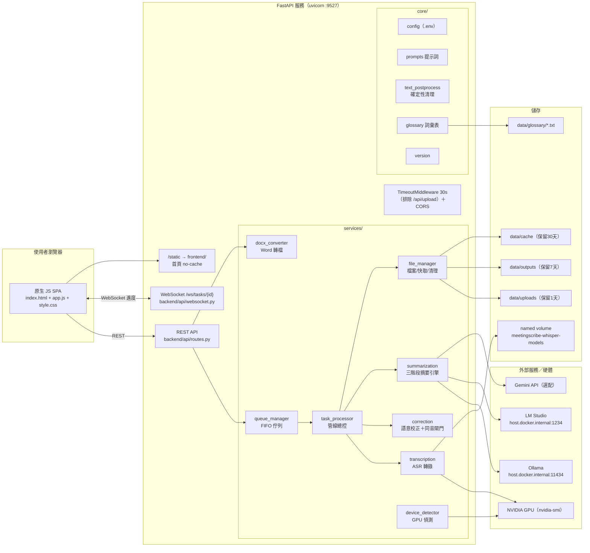
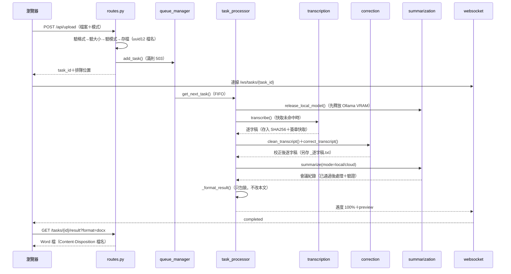
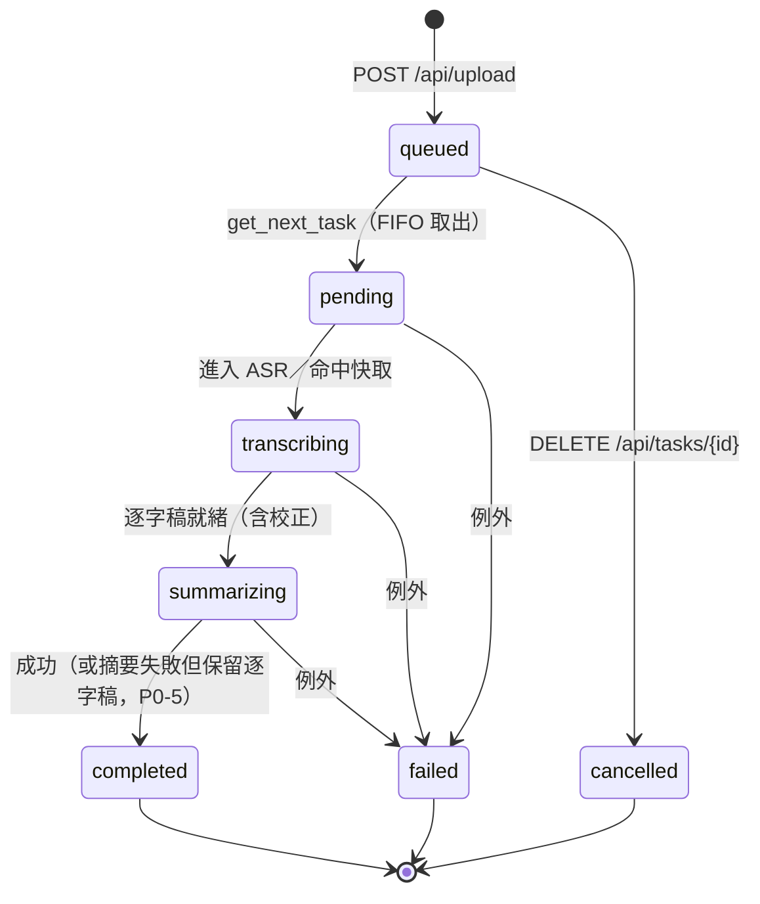
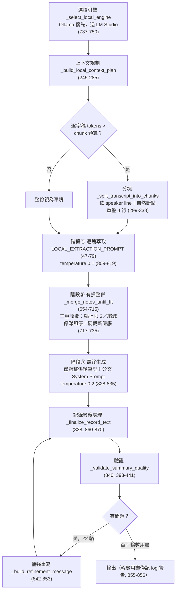
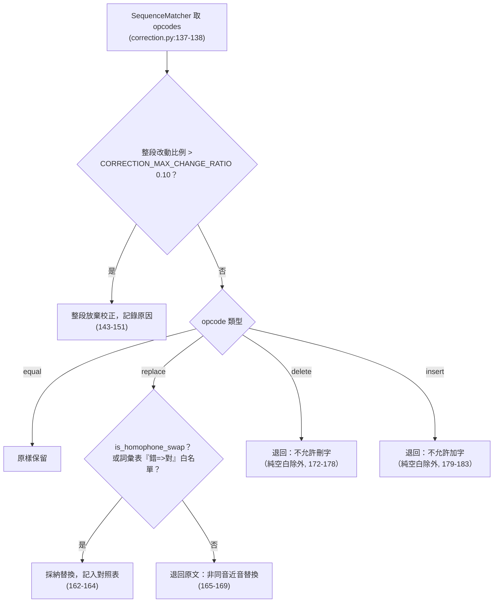
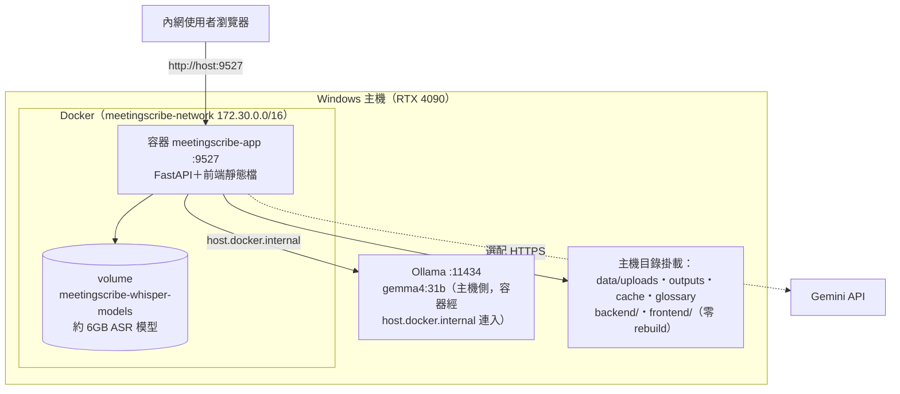

# 政府智慧會議紀錄生成系統 — 系統架構與程式設計書

| 項目 | 內容 |
| :--- | :--- |
| 文件版本 | v4.5.0 |
| 文件日期 | 2026-07-20 |
| 系統版本 | 4.5.0（唯一來源：根目錄 `VERSION` 檔，經 `backend/core/version.py:15-26` 讀取） |
| 適用讀者 | 開發者、維護工程師 |
| 專案根目錄 | `D:\dev\convert` |

> 本文件所有技術細節均附 `檔案:行號` 引用，行號以 2026-07-14 的 `main` 分支（commit `e0054e3`）為準；
> v4.4.0 新增之會議模板系統見第 6.5 節（該節行號以 v4.4.0 為準）；
> v4.5.0 新增之科務會議模板與附件輸出見第 6.5 節末段。
> 已知不一致：`pyproject.toml:15` 的 `version = "4.2.0"` 未同步更新；系統實際版本一律以 `VERSION` 檔為準。

---

## 目錄

1. [文件目的與範圍](#1-文件目的與範圍)
2. [系統總覽](#2-系統總覽)
3. [整體架構圖與目錄結構](#3-整體架構圖與目錄結構)
4. [模組職責詳解](#4-模組職責詳解)
5. [處理管線資料流](#5-處理管線資料流)
6. [摘要生成引擎：萃取式三階段](#6-摘要生成引擎萃取式三階段)
7. [逐字稿語意校正與同音閘門](#7-逐字稿語意校正與同音閘門)
8. [防杜撰與品質驗證機制](#8-防杜撰與品質驗證機制)
9. [API 規格](#9-api-規格)
10. [設定系統](#10-設定系統)
11. [GPU 資源管理](#11-gpu-資源管理)
12. [前端設計](#12-前端設計)
13. [部署架構](#13-部署架構)
14. [測試策略](#14-測試策略)
15. [重要設計決策記錄（ADR）](#15-重要設計決策記錄adr)
16. [附錄：file:line 速查表](#16-附錄fileline-速查表)

---

## 1. 文件目的與範圍

本文件是「政府智慧會議紀錄生成系統」的權威技術設計書，目的：

- 讓新進開發者能在不逐行讀碼的情況下，掌握系統的整體架構、模組邊界與資料流。
- 讓維護工程師遇到問題時，能循 `檔案:行號` 引用直接定位到對應程式碼。
- 記錄關鍵設計決策（第 15 章 ADR），避免後人「不明就裡地改回去」。

**範圍**：涵蓋後端（`backend/`）、前端（`frontend/`）、部署（`docker/`、`scripts/`）、測試（`tests/`）與設定系統。舊版 CLI（根目錄 `main.py`、`src/`）與封存目錄（`archive/`、`Faster-Whisper-XXL/`）不在本文件範圍內，僅在與後端有互動處（如 `config.yaml` 的歸屬）提及。

---

## 2. 系統總覽

### 2.1 系統目標

公務機關同仁上傳會議錄音（或影片）後，系統自動產出：

1. **逐字稿**（純文字 `.txt`，經確定性清理與語意校正）。
2. **符合臺灣公文格式的會議紀錄**（Markdown `.md` 與 Word `.docx`），欄位含會議名稱／時間／地點／主席／出席與列席人員／報告事項／討論事項（案由、說明、各單位意見、決議）／主席裁示事項（主辦單位、辦理期程），格式由系統提示詞強制（`backend/core/prompts.py:33-55`）。

核心價值主張是「**有憑有據、不杜撰**」：凡逐字稿未明確提及的人名、單位、日期、數字，一律標示「（待確認）」或「逐字稿未提及」，嚴禁推測補寫（`backend/core/prompts.py:18-21`）。

### 2.2 兩大設計堅持

| 設計堅持 | 落實機制 | 主要程式位置 |
| :--- | :--- | :--- |
| **忠於逐字稿＋防杜撰** | 提示詞層忠實性規則、萃取式三階段摘要（先抽事實再組稿）、14 區塊結構驗證＋待辦召回檢查、語意校正的同音驗證閘門（非同音近音替換一律退回） | `prompts.py:13-21`、`summarization.py:782-858`、`summarization.py:393-441`、`correction.py:129-185` |
| **可離線、保隱私** | 預設本地模式（Ollama／LM Studio 本地 LLM＋本地 ASR），資料不出主機；雲端模式（Gemini API）為選配，未設 API Key 時前端雲端卡自動停用 | `config.py:89`（`DEFAULT_MODE=local`）、`routes.py:132-136`、`app.js:124-131` |

### 2.3 技術棧

| 層次 | 技術 | 版本／設定依據 |
| :--- | :--- | :--- |
| Web 框架 | FastAPI ＋ uvicorn（埠 9527） | `backend/main.py:97-102`、`backend/main.py:150-157` |
| 前端 | 原生 JavaScript SPA（無框架）、單一 HTML＋CSS＋JS | `frontend/index.html`、`frontend/js/app.js`（866 行）、`frontend/css/style.css`（337 行） |
| ASR | Transformers 路徑：MediaTek-Research/Breeze-ASR-26（revision 鎖定 `949c87b…`）；回滾路徑：faster-whisper ＋ Breeze-ASR-25 | `config.py:154-157`、`asr_model_resolver.py:15-16`、`transcription.py:126-136` |
| 本地 LLM | Ollama（預設 `gemma4:31b`）優先，LM Studio（OpenAI 相容 API）備援 | `config.py:48-58`、`summarization.py:737-750` |
| 雲端 LLM | Gemini API（OpenAI 相容端點，預設 `gemini-3.5-flash-lite`） | `config.py:76-80` |
| 語意校正 | pypinyin 同音比對＋OpenCC s2twp 簡繁正規化 | `correction.py:74-77`、`text_postprocess.py:37-49` |
| 文件輸出 | python-docx（Markdown → 公文格式 Word） | `docx_converter.py` |
| 部署 | Docker Compose（標準版／Windows GPU 版）＋ named volume 模型持久化 | `docker/docker-compose.yml`、`docker/docker-compose-windows-gpu.yml` |
| 設定 | pydantic-settings（環境變數 / `.env`） | `config.py:18-317` |

---

## 3. 整體架構圖與目錄結構

### 3.1 整體架構圖



### 3.2 目錄結構

```text
D:\dev\convert
├── VERSION                     # 版本唯一來源（4.3.3）
├── backend/                    # 後端服務（本文件主要範圍）
│   ├── main.py                 # FastAPI 進入點、lifespan、中間件、路由掛載
│   ├── api/
│   │   ├── routes.py           # 12 個 REST 端點（prefix=/api）
│   │   └── websocket.py        # WebSocket 進度推播、ConnectionManager
│   ├── core/
│   │   ├── config.py           # pydantic-settings 設定（僅讀環境變數/.env）
│   │   ├── prompts.py          # 公文格式系統提示詞、校正提示詞
│   │   ├── text_postprocess.py # 確定性清理、記錄級後處理
│   │   ├── glossary.py         # 機關詞彙表（hotwords/白名單/校正 few-shot）
│   │   ├── asr_model_resolver.py # ASR 後端推斷、revision 鎖定、快取簽章
│   │   ├── platform_config.py  # 平台偵測；config.yaml 僅由此供 LM Studio 讀取
│   │   ├── logger.py           # loguru 日誌
│   │   └── version.py          # VERSION 檔讀取
│   ├── middleware/
│   │   └── timeout.py          # 30 秒請求逾時中間件
│   ├── models/
│   │   └── schemas.py          # TaskStatus 8 狀態、ProgressMessage 等
│   └── services/
│       ├── task_processor.py   # 管線總控（轉錄→校正→摘要→組稿）
│       ├── queue_manager.py    # FIFO 佇列
│       ├── transcription.py    # ASR（transformers / faster-whisper 雙路徑）
│       ├── correction.py       # 語意校正＋同音閘門
│       ├── summarization.py    # 摘要引擎（1,623 行，系統核心）
│       ├── file_manager.py     # 上傳/快取/輸出/排程清理
│       ├── device_detector.py  # GPU 偵測（存在 vs 忙碌）
│       └── docx_converter.py   # Markdown → 公文格式 Word
├── frontend/                   # 原生 JS SPA
│   ├── index.html              # 單頁（三步驟流程列＋狀態列＋三張卡）
│   ├── css/style.css           # 政府藍設計系統
│   └── js/app.js               # 全部前端邏輯（866 行）
├── docker/
│   ├── Dockerfile              # 標準版（python:3.11-slim）
│   ├── Dockerfile.gpu          # GPU 版（nvidia/cuda:12.3.2-cudnn9）
│   ├── docker-compose.yml      # 標準版 compose
│   ├── docker-compose-windows-gpu.yml  # Windows GPU 版 compose
│   └── docker-compose.override.yml     # 開發熱重載（標準版自動載入）
├── data/
│   ├── glossary/               # 機關詞彙表 *.txt
│   ├── uploads/ outputs/ cache/  # 執行期資料（volume 掛載）
├── scripts/                    # 啟停/部署/驗證腳本（windows/ macos/）
├── tests/                      # pytest 測試（304 個 test 函式）
├── doc/                        # 文件（操作手冊、規格與設計）
├── config.yaml                 # ⚠️ 僅供舊版 CLI；後端服務不讀取（config.yaml:1-10）
├── main.py / src/              # 舊版 CLI（不在本文件範圍）
├── requirements.txt / requirements-correction.txt
├── pyproject.toml / uv.lock    # 開發機環境（uv）
└── .github/                    # 僅 copilot 說明文件；workflows/ 為空（無 CI）
```

---

## 4. 模組職責詳解

### 4.1 backend/main.py — 服務進入點

| 職責 | 說明 | 位置 |
| :--- | :--- | :--- |
| lifespan 啟動 | 依序：裝置偵測 `device_detector.detect_best_device()` → 背景啟動 `task_processor.start()` → 啟動檔案清理排程 `file_manager.start_cleanup_scheduler()` → 啟動即清理一次過期檔案 | `main.py:31`、`main.py:35`、`main.py:38`、`main.py:41-43` |
| 啟動日誌明示生效設定 | P0-3(c)：啟動時完整列出「實際生效」的 ASR/LLM/校正參數，並明示來源為「環境變數 / .env，非 config.yaml」，杜絕改 `config.yaml` 不生效的除錯黑洞 | `main.py:50-76` |
| 逾時中間件 | `TimeoutMiddleware` 30 秒，排除 `/api/upload`（大檔上傳不受限） | `main.py:105-109`、`middleware/timeout.py:17-83` |
| CORS | 預設 `*`（內網部署），此時依規範停用 credentials；生產以 `ALLOWED_ORIGINS` 指定 | `main.py:111-121`、`config.py:262-269` |
| WebSocket 端點 | `/ws/tasks/{task_id}` 轉交 `websocket_endpoint` | `main.py:127-130` |
| 靜態檔與首頁 | `/static` → `frontend/`；`GET /` 回傳 `index.html` 並加 `Cache-Control: no-cache, must-revalidate`（改版免 Ctrl+F5） | `main.py:133`、`main.py:136-147` |
| 監聽 | uvicorn `0.0.0.0:9527` | `main.py:150-157` |
| 關閉收尾 | 停清理排程 → 停任務處理器 → 取消背景 task | `main.py:80-93` |

### 4.2 backend/api/ — 對外介面

- **routes.py**：12 個 REST 端點（`prefix=/api`，`routes.py:29`），詳見第 9 章。
- **websocket.py**：
  - `STATUS_LABELS`：8 個任務狀態的中文標籤（v4.3.2 起推送給使用者的狀態一律中文，`websocket.py:19-28`）。
  - `ConnectionManager`：以 `task_id` 分組管理連線、送訊息、清理失效連線、廣播排隊更新（`websocket.py:59-129`）。
  - `websocket_endpoint`：連上先推當前狀態（完成任務附結果預覽）→ 迴圈中 30 秒逾時就推最新狀態 → `ping`/`pong` 心跳 → 任務進終態（completed/failed/cancelled）即關閉（`websocket.py:136-227`）。

### 4.3 backend/services/ — 業務核心

| 模組 | 職責 | 關鍵位置 |
| :--- | :--- | :--- |
| `task_processor.py` | 管線總控：把「轉錄→確定性清理→語意校正→摘要→組稿存檔」串成完整流程並推播進度；摘要失敗不偽裝成功（P0-5） | `_process_task`：`task_processor.py:169-256` |
| `queue_manager.py` | FIFO 佇列：`deque`＋`asyncio.Lock`＋`asyncio.Event`；佇列滿回 `None`；`MAX_CONCURRENT_TASKS`（預設 1）序列化保護單卡 | `queue_manager.py:24-30`、`queue_manager.py:47-51`、`queue_manager.py:88-91` |
| `transcription.py` | ASR 雙路徑（transformers / faster-whisper）、VRAM 檢查、GPU 失敗自動降級 CPU 重試、hotwords 注入 | `transcription.py:87-124`、`transcription.py:434-481` |
| `correction.py` | 逐字稿選擇性 LLM 校正＋同音驗證閘門（第 7 章） | `correction.py:104-185` |
| `summarization.py` | 摘要引擎（1,623 行）：本地三階段、雲端兩段式、品質驗證與補強、Ollama VRAM 釋放、模型名智能解析（第 6、8、11 章） | `summarization.py:41-1623` |
| `file_manager.py` | 上傳驗證（防路徑遍歷/空字節）、UUID 檔名、SHA256＋簽章之 ASR 快取、逐字稿/結果儲存、每日 3:00 排程清理（uploads 1 天 / outputs 7 天 / cache 30 天） | `file_manager.py:39-41`、`file_manager.py:51-76`、`file_manager.py:132-141`、`file_manager.py:338-370` |
| `device_detector.py` | GPU 偵測：「存在」與「忙碌」分離（第 11 章） | `device_detector.py:43-136`、`device_detector.py:179-200` |
| `docx_converter.py` | Markdown → Word：公文結構辨識、表格完整框線、CJK 字型 | `docx_converter.py:38-43`、`docx_converter.py:296-401` |

### 4.4 backend/core/ — 共用基礎

| 模組 | 職責 | 關鍵位置 |
| :--- | :--- | :--- |
| `config.py` | pydantic-settings 全域設定（第 10 章）；檔頭即聲明 config.yaml 對後端無效 | `config.py:4-6`、`config.py:310-313` |
| `prompts.py` | `MEETING_RECORD_SYSTEM_PROMPT` 公文格式＋防杜撰提示詞（`prompts.py:7-55`）；`TRANSCRIPT_CORRECTION_SYSTEM_PROMPT` 只修同音近音（`prompts.py:71-88`）；`build_correction_user_message` 組校正訊息（`prompts.py:91-99`） | — |
| `text_postprocess.py` | 確定性清理（OpenCC s2twp、幻覺黑名單、重複去重、公務用字白名單）與記錄級後處理（英文清理、結構補全）；一律在「驗證前」執行（P1-9） | `text_postprocess.py:179-197`、`text_postprocess.py:295-373` |
| `glossary.py` | 機關詞彙表：`data/glossary/*.txt`、一行一詞、`#` 註解、支援「錯=>對」已知誤辨；排序即 hotwords 優先序；`english_protected_terms()` 保護 AI/API/Ollama 等英文專名不被英文清理誤刪 | `glossary.py:46-86`、`glossary.py:89-102`、`glossary.py:105-108` |
| `asr_model_resolver.py` | ASR 後端推斷（auto 時依模型名判斷）、Breeze-ASR-26 revision 自動鎖定 `949c87bca9dbe90e160cf739460cc765e80805f3`、快取簽章 `sha256(backend::model::revision)[:16]`、safetensors 安全下載白名單 | `asr_model_resolver.py:63-71`、`asr_model_resolver.py:16`、`asr_model_resolver.py:74-88` |
| `platform_config.py` | 平台偵測（macos/windows/docker）；讀取 `config.yaml`＋`config.{platform}.yaml`——**僅**供 LM Studio 參數與舊版 CLI 使用 | `platform_config.py:68-110` |
| `version.py` | 讀根目錄 `VERSION` 檔，失敗回退 `0.0.0` | `version.py:15-26` |

### 4.5 backend/models/schemas.py — 資料模型

- `TaskStatus`：8 狀態 enum（`schemas.py:15-24`）。
- `ProcessingMode`：`local` / `cloud`（`schemas.py:27-30`）。
- `TaskInfo`／`QueueStatus`／`UploadResponse`／`HealthStatus`／`ProgressMessage`（欄位見第 9 章）。

### 4.6 frontend/ — 前端

單一頁面應用，無建置工具、無外部 CDN；詳見第 12 章。

---

## 5. 處理管線資料流

### 5.1 端對端流程



### 5.2 管線步驟與進度百分比區間表

| 進度 | 階段（前端顯示訊息） | TaskStatus | 程式位置 |
| :--- | :--- | :--- | :--- |
| 5% | 準備處理 | PENDING | `task_processor.py:177` |
| 10% | 載入 Whisper 模型… | TRANSCRIBING | `task_processor.py:113` |
| 5% / 15% / 60% | 轉錄服務內部回報（載入模型→開始轉錄→轉錄完成，原值透傳） | TRANSCRIBING | `transcription.py:450-464` |
| 60% | 快取命中：使用快取逐字稿（直接跳 60） | TRANSCRIBING | `task_processor.py:104-107` |
| 62% | 語意校正逐字稿（同音錯字/專有名詞）… | TRANSCRIBING | `task_processor.py:156` |
| 65% | 生成摘要 | SUMMARIZING | `task_processor.py:199`、`summarization.py:199` |
| 68→80%（本地） | 萃取逐字稿重點 i/n（68 + (i−1)/n × 12） | SUMMARIZING | `summarization.py:809-811` |
| 68→82%（雲端） | 萃取逐字稿重點（雲端）i/n（68 + 完成比 × 14） | SUMMARIZING | `summarization.py:1170-1175` |
| 75→84%（本地） | 整併萃取筆記 第 r 輪（min(84, 75+組序)） | SUMMARIZING | `summarization.py:695-700` |
| 86%（本地）/ 84%（雲端） | 整理最終會議記錄… | SUMMARIZING | `summarization.py:828`、`summarization.py:1212` |
| 86→94%（雲端） | 雲端回應接收中…（串流每 5 個 chunk 前進，86 + min(chunks/10, 8)） | SUMMARIZING | `summarization.py:1284-1289` |
| 88+n%（本地）/ 94%（雲端） | 補強摘要完整性（第 n 輪）…（雲端固定 94% 防倒退） | SUMMARIZING | `summarization.py:844`、`summarization.py:1229-1235` |
| 95% | 摘要生成完成 | SUMMARIZING | `summarization.py:214` |
| 100% | 完成（或「完成（⚠️ 僅逐字稿，會議紀錄生成失敗）」） | COMPLETED | `task_processor.py:235-241` |

### 5.3 任務 8 狀態機

狀態定義於 `schemas.py:15-24`，中文標籤於 `websocket.py:19-28`：

| 狀態 | 中文標籤 | 進入時機 |
| :--- | :--- | :--- |
| `queued` | 排隊等候中 | 上傳成功入列（`queue_manager.py:61-75`） |
| `pending` | 準備處理中 | 從佇列取出（`queue_manager.py:100-105`） |
| `uploading` | 檔案上傳中 | enum 保留值；目前後端管線不主動設定（上傳於入列前同步完成），僅供顯示層對照 |
| `transcribing` | 語音轉錄中 | 進入 ASR／快取階段（`task_processor.py:106`、`task_processor.py:113`） |
| `summarizing` | 生成會議紀錄中 | 進入摘要階段（`task_processor.py:199`） |
| `completed` | 處理完成 | `complete_task(success=True)`（`queue_manager.py:114-133`） |
| `failed` | 處理失敗 | 管線任一步驟拋出未捕捉例外（`task_processor.py:245-256`） |
| `cancelled` | 已取消 | 使用者取消（僅限排隊中，`queue_manager.py:135-158`） |



> 注意：**摘要失敗 ≠ 任務失敗**。摘要引擎拋錯時任務仍走向 `completed`，但輸出標題改為「逐字稿（會議紀錄生成失敗）」並冠上 `SUMMARY_FAILED_BANNER` 顯著警告（`task_processor.py:31-34`、`task_processor.py:207-220`、`task_processor.py:297-302`）。只有轉錄等前置步驟失敗才進 `failed`。

### 5.4 ASR 快取

- 快取鍵：檔案內容 SHA256（`file_manager.py:124-130`）＋ `cache_signature`（`sha256("backend::model::revision")[:16]`，`asr_model_resolver.py:74-80`）。換模型、換後端或換 revision 都會自然失效，不會誤用舊模型的逐字稿。
- 命中：直接推進到 60%，跳過 ASR（`task_processor.py:100-107`）。
- 未命中：先呼叫 `summarization_service.release_local_model()` 請 Ollama 卸載模型騰出 VRAM，再載入 ASR（`task_processor.py:109-111`，見第 11 章）。

---

## 6. 摘要生成引擎：萃取式三階段

`backend/services/summarization.py`（1,623 行）是系統核心。設計哲學：**先分塊萃取事實、再組合成公文**，而非把整份逐字稿一次丟給 LLM（原因見 ADR-1）。

### 6.1 本地路徑：`_summarize_with_local_pipeline`（`summarization.py:782-858`）



**上下文預算規劃**（`summarization.py:245-285`）：

| 預算 | 公式 | 位置 |
| :--- | :--- | :--- |
| `chunk_input_budget` | `min(max(1200, ctx − output − extraction_overhead), 3200)`；ctx＝`LOCAL_LLM_EFFECTIVE_CONTEXT_TOKENS`（預設 8192），output＝`LOCAL_LLM_RESERVED_OUTPUT_TOKENS`（預設 3072） | `summarization.py:254-260` |
| `notes_merge_budget` | `max(900, ctx − output − max(merge_overhead, final_overhead))`；**P0-6**：必須以「整併 prompt」與「最終生成（含補強會附上當前摘要）」兩者中較大的開銷計算，否則最終步驟輸入超過 `num_ctx` 會被 Ollama **靜默截斷** | `summarization.py:261-274` |

token 估算 `_estimate_tokens` 為中英混合保守估計（CJK 每字 1 token、拉丁詞 ×1.2，`summarization.py:232-243`）。

**Ollama 呼叫細節**（`_summarize_with_ollama`，`summarization.py:890-1017`）：

- `keep_alive` 採設定值（預設 `10m`，`config.py:106-109`）：三階段流程連續呼叫十數次，`keep_alive=0` 會導致每階段重載 20GB 模型（P0-7 註解：`summarization.py:934-936`）。
- gemma4 是思考型模型，thinking 會吃光 `num_predict` 導致正文為空 → 預設帶 `think: false`；模型不支援該參數回 400 時，自動改以不帶 `think` 欄位重送（`summarization.py:920-959`）。
- 空回應自動重試一次並升溫（`temperature → max(t, 0.3)`，`summarization.py:926-939`）。
- 404（模型不存在）時列出主機可用模型與 `ollama pull` 建議指令（`summarization.py:989-1011`）。
- 模型名智能解析 `_resolve_compatible_model`：4 個策略（正規化量化後綴同名 → 同家族前綴 → 同家族 `:latest` → 任一同家族），設定 `gemma4:31b` 而主機裝 `gemma4:31b-it-q4_K_M` 時自動對上（`summarization.py:1408-1470`）；生效名經 `get_effective_local_model()` 提供給 `/api/config` 供前端顯示（`summarization.py:1501-1503`、`routes.py:374`）。

### 6.2 雲端路徑：`_summarize_with_gemini`（`summarization.py:1190-1251`，v4.3.3 根治）

歷史根因（v4.3.2 實測雲端仍輸給地端）：整份逐字稿「單發萃取」會被模型壓成一頁筆記——LLM 輸出長度不隨輸入等比放大；第二段生成又只看筆記，第一段丟失的立場、理由、數據永遠救不回來（`summarization.py:1199-1206`）。v4.3.3 的三個根治手段：

1. **分段併發萃取** `_extract_notes_with_gemini`（`summarization.py:1136-1188`）：
   - 沿用地端實證分塊密度 `CLOUD_LLM_CHUNK_TOKENS=3200`（`config.py:81-84`）切塊。
   - `asyncio.Semaphore(CLOUD_LLM_MAX_CONCURRENT_REQUESTS=3)` 併發限流（`summarization.py:1156`、`config.py:85-88`）。
   - 提示詞用 `CLOUD_EXTRACTION_PROMPT`＝本地萃取規則＋雲端豐富度強制規則（各方立場/理由/數據/實例必留、嚴禁壓縮成單句、筆記長度無上限）（`summarization.py:85-90`）。
   - 單塊失敗重試一次（`summarization.py:1163-1169`）；`asyncio.gather(..., return_exceptions=True)` 讓失敗時其餘協程收尾後才拋首個例外，避免 unretrieved exception 與 API 配額浪費（`summarization.py:1178-1186`）。
   - 分段筆記**零損串接**（`"\n\n---\n\n".join`，`summarization.py:1187`）——雲端上下文充足，不需要地端的有損整併。
2. **雙輸入生成** `_build_cloud_summary_message`（`summarization.py:593-613`）：最終生成同時餵「萃取筆記（涵蓋度檢查表）＋原始逐字稿（細節來源）」；補強輪也附逐字稿（`_build_cloud_refinement_message`，`summarization.py:615-631`）——「內容過短」這類豐富度問題必須回原文找細節才補得回來。
3. **動態長度下限** `_estimate_cloud_min_summary_chars`（`summarization.py:1125-1134`）：`min_chars = max(250, min(2000, transcript_tokens // 15))`。校準依據 0708 實測：103 分鐘會議 ≈ 1.8 萬 tokens → 下限約 1,200 字，恰可攔截曾發生的 855 字過薄輸出；上限 2000 避免灌水要求，下限 250 維持防空底線。

`_gemini_chat`（`summarization.py:1253-1304`）：AsyncOpenAI 相容客戶端、串流接收、串流進度區間 86–94%（v4.3.3 起，避免與萃取階段 68–84% 進度倒退衝突，`summarization.py:1284-1289`）。

### 6.3 本地 vs 雲端路徑完整對照

| 面向 | 本地（Ollama / LM Studio） | 雲端（Gemini） |
| :--- | :--- | :--- |
| 入口 | `_summarize_with_local_pipeline`（`summarization.py:782-858`） | `_summarize_with_gemini`（`summarization.py:1190-1251`） |
| 分塊依據 | 動態預算 `chunk_input_budget`（1200–3200 tokens，`summarization.py:259-260`） | 固定 `CLOUD_LLM_CHUNK_TOKENS=3200`（`summarization.py:1148-1150`） |
| 萃取方式 | 逐塊**循序**（單卡 GPU 序列化） | 逐塊**併發**（Semaphore=3，`summarization.py:1156`） |
| 萃取提示詞 | `LOCAL_EXTRACTION_PROMPT`（`summarization.py:47-79`） | `CLOUD_EXTRACTION_PROMPT`＝本地版＋豐富度強制規則（`summarization.py:85-90`） |
| 筆記整併 | **有損整併** `_merge_notes_until_fit`（輪上限 3、停滯偵測、硬截斷，`summarization.py:654-735`） | **零損串接** join（`summarization.py:1187`） |
| 最終生成輸入 | 僅整併後筆記（context 有限，`summarization.py:829-835`） | 筆記＋**原始逐字稿**雙輸入（`summarization.py:1213-1222`） |
| 長度下限 | 固定 250 字（`summarization.py:397`） | 動態 `max(250, min(2000, tokens//15))`（`summarization.py:1125-1134`） |
| 補強輪 | ≤ `LOCAL_LLM_MAX_REFINEMENT_ROUNDS`（2），輸入＝筆記（`summarization.py:841-853`） | 同上限 2 輪，輸入＝筆記＋逐字稿（`summarization.py:1226-1246`） |
| 進度區間 | 萃取 68–80、整併 75–84、生成 86、補強 88+n | 萃取 68–82、生成 84、串流 86–94、補強固定 94 |
| 失敗處理 | 空回應重試＋升溫、404 列可用模型（`summarization.py:920-1011`） | 單塊重試一次、gather 收尾後拋例外（`summarization.py:1163-1186`） |

共通不變式：**後處理（`_finalize_record_text`）永遠在驗證之前執行；驗證通過後任何流程不得再改寫本文**（P1-9，`summarization.py:836-838`、`task_processor.py:266-273`）。

### 6.5 會議模板系統（v4.4.0）

紀錄格式自 v4.4.0 起由**會議模板註冊表**（`backend/core/templates.py`）驅動，
取代原先分散寫死在四個檔案的公文格式常數。設計參考姊妹專案 `D:\dev\local`
的「domain 知識模組」模式：prompt 知識與程式端偵測共用同一組常數，永不漂移。

**`MeetingTemplate`（frozen dataclass）欄位一覽**：

| 欄位 | 用途 | 消費端 |
| :--- | :--- | :--- |
| `system_prompt` | 生成系統提示詞（`None`＝延遲讀取 `settings.DEFAULT_SYSTEM_PROMPT`，env 覆寫仍生效） | `summarize()` |
| `extraction_prompt_extra` | 萃取階段增補規則（附加於 LOCAL/CLOUD 共用基底之後） | `_local/_cloud_extraction_prompt()` |
| `generation_message_extra` | 最終生成／補強訊息增補 | 各 message builder |
| `required_section_patterns`／`extra_field_patterns` | 結構驗證：缺少即列入補強問題 | `_validate_summary_quality()` |
| `forbidden_patterns` | **機敏洩漏檢查**：命中即觸發補強重寫 | 同上 |
| `record_header_fields`／`record_sections` | 記錄級骨架補全（缺漏補「（待確認）」） | `text_postprocess.ensure_record_structure()` |
| `docx_section_pattern`／`docx_label_pattern` | Word 公文層次辨識 | `docx_converter.convert(template_id=…)` |
| `glossary_terms`／`glossary_corrections` | 領域術語表（**僅注入 LLM 校正層**，不進 ASR hotwords 以免污染逐字稿快取簽章） | `correction.correct_transcript(extra_glossary_block=…)` |
| `local_only` | 機敏會議強制本地：前端鎖定雲端卡＋後端 upload 400 | `routes.py` upload、前端 `selectTemplate()` |
| `attachment`（v4.5.0） | 附件定義（`AttachmentSpec`）：由本文 md 確定性建構第二份 docx | `routes.py` result 端點 `doc=attachment`、前端附件按鈕 |
| `form_layout`（v4.6.0） | 表單式 DOCX 版面（`FormLayoutSpec`）：宣告式描述官方表格版面，由本文 md 確定性抽欄位組表 | `docx_converter.convert()` 表單分支 |

**內建模板**：
1. `general`——現行公文格式，預設值；所有樣式自 v4.3.3 常數原樣搬入，行為
   byte-identical（`tests/test_templates.py` golden 回歸把關）。
2. `procurement_evaluation`——採購評選會（`backend/core/prompt_templates/procurement.py`）：
   - 結構對齊工程會「最有利標簽辦文件範例 6-3」（壹～拾陸），欄位符合
     採購評選委員會審議規則 §11 法定 12 款記載事項
   - 委員匿名（「委員提問」）／廠商實名；詢答「委員提問：／廠商答詢：」成對記載
   - 機敏防護：個別委員評分（最有利標評選辦法 §20）、底價（採購法 §34）
     不入紀錄；`forbidden_patterns` 掃描數字洩漏，命中即補強重寫
   - `local_only=True`：僅限本地 GPU 處理
3. `section_meeting`——科務會議（v4.5.0，`backend/core/prompt_templates/section_meeting.py`）：
   - 格式逐段對齊使用者提供之官方範本：開頭欄位（時間／地點／主持人＋紀錄
     ／出席人員）→ 歷次列管案件 → 決議事項辦理情形彙整表（Markdown 四欄
     表格：案由及承辦單位｜辦理情形｜解除列管｜繼續列管）→ 三層條列
     （一、→（一）→1.）→ 散會
   - 交辦事項每項一列入彙整表；「辦理情形」欄只填承辦股／同仁名＋全形冒號；
     指示來源辨識（科長本人 vs 轉述局長／副局長／局務會議）；人名實名照逐字稿
   - **附件輸出**：`attachment=AttachmentSpec(label=列管資料)`——
     `build_tracking_attachment()` 由本文 md 抽出兩張列管表格組成附件
     （程式確定性抽取、不靠 LLM 二次生成，保證本文與附件一致；
     缺段補「（待確認）」骨架＋warning，永不拋例外）
4. `isms_monthly`——ISMS 月工作會議（v4.6.0，`backend/core/prompt_templates/isms_meeting.py`）：
   - 格式逐段對齊使用者提供之官方範本（機關「會議記錄表」表格式版面）：
     置中標題＋勾選行（■月工作會議）→ 主表格八列（專案名稱／會議議題／
     地點·主席／日期·記錄／參加人員／內容／追蹤事項／決議事項＋臨時動議
     同格）→ 簽到表（機關科室｜廠商公司＋簽名空列）
   - LLM 輸出十四個標籤欄位的標籤式 Markdown（好生成、好驗證、好補骨架）；
     `extract_form_fields()` 確定性抽出欄位 dict（容錯全形空白標籤與全半形
     冒號、水平線後逐字稿附錄不吞入欄位、缺漏填「（待確認）」、永不拋例外）
   - **表單式 DOCX**（`form_layout=FormLayoutSpec`）：`docx_converter`
     依宣告式 spec 渲染官方表格版面（固定欄格線 `tblLayout fixed`、XML 框線、
     span 水平合併、簽名列最小列高）；`applicability_pattern` 未命中本文
     （如摘要失敗 result 為逐字稿）或渲染例外時退回一般段落渲染，
     convert 永不因表單版面拋例外
   - 人名／廠商實名照逐字稿；日期採民國點分＋週別（例：115.07.28（二））；
     `local_only=False`（會議本身即有外部廠商顧問參與）

**請求路徑**：前端選單（`/api/config` 的 `meeting_templates` 動態渲染）→
`POST /api/upload` 的 `meeting_template` Form 參數（驗證＋local_only 強制）→
`TaskInfo.template_id` → `task_processor` → `summarize(template_id=…)`。

**附件下載路徑**（v4.5.0）：`GET /api/tasks/{id}/result?format=docx&doc=attachment`
→ 讀本文 md → `template.attachment.build_markdown()` → `docx_converter.convert()`
（`{base}_{task_id}_attachment.docx`，沿用 mtime 快取）；無附件模板→400、
非 docx→400。前端附件按鈕依任務狀態 API 回傳的 `template_id` 顯示
（不信前端選單狀態，避免上傳後切換選單造成錯配）。

**新增一種會議類型的步驟**：① 在 `backend/core/prompt_templates/` 新增
prompt 模組 ② 在 `templates.py` 的 `_TEMPLATES` 註冊一筆 `MeetingTemplate`
③ 完成——驗證、後處理、Word 輸出、前端選單（含附件按鈕）全部自動生效，
其他檔案零改動。v4.5.0 的科務會議模板即為此流程的首次實證
（新增 prompt 模組＋註冊一筆；附件屬新基礎設施，為一次性投資）。
若官方範本為表格式版面，另在 `templates.py` 宣告一筆 `FormLayoutSpec`
（純資料，渲染器已於 v4.6.0 一次性建置於 `docx_converter`，同附件先例）。

---

## 7. 逐字稿語意校正與同音閘門

`backend/services/correction.py`。設計依據：中文 ASR 錯誤以**同音替換**為壓倒性主體，naive 全文改寫有品質劣化實證（`correction.py:1-11`）。與摘要管線完全解耦，可用 `ENABLE_TRANSCRIPT_CORRECTION` 獨立開關。

### 7.1 四層機制

| 層 | 機制 | 位置 |
| :--- | :--- | :--- |
| 第 1 層 | 機關詞彙表注入 ASR 解碼（faster-whisper `hotwords` 每視窗生效；transformers 併入 initial prompt） | `glossary.py:1-10`、`transcription.py:262-276`、`transcription.py:306-319` |
| 第 2 層 | 確定性清理 `clean_transcript`：OpenCC s2twp（僅轉換偵測到簡體的行，防「干預→幹預」誤傷）→ Whisper 幻覺黑名單（「請訂閱」「字幕由…提供」等）→ 連續重複句去重 → 公務用字白名單 | `text_postprocess.py:179-197`、`text_postprocess.py:52-74`、`text_postprocess.py:94-118`、`text_postprocess.py:152-158` |
| 第 3 層 | 選擇性 LLM 校正：分段 → 帶前文與詞彙表 → 本地 LLM temperature 0.0 校正（提示詞只允許修同音近音錯字） | `correction.py:266-329`、`prompts.py:71-88`、`task_processor.py:156-164` |
| 第 4 層 | **同音驗證閘門** `gate_correction`：對 LLM 輸出逐 opcode 比對，非同音近音替換一律退回原文 | `correction.py:129-185` |

### 7.2 同音閘門判定流程



- `is_homophone_swap`（`correction.py:104-118`）：只允許純 CJK 且等長的替換；以 pypinyin 逐音節比對（`correction.py:74-77`）。
- `_syllables_near`（`correction.py:88-101`）：台灣口音容錯——聲母等價組 `zh/z`、`ch/c`、`sh/s`、`l/n`、`f/h`、`r/l`；韻母等價組 `in/ing`、`en/eng`、`an/ang` 等（`correction.py:28-34`）。
- 已知誤辨白名單：詞彙表 `錯=>對` 條目直接放行（`correction.py:121-126`）。

### 7.3 分段與範圍控制

- `_split_segments`（`correction.py:191-235`）：句界切 → 超長退以空白切 → 仍超長硬切，確保每段 ≤ `CORRECTION_MAX_SEGMENT_CHARS`（400，`config.py:130-133`）；否則 LLM 整段重寫會被閘門全退、白做工。
- `CORRECTION_SCOPE`（`config.py:126-129`）三檔：
  - `auto`（預設，實測建議值）：段落需命中詞彙表已知誤辨、或「注音 n-gram 模糊命中」（段內任一與詞彙表詞等長且拼音相近的視窗）才送 LLM（`correction.py:237-264`）。全文校正在長會議實測 69 分鐘、淨效益趨近 0（`docker-compose-windows-gpu.yml:106-109`）。
  - `all`：全部段落送校正。
  - `off`：停用（`task_processor.py:153-154`）。
- 所有採納的修改組成對照表 `CorrectionReport.to_markdown()`，僅記錄於 log 供人工複核，不進交付文件（`correction.py:58-71`、`task_processor.py:288-292`）。
- 任一步驟失敗不阻斷主流程，退回上一版逐字稿（`task_processor.py:137-167`）。

---

## 8. 防杜撰與品質驗證機制

四道防線，由前而後：

### 8.1 提示詞層（`backend/core/prompts.py`）

`MEETING_RECORD_SYSTEM_PROMPT`（`prompts.py:7-55`）核心規則：

- 回應第一個字元必須是「會議名稱：」；正文前嚴禁任何前言/分析/英文段落（`prompts.py:14`）。
- 忠實性最高原則：未明確提及之單位、人名、決議、數字、日期一律填「（待確認）」；嚴禁「推測」「可能是」「應為」等推論語句（`prompts.py:18-21`）。
- 禁止輸出簡體中文、`<think>`/`<thought>`/`<details>` 標籤、XML/HTML、code fence（`prompts.py:16`）。
- 臺灣公務用語與全形標點、中華民國紀年（`prompts.py:28-31`）。

### 8.2 驗證層：`_validate_summary_quality`（`summarization.py:393-441`）

| 檢查項 | 內容 | 位置 |
| :--- | :--- | :--- |
| 14 必要區塊 | 會議名稱/時間/地點、主席、出席/列席人員、記錄、一報告事項、二討論事項、案由、說明、各單位意見、決議、三主席裁示事項——容錯 regex（允許空格與全半形冒號差異，P1-8） | `summarization.py:376-391`、`407-409` |
| 主辦單位／辦理期程 | 必須存在 | `summarization.py:411-415` |
| 長度下限 | 本地固定 250 字；雲端動態下限（第 6.2 節） | `summarization.py:417-421` |
| 簡體漂移 | OpenCC 支援下的無歧義簡體字元表全字偵測（取代舊 45 字硬編碼） | `summarization.py:443-448`、`text_postprocess.py:30-34`、`77-86` |
| 非 Markdown 洩漏 | 思考標籤、HTML/XML、code fence | `summarization.py:450-462` |
| 英文／評分準則洩漏 | 英文前言慣用語、回吐提示詞評估標準、模板殘留、整行英文啟發式（單行英文詞 ≥6 且 CJK ≤2） | `summarization.py:464-505` |
| 待辦召回 | 從萃取筆記「待辦清單」表格**第一欄**抽關鍵字（`summarization.py:345-372`），正規化後以「包含」比對最終摘要——容許改寫補詞，避免逐字不符誤判遺漏 | `summarization.py:432-439` |

### 8.3 自動補強

驗證有問題 → 產生問題清單 → 要求模型「重新輸出完整版本，不要只輸出修補片段」，最多 `LOCAL_LLM_MAX_REFINEMENT_ROUNDS=2` 輪（本地：`summarization.py:841-853`；雲端帶逐字稿：`summarization.py:1226-1246`）。輪數用盡仍有問題僅記 log 警告，不阻斷輸出（`summarization.py:855-856`、`1248-1249`）。

### 8.4 記錄級後處理（驗證前執行，P1-9）

`finalize_record`（`text_postprocess.py:366-373`）依序：

1. `remove_english_segments`：刪英文比例過高的行；詞彙表英文專名（AI、API、Ollama…）白名單保護，「（待確認）」行豁免，刪除行為記入 log（`text_postprocess.py:230-267`）。
2. `sanitize_text_language`：常見英文詞彙替換為中文（Okay→好、Action Items→待辦事項…，`text_postprocess.py:213-227`、`270-275`）。
3. `to_taiwan_traditional`：OpenCC s2twp（`text_postprocess.py:52-74`）。
4. `ensure_record_structure`：缺漏公務欄位補「（待確認）」骨架（`text_postprocess.py:295-363`）。

順序不變式：**後處理 → 驗證 → （必要時補強後再後處理→再驗證）→ 之後任何流程不得改寫本文**。`task_processor._format_result` 只負責包裝標題與失敗警告（`task_processor.py:258-316`）。

### 8.5 摘要失敗不偽裝成功（P0-5）

摘要拋錯時：保留逐字稿輸出、標題改「# 逐字稿（會議紀錄生成失敗）」、冠 `SUMMARY_FAILED_BANNER` 警告＋失敗原因，任務仍標 `COMPLETED` 讓使用者至少拿到逐字稿（`task_processor.py:31-34`、`207-220`、`236`、`297-302`）。

---

## 9. API 規格

### 9.1 REST 端點（`backend/api/routes.py`，prefix=`/api`）

| # | 方法/路徑 | 功能 | 重點行為 | 位置 |
| :--- | :--- | :--- | :--- | :--- |
| 1 | `GET /health?quick=` | 健康檢查 | `quick=true` 用快取裝置資訊（防 GPU 滿載阻塞）；回版本、GPU、Ollama/LM Studio/Gemini 可用性、佇列狀態 | `routes.py:32-89` |
| 2 | `POST /upload` | 上傳檔案 | 驗格式（`file_manager.py:51-76`）→ 驗大小（413）→ 驗模式（400）→ 雲端模式檢查 API Key（400）→ 存檔（uuid4 前 12 碼檔名，`file_manager.py:108-110`）→ 入佇列；佇列滿刪檔回 503 | `routes.py:92-167` |
| 3 | `GET /tasks/{id}` | 查任務進度 | 不存在回 404；即時更新排隊位置 | `routes.py:170-186` |
| 4 | `GET /tasks/{id}/transcript` | 下載逐字稿 | 純文字 `.txt`；轉錄＋校正完成即產生，摘要失敗仍可下載；下載檔名 `YYYYMMDDhhmmss_逐字稿.txt` | `routes.py:189-210` |
| 5 | `GET /tasks/{id}/result?format=md\|docx` | 下載會議紀錄 | 僅 `COMPLETED` 可下；`docx` 動態轉檔＋mtime 快取（`.docx` 比 `.md` 舊才重轉）；下載檔名 `YYYYMMDDhhmmss_會議紀錄.{md,docx}` | `routes.py:213-293` |
| 6 | `DELETE /tasks/{id}` | 取消任務 | 僅排隊中可取消；處理中回 400 | `routes.py:296-320` |
| 7 | `GET /queue/status` | 佇列整體狀態 | 回 `QueueStatus` | `routes.py:323-328` |
| 8 | `GET /queue/position/{id}` | 查排隊位置 | 位置＋總排隊數＋預估等待 | `routes.py:331-349` |
| 9 | `GET /config` | 公開設定 | `max_file_size_mb`、`allowed_extensions`、`gemini_available`、`local_llm_model`（**解析後生效名**）、`cloud_llm_model`、ASR 模型與 revision 等——前端模式卡顯示唯一來源 | `routes.py:352-376` |
| 10 | `GET /storage/stats` | 儲存統計 | 各目錄檔數/大小＋保留政策 | `routes.py:379-390` |
| 11 | `POST /storage/cleanup` | 手動清理 | 僅清過期檔案 | `routes.py:393-402` |
| 12 | `GET /gemini/health?force_refresh=` | Gemini 連線檢查 | 24 小時快取（`summarization.py:110-114`、`1522-1572`）；`force_refresh=true` 強制重測 | `routes.py:405-437` |

另有非 API 路由：`GET /`（首頁，no-cache，`main.py:136-147`）與 `/static`（`main.py:133`）。

### 9.2 WebSocket 協定

- 端點：`ws(s)://host/ws/tasks/{task_id}`（`main.py:127-130`）。
- 連線即推當前狀態（任務已完成則附 `preview`）（`websocket.py:144-169`）。
- 伺服端 30 秒 `receive_text` 逾時 → 主動推最新狀態；任務進終態後推完即關閉（`websocket.py:172-218`）。
- 心跳：客戶端每 30 秒送 `"ping"`（`app.js:519-523`），伺服端回 `"pong"`（`websocket.py:181-186`）。

**ProgressMessage 欄位**（`schemas.py:67-77`）：

| 欄位 | 型別 | 說明 |
| :--- | :--- | :--- |
| `task_id` | str | 任務編號（uuid4 前 8 碼，`queue_manager.py:54`） |
| `status` | TaskStatus | 8 狀態之一 |
| `progress` | float | 0–100 |
| `stage` | str | 內部階段文字 |
| `message` | str | 顯示給使用者的訊息（狀態一律中文標籤） |
| `eta_seconds` | int? | 預估等待秒數 |
| `queue_position` | int? | 排隊位置 |
| `queue_total` | int? | 總排隊數 |
| `preview` | str? | 完成時的結果預覽（前 2,000 字，`websocket.py:51-52`） |

---

## 10. 設定系統

### 10.1 優先序與 config.yaml 的定位

```
環境變數  >  .env 檔  >  config.py 內的 Field 預設值
```

由 pydantic-settings 實作（`config.py:310-313`：`env_file=".env"`、`extra="ignore"`）。

**`config.yaml` 對後端服務完全無效**。三處明文聲明：

1. `config.py:4-6`（模組 docstring）。
2. `config.yaml:1-10`（檔頭紅字警告：「後端服務不讀取本檔案！」）。
3. `main.py:50-76`（啟動日誌明示「實際生效設定＝環境變數 / .env，非 config.yaml」）。

例外：LM Studio 參數（`llm.lmstudio.*`）與舊版 CLI 透過 `platform_config.py:68-110` 讀取 `config.yaml`＋`config.{platform}.yaml`（`summarization.py:129-142`、`1086-1094`）。理由見 ADR-3。

### 10.2 關鍵設定鍵表（皆可用環境變數覆蓋）

| 設定鍵 | 預設值 | 說明 | 位置 |
| :--- | :--- | :--- | :--- |
| `DEFAULT_MODE` | `local` | 預設處理模式 | `config.py:89` |
| `MAX_FILE_SIZE_MB` | 200 | 單檔上限 | `config.py:26` |
| `ALLOWED_EXTENSIONS` | `.mp3,.mp4,.wav,.m4a,.mkv,.webm,.ogg,.flac,.avi,.mov` | 允許副檔名 | `config.py:28-31` |
| `MAX_CONCURRENT_TASKS` | 1 | 同時處理任務數（單卡序列化） | `config.py:36` |
| `QUEUE_MAX_SIZE` | 50 | 佇列上限 | `config.py:37` |
| `TASK_TIMEOUT_SECONDS` | 3600 | 單一任務逾時 | `config.py:38` |
| `ESTIMATED_MINUTES_PER_TASK` | 4 | 排隊等待估算單位 | `config.py:39` |
| `OLLAMA_BASE_URL` | `http://host.docker.internal:11434` | Ollama 端點 | `config.py:44-47` |
| `LOCAL_LLM_MODEL` | `gemma4:31b` | 本地模型（可被智能解析替換為量化變體） | `config.py:48-51` |
| `LMSTUDIO_BASE_URL` / `LMSTUDIO_MODEL` | `http://host.docker.internal:1234/v1` / `gpt-oss-20b` | LM Studio 備援 | `config.py:54-58` |
| `GEMINI_API_KEY` | None | 雲端金鑰（格式驗證：≥10 字元、僅英數 `_-`） | `config.py:60-75` |
| `GEMINI_MODEL` | `gemini-3.5-flash-lite` | 雲端模型 | `config.py:80` |
| `CLOUD_LLM_CHUNK_TOKENS` | 3200 | 雲端萃取分塊大小（v4.3.3） | `config.py:81-84` |
| `CLOUD_LLM_MAX_CONCURRENT_REQUESTS` | 3 | 雲端萃取併發上限 | `config.py:85-88` |
| `LOCAL_LLM_EFFECTIVE_CONTEXT_TOKENS` | 8192 | 本地有效上下文預算（GPU compose 覆蓋為 16384） | `config.py:90-93` |
| `LOCAL_LLM_RESERVED_OUTPUT_TOKENS` | 3072 | 保留輸出預算（GPU compose 覆蓋為 2048） | `config.py:94-97` |
| `LOCAL_LLM_CHUNK_OVERLAP_LINES` | 4 | 分塊重疊行數 | `config.py:98-101` |
| `LOCAL_LLM_MAX_REFINEMENT_ROUNDS` | 2 | 補強輪上限（本地與雲端共用） | `config.py:102-105` |
| `LOCAL_LLM_KEEP_ALIVE` | `10m` | Ollama keep_alive（P0-7） | `config.py:106-109` |
| `LOCAL_LLM_MAX_MERGE_ROUNDS` | 3 | 筆記整併輪上限 | `config.py:110-113` |
| `LOCAL_LLM_DISABLE_THINKING` | True | 關閉思考型模型 thinking（gemma4 正文為空的根因修復） | `config.py:114-117` |
| `ENABLE_TRANSCRIPT_CORRECTION` | True | 語意校正開關 | `config.py:122-125` |
| `CORRECTION_SCOPE` | `auto` | auto／all／off | `config.py:126-129` |
| `CORRECTION_MAX_SEGMENT_CHARS` | 400 | 校正分段長度 | `config.py:130-133` |
| `CORRECTION_CONTEXT_CHARS` | 60 | 校正附帶前文長度 | `config.py:134-137` |
| `CORRECTION_MAX_CHANGE_RATIO` | 0.10 | 單段改動上限，超過整段放棄 | `config.py:138-141` |
| `GLOSSARY_DIR` | 空（＝`data/glossary`） | 詞彙表目錄 | `config.py:142-145`、`glossary.py:23-29` |
| `ASR_BACKEND` | `auto` | auto／transformers／faster_whisper | `config.py:150-153` |
| `WHISPER_MODEL` | `MediaTek-Research/Breeze-ASR-26` | ASR 模型 | `config.py:154-157` |
| `WHISPER_MODEL_REVISION` | None（自動鎖 `949c87b…`） | revision 鎖定 | `config.py:158-161`、`asr_model_resolver.py:83-88` |
| `ASR_VAD_MIN_SILENCE_MS` | 500 | VAD 靜音分割門檻（P1-6 由 2000 調降） | `config.py:187-190` |
| `ASR_CONDITION_ON_PREVIOUS_TEXT` | False | 長檔防重複迴圈第一要務 | `config.py:200-203` |
| `ASR_ENABLE_HOTWORDS` | True | 詞彙表注入 ASR | `config.py:220-223` |
| `ASR_CHUNK_LENGTH_SECONDS` / `ASR_CHUNK_STRIDE_SECONDS` | 30 / 5 | transformers 重疊分塊解碼（P0-2） | `config.py:232-235`、`224-227` |
| `ASR_TRANSFORMERS_MIN_VRAM_MB` | 6000 | transformers 路徑最低可用 VRAM | `config.py:248-251` |
| `ASR_INITIAL_PROMPT` | 「以下是台灣繁體中文的會議記錄。」 | 繁體/標點誘導 | `config.py:252-255` |
| `ALLOWED_ORIGINS` | `*` | CORS 來源（`*` 時自動停用 credentials） | `config.py:262-265` |
| `DATA_DIR` | `/app/data` | 資料根目錄 | `config.py:261` |

---

## 11. GPU 資源管理

### 11.1 「GPU 存在」與「GPU 忙碌」分離（v4.3.2 根治）

問題：處理中 VRAM 被占滿（正是在用 GPU！）曾被回報成「GPU 未偵測」。修正原則（`device_detector.py:39-41`、`179-200`）：

| 旗標 | 定義 | 位置 |
| :--- | :--- | :--- |
| `gpu_present` | `nvidia-smi` 成功回報即 True（GPU 物理存在） | `device_detector.py:92` |
| CUDA 判定 | 可用 VRAM ≥ 4000MB 才回 CUDA 可用；transformers 路徑另檢 torch CUDA runtime | `device_detector.py:99-122` |
| VRAM < 4000MB | 記為「GPU 使用中：本次載入暫用 CPU；GPU 本身存在且正被其他模型使用」，**不是**「不存在」 | `device_detector.py:123-127` |
| `gpu_available` | `gpu_present or current_device == CUDA`（狀態列顯示用） | `device_detector.py:187` |
| `gpu_busy` | `gpu_available and current_device != CUDA`（存在但忙碌） | `device_detector.py:195` |

前端據此顯示「GPU: 名稱（使用中）」而非誤報未偵測（`app.js:165-177`）。

### 11.2 單卡 VRAM 競爭與釋放輪詢

24GB 單卡上 ASR 與 LLM 競爭 VRAM。時序控制：

1. **ASR 開跑前**主動呼叫 `release_local_model()` 請 Ollama 卸載常駐模型（`task_processor.py:109-111`）。
2. `release_local_model`（`summarization.py:1586-1613`）：對 `/api/generate` 送 `keep_alive: 0` 請求卸載；**v4.3.2 根因修復**——Ollama 卸載是非同步的，若不等真的卸完，緊接著的 ASR 裝置偵測會看到 VRAM 仍被佔用而誤降級 CPU。因此輪詢 `/api/ps` 直到已載入模型清空，最多等 15 秒（每秒一次，`summarization.py:1600-1610`）。
3. 摘要階段 Ollama 以 `keep_alive=10m` 常駐（三階段連續十數次呼叫不重載 20GB 模型，P0-7），流程結束後自然逾時釋放（`summarization.py:934-936`）。

### 11.3 ASR 執行期裝置決策與降級策略

`_detect_runtime`（`transcription.py:87-124`）：

- transformers 路徑：CUDA 需同時滿足（a）`torch.cuda.is_available()`（防 CPU-only torch 誤入，`transcription.py:102-110`）；（b）可用 VRAM ≥ `ASR_TRANSFORMERS_MIN_VRAM_MB=6000`（`transcription.py:111-118`），否則降 CPU float32。
- faster-whisper 路徑：CUDA 用 `WHISPER_COMPUTE_TYPE`（預設 `int8_float16`），CPU 用 int8（`transcription.py:122-124`）。
- MPS：目前 ASR 路徑不使用，降 CPU（`transcription.py:96-99`）。
- **執行失敗自動降級**：`transcribe_detailed` 捕捉例外後 `fallback_to_cpu()`＋卸載模型＋`force_cpu=True` 重試一次（`transcription.py:467-479`）；完成後 `finally` 一律卸載模型並清 CUDA 快取（`transcription.py:480-481`、`191-211`）。

---

## 12. 前端設計

`frontend/`：原生 JS、無框架、無建置工具；靜態資源以 `?v=4.3.3` 破快取（`index.html:8`、`index.html:237`），配合首頁 no-cache header 實現改版免強制重整。

### 12.1 設計系統（`css/style.css`，v4.3.0 全面改版）

| 元素 | 規格 | 位置 |
| :--- | :--- | :--- |
| 主色 | 政府藍 `--primary: #005EA2`（USWDS，白底對比 7.1:1） | `style.css:13` |
| 全站字級 | `html { font-size: 120% }` 等比放大 20%，所有尺寸以 rem 定義（v4.3.1） | `style.css:38-40` |
| 次要文字 | `#55565B`（AA ≥4.5:1，註解明示勿改回 `#86868B`） | `style.css:20` |
| 版面 | 16:9 寬螢幕優先（1920×1080 主目標）、容器 max-width 1120px | `style.css:61-66` |
| 圖示 | 內嵌單色 SVG，零外連 CDN | `index.html` 全檔 |
| 標題區 | v4.3.3 品牌小字移除、副標精簡為「AI轉錄・智慧生成」並放大至 1.25rem | `index.html:15-19`、`style.css:71-73` |

### 12.2 頁面結構與狀態機

常駐元件：三步驟流程列（1 設定與上傳 / 2 處理中 / 3 完成下載，`index.html:22-43`、`setWizardStage` `app.js:242-247`）、系統狀態列三膠囊（系統狀態/GPU/排隊，每 30 秒 `checkHealth` 刷新，`index.html:46-59`、`app.js:93`、`139-218`）、頁尾（模式膠囊＋動態版本號，`index.html:229-234`、`app.js:150-152`、`810-818`）。

**步驟 1 — 設定與上傳**（`index.html:62-125`）：

- 模式卡 `role="radiogroup"`，本地預設選取；卡上動態顯示 `/api/config` 的 `local_llm_model`（解析後生效名）與 `cloud_llm_model`——**「前端不得寫死模型名」**（`app.js:220-239`）。無 API Key 時雲端卡加 `disabled` 灰化並顯示警告（`app.js:124-131`、`index.html:100-102`）。
- 上傳卡：拖放／點選／鍵盤 Enter/Space（`app.js:755-769`）；`accept` 副檔名 `.mp3,.mp4,.wav,.m4a,.mkv,.webm,.ogg,.flac,.avi,.mov`（`index.html:121`）；大小上限由 `/api/config` 動態帶入（`app.js:114-116`、`848-854`）。

**步驟 2 — 處理中**（`index.html:128-177`）：排隊子畫面（目前排隊件數＋您的順位＋badge）與進度子畫面（四段小步驟＋進度條＋百分比）由 `handleProgressUpdate` 切換（`app.js:551-628`）；任務送出即鎖定模式選擇並顯示「處理中，模式已鎖定」（`app.js:303-336`、`index.html:104-109`）。

**步驟 3 — 完成下載**（`index.html:180-208`）：Word 主按鈕＋Markdown／逐字稿次按鈕＋「重新開始」文字按鈕；**刻意不提供複製按鈕**（公務流程以檔案下載歸檔為準）。下載檔名以後端 `Content-Disposition` 為唯一來源，支援 RFC 5987 `filename*=utf-8''`（`app.js:368-385`）。

WebSocket：`connectWebSocket`（`app.js:487-524`）建立連線＋30 秒 ping 心跳；`onmessage` 交 `handleProgressUpdate`；錯誤/失敗統一導向錯誤卡（`app.js:340-366`、`624-627`）。

### 12.3 無障礙

| 措施 | 位置 |
| :--- | :--- |
| `aria-live="polite"`（排隊/進度）、`role="alert"`（錯誤卡）、`role="progressbar"` | `index.html:132`、`171`、`211`、`168` |
| radio 卡片鍵盤操作（Enter/Space）＋ `aria-checked` 同步 | `app.js:730-753`、`799-807` |
| 狀態三重編碼：✓/!/✕ 符號＋文字＋顏色（不只靠顏色） | `style.css:117-120` |
| `:focus-visible` 明顯焦點框 | `style.css:52-57` |
| `prefers-reduced-motion` 減少動態 | `style.css:335` |

---

## 13. 部署架構

### 13.1 兩種 Compose 對照

兩者**都以 volume 掛載 `backend/` 與 `frontend/`** → 日常改碼只需 `git pull` ＋ `restart`，**無需 build**（僅 `requirements*.txt` / Dockerfile 變更才需要）。

| 面向 | 標準版 `docker-compose.yml` | GPU 版 `docker-compose-windows-gpu.yml` |
| :--- | :--- | :--- |
| 專案名 | `meetingscribe`（`docker-compose.yml:15`） | `meetingscribe-win-gpu`（`docker-compose-windows-gpu.yml:33`） |
| 映像 | `meetingscribe:latest`（L25） | `meetingscribe:windows-gpu-cuda12`（L43） |
| 容器名 | `meetingscribe-app`（L26） | 同名 `meetingscribe-app`（L44，**刻意**——確保兩版不並存、腳本/文件指令通用） |
| Dockerfile | `docker/Dockerfile`（python:3.11-slim） | `docker/Dockerfile.gpu`（nvidia/cuda:12.3.2-cudnn9-runtime-ubuntu22.04＋補裝 cuDNN 8，`Dockerfile.gpu:22`、`62-70`） |
| 埠 | 9527 | 9527 |
| env_file | `.env` ＋ `.env.local`（L31-33） | `.env`（L49-50） |
| GPU | 註解預留（L39-50） | nvidia device 1＋limits 16G/8cpu（L56-70） |
| ASR | transformers＋Breeze-ASR-26，revision 鎖 `949c87b…`（L84-88） | faster_whisper＋`SoybeanMilk/faster-whisper-Breeze-ASR-25`＋float16（L98-102；v4.2.2 實測回滾，理由見檔內 L90-96 註解） |
| LLM 上下文 | 後端預設（8192/3072） | `EFFECTIVE_CONTEXT_TOKENS=16384`、`RESERVED_OUTPUT_TOKENS=2048`、`DISABLE_THINKING=true`（L118-120） |
| 校正 scope 預設 | `all`（L94） | `auto`（L109，長會議實測建議值） |
| 上限 | `MAX_FILE_SIZE_MB=200`、`MAX_CONCURRENT_TASKS=1`、`QUEUE_MAX_SIZE=50`（L100-103） | `MAX_FILE_SIZE_MB=500`、`MAX_CONCURRENT_TASKS=2`、`QUEUE_MAX_SIZE=100`、`ENABLE_BATCH_UPLOAD=true`（L125-128） |
| override | **自動載入 `docker-compose.override.yml`**：唯讀掛載＋啟動時 `pip install`＋`uvicorn --reload` 熱重載（`docker-compose.override.yml:34-69`） | 以 `-f` 指定檔名啟動，**override 不生效**（無熱重載，改後端碼需 `restart`） |
| VERSION 掛載 | **未掛載** → 版本號顯示需 rebuild 才更新 | 有掛 `../VERSION:/app/VERSION:ro`（L147） |
| healthcheck | start_period 120s（L138-143） | start_period 600s（首次載模型慢，L167-172） |

> 上述 `meetingscribe`／`meetingscribe-app`／`meetingscribe-whisper-models`／`meetingscribe-network`／`com.meetingscribe.*` 標籤均為 **Docker 基礎設施識別字**（映像、容器、volume、網路名），非顯示層文字，依規範如實記載且不得任意更名（更名會導致 volume/網路脫鉤重建）。macOS 啟動腳本中的 conda 環境名 `meetingscribe`（`start_service.sh:19`）同屬基礎設施識別字。

**共用資源**：named volume `meetingscribe-whisper-models`（約 6GB ASR 模型，掛 `/app/models`，兩份 compose 各自宣告同名 volume：`docker-compose.yml:164-169`、`docker-compose-windows-gpu.yml:193-198`）；網路 `meetingscribe-network`（bridge，`172.30.0.0/16`）。

### 13.2 兩條紅線（GPU compose 檔頭 `docker-compose-windows-gpu.yml:28-30`）

1. **嚴禁 `docker compose down -v`** —— 會清空 6GB ASR 模型 volume，重新下載。
2. **嚴禁 `build --no-cache`** —— 會重抓數 GB 的 apt/pip 依賴。

### 13.3 Dockerfile 分層快取

標準版（`docker/Dockerfile`）：

```
COPY requirements.txt → pip install（大層，數 GB 依賴）    Dockerfile:25-32
COPY requirements-correction.txt → pip install（獨立小層 ~3MB，
    註解明示「勿併入上面的大層，會毀掉快取」）              Dockerfile:34-36
COPY . .（程式碼層，最常變動，放最後）                     Dockerfile:71
```

GPU 版（`docker/Dockerfile.gpu`）額外關鍵：**CUDA torch 必須「先」安裝再裝 requirements**——`requirements.txt` 會裝 PyPI 的 CPU torch；若後裝 CUDA 版，pip 回報 already satisfied 而跳過（v4.2 實測：容器 `torch_cuda_version=null`，transformers ASR 全掉 CPU）。先裝 CUDA 版，requirements 解析時即視為已滿足（`Dockerfile.gpu:87-93`）。

兩版皆：非 root `appuser` 執行（`Dockerfile:62`、`78`）、HF/Transformers 快取指向 volume（`Dockerfile:51-53`）、healthcheck 打 `/api/health`。

### 13.4 啟動與更新流程

| 情境 | 指令 | 依據 |
| :--- | :--- | :--- |
| Windows 標準版啟動 | `scripts/windows/start.bat` | `scripts/windows/` |
| Windows GPU 一鍵部署 | `scripts/windows/deploy-v4.2.ps1`（5 步驟） | `scripts/windows/` |
| macOS 原生啟動 | `start_service.sh`（conda 環境＋`verify_env.py` 前置驗證＋`uvicorn --reload`）；互動選單 `scripts/service_manager.sh` | `start_service.sh:19-38` |
| 開發機（uv） | `uv sync` → `uv run uvicorn backend.main:app --reload` | `pyproject.toml`、`uv.lock` |
| 日常改碼更新（GPU 版） | `git pull && docker compose -f docker-compose-windows-gpu.yml restart` | `docker-compose-windows-gpu.yml:214-215` |
| 依賴/Dockerfile 變更 | `docker compose -f <file> build`（禁 `--no-cache`）→ `up -d` | `docker-compose-windows-gpu.yml:209-212` |

### 13.5 部署拓撲



---

## 14. 測試策略

`tests/` 共 **304 個 test 函式**（`grep -c "def test_"` 實測；含 parametrize 展開後 v4.3.3 驗收報告為 320 passed）。無 CI（`.github/workflows/` 為空目錄），以本機 `pytest` 執行。

| 測試檔 | 函式數 | 覆蓋重點 |
| :--- | :--- | :--- |
| `test_api_routes.py` | 42 | 12 個 REST 端點的成功/錯誤路徑 |
| `test_file_manager.py` | 42 | 檔名安全、大小驗證、快取簽章、保留政策清理 |
| `test_queue_manager.py` | 38 | FIFO、佇列滿、取消、位置/等待估算 |
| `test_whisper_transcriber.py` | 34 | ASR 雙路徑、裝置決策、降級重試 |
| `test_docx_converter.py` | 29 | 公文結構辨識、表格框線、字型 |
| `test_summarization_service.py` | 19 | 三階段管線；含 v4.3.3 新增 4 例：動態長度下限、雲端分塊萃取、雙輸入生成、補強觸發 |
| `test_system_prompt_validation.py` | 19 | 提示詞防杜撰規則、必要欄位 |
| `test_correction_service.py` | 17 | 同音閘門、改動比例上限、scope 判定 |
| `test_websocket.py` | 17 | 連線管理、狀態推播、中文標籤 |
| `test_task_processor.py` | 13 | 管線總控、摘要失敗不偽裝成功 |
| `test_websocket_error_handling.py` | 8 | 斷線/例外清理 |
| `test_transcription_service.py` | 6 | 轉錄結果組裝 |
| `test_queue_fix.py` | 4 | 佇列回歸修復 |
| 其他（install_deps / download_models / verify_env / timeout_middleware / device_detector / e2e 等） | 15 | 環境驗證、逾時中間件、整合冒煙 |

測試方針：

- **單元為主、mock 外部服務**：Ollama/Gemini/nvidia-smi 均以 mock 注入；`/api/health` 的 `_resolve_status` 同時容忍同步/非同步 mock（`routes.py:65-73`）。
- **E2E 實測另行**：真實音檔端對端驗證以 `scripts/test_full_pipeline.py`、`tests/test_end_to_end.py` 與人工 E2E 驗收（如 0730.m4a 實測）補足，不納入日常快速回歸。

---

## 15. 重要設計決策記錄（ADR）

### ADR-1：為何「萃取優先」而非一次生成

- **背景**：長會議逐字稿遠超本地 LLM 上下文；直接單發生成會遺漏待辦、且模型傾向壓縮實質討論。
- **決策**：三階段「分塊萃取 → 整併 → 最終生成」，萃取以低溫（0.1）強制結構化輸出待辦表格（`summarization.py:47-79`、`782-858`）。
- **理由**：分塊迫使模型對**每一段**都完整抽取，資訊密度有結構性保證；待辦表格第一欄成為驗證層召回比對的依據（`summarization.py:345-372`、`432-439`），形成「抽得出→驗得到→漏了會補」的閉環。
- **代價**：多次 LLM 呼叫、處理時間增加；以 `keep_alive=10m` 抵銷重載成本（P0-7）。

### ADR-2：為何雲端也要分塊萃取（v4.3.3）

- **背景**：雲端上下文夠大，直覺上可整份單發萃取；v4.3.2 實測卻產出 855 字過薄紀錄，品質輸給地端。
- **根因**：LLM 輸出長度不隨輸入等比放大——整份輸入會被壓成一頁筆記，第二段生成只看筆記，丟失的細節救不回來（`summarization.py:1199-1206`）。
- **決策**：雲端沿用地端實證分塊密度（3200 tokens）分段**併發**萃取；筆記零損串接；生成/補強改雙輸入（筆記＋逐字稿）；驗證加動態長度下限（`summarization.py:1136-1188`、`593-631`、`1125-1134`）。
- **教訓**：地端品質勝出正是因為 context 限制**迫使**分塊——豐富度要靠結構保證，不能指望提示詞勸說。

### ADR-3：為何後端只讀 .env、不讀 config.yaml（P0-3）

- **背景**：歷史上 CLI 與後端並存，`config.yaml` 曾造成「改了設定卻沒生效」的除錯黑洞。
- **決策**：後端一律 pydantic-settings（環境變數 > `.env` > 預設值）；`config.yaml` 明文標註僅供舊版 CLI；三處聲明（`config.py:4-6`、`config.yaml:1-10`、`main.py:50-76`）＋啟動日誌完整列印實際生效參數。
- **理由**：Docker 部署下環境變數是唯一可靠注入途徑；雙來源必然漂移。LM Studio 參數例外保留 yaml 路徑（`platform_config.py`）是 macOS 舊流程的相容性妥協。

### ADR-4：為何保留 meetingscribe 基礎設施識別字（v4.3.3）

- **背景**：v4.3.3 要求顯示層全面移除品牌字樣，統一為「政府智慧會議紀錄生成系統」。
- **決策**：只改**顯示層**（頁面標題、副標、日誌可見文字）；Docker 映像/容器/volume/網路名（`meetingscribe:latest`、`meetingscribe-app`、`meetingscribe-whisper-models`、`meetingscribe-network`）與 conda 環境名維持不變。
- **理由**：更名 volume 等同放棄 6GB 模型快取（觸紅線）；容器名被部署腳本、healthcheck 文件、維運指令引用，更名的風險與收益完全不成比例。邊界原則：**使用者看得到的是品牌，維運工具看得到的是識別字**。

### ADR-5：為何驗證後不得再改寫（P1-9）

- **背景**：舊版在 `task_processor` 於摘要驗證**之後**又做英文清理/結構補全，導致「驗證通過的內容」與「實際輸出」不一致，驗證形同虛設。
- **決策**：記錄級後處理全部移入 `summarization`，一律在**驗證前**執行（`summarization.py:836-838`、`text_postprocess.py:200-203`）；`_format_result` 只包裝標題與失敗警告（`task_processor.py:266-273`）。
- **不變式**：驗證是最後一關；通過後本文即凍結。

### ADR-6（補充）：摘要失敗不偽裝成功（P0-5）

- **決策**：摘要失敗時任務仍 `COMPLETED`，但輸出標題與顯著警告明示「僅逐字稿」（`task_processor.py:31-34`、`297-302`）。
- **理由**：轉錄成果（最耗時的部分）不應因摘要失敗而丟棄；但絕不允許把逐字稿偽裝成會議紀錄交付——警告文字明確要求「勿將本檔直接作為正式會議紀錄使用」。

### ADR-7（補充）：整併三重收斂保護

- **背景**：舊邏輯在整併輸出無法縮進預算時會無限重壓縮。
- **決策**：輪數上限 `LOCAL_LLM_MAX_MERGE_ROUNDS=3`、縮減停滯偵測（<90% 即停）、行界硬截斷保底＋`num_predict` 綁定預算讓輸出「物理上」超不了太多（`summarization.py:666-715`、`717-735`）。

---

## 16. 附錄：file:line 速查表

### 後端

| 主題 | 位置 |
| :--- | :--- |
| lifespan 啟動順序 | `backend/main.py:24-93` |
| 生效設定啟動日誌（P0-3c） | `backend/main.py:50-76` |
| TimeoutMiddleware 30s（排除 /api/upload） | `backend/main.py:105-109`、`backend/middleware/timeout.py:17-83` |
| WebSocket 端點掛載／靜態檔／首頁 no-cache | `backend/main.py:127-147` |
| 12 REST 端點 | `backend/api/routes.py:32-437`（明細見第 9.1 節表格） |
| /config 回傳生效模型名 | `backend/api/routes.py:352-376` |
| 狀態中文標籤 | `backend/api/websocket.py:19-28` |
| ConnectionManager／WS 主迴圈 | `backend/api/websocket.py:59-129`、`136-227` |
| TaskStatus 8 狀態／ProgressMessage | `backend/models/schemas.py:15-24`、`67-77` |
| 管線總控 `_process_task` | `backend/services/task_processor.py:169-256` |
| 摘要失敗警告 banner | `backend/services/task_processor.py:31-34` |
| ASR 前釋放 Ollama VRAM | `backend/services/task_processor.py:109-111` |
| `_format_result`（驗證後不改本文） | `backend/services/task_processor.py:258-316` |
| 本地三階段管線 | `backend/services/summarization.py:782-858` |
| 上下文預算規劃（P0-6） | `backend/services/summarization.py:245-285` |
| 逐字稿分塊（重疊 4 行） | `backend/services/summarization.py:299-338` |
| 本地萃取提示詞／雲端豐富度追加 | `backend/services/summarization.py:47-79`、`85-90` |
| 筆記整併（三重收斂）＋硬截斷 | `backend/services/summarization.py:654-715`、`717-735` |
| 品質驗證（14 區塊＋召回） | `backend/services/summarization.py:376-391`、`393-441` |
| 洩漏偵測（標籤/英文/評分準則） | `backend/services/summarization.py:450-505` |
| Ollama 呼叫（think:false、keep_alive、重試） | `backend/services/summarization.py:890-1017` |
| 模型名智能解析（4 策略） | `backend/services/summarization.py:1408-1470` |
| 雲端動態長度下限 | `backend/services/summarization.py:1125-1134` |
| 雲端分段併發萃取 | `backend/services/summarization.py:1136-1188` |
| 雲端兩段式主流程 | `backend/services/summarization.py:1190-1251` |
| 雲端雙輸入生成/補強訊息 | `backend/services/summarization.py:593-613`、`615-631` |
| Gemini 串流（進度 86–94%） | `backend/services/summarization.py:1253-1304` |
| Gemini 健康檢查 24h 快取 | `backend/services/summarization.py:110-114`、`1522-1572` |
| VRAM 釋放＋/api/ps 輪詢 15s | `backend/services/summarization.py:1586-1613` |
| 同音閘門 `gate_correction` | `backend/services/correction.py:129-185` |
| 同音判定／台灣口音容錯 | `backend/services/correction.py:104-118`、`88-101`、`28-34` |
| 校正分段／scope 判定 | `backend/services/correction.py:191-235`、`237-264` |
| ASR 執行期裝置決策 | `backend/services/transcription.py:87-124` |
| transformers 重疊分塊解碼（P0-2） | `backend/services/transcription.py:349-382` |
| faster-whisper＋VAD＋hotwords | `backend/services/transcription.py:297-347` |
| GPU 失敗降級 CPU 重試 | `backend/services/transcription.py:434-481` |
| initial prompt＋詞彙表 hotwords | `backend/services/transcription.py:262-276` |
| FIFO 佇列／等待估算 | `backend/services/queue_manager.py:24-30`、`194-202` |
| 檔案保留政策／每日 3:00 清理 | `backend/services/file_manager.py:39-41`、`338-370` |
| 上傳安全驗證 | `backend/services/file_manager.py:51-76` |
| ASR 快取簽章 | `backend/services/file_manager.py:132-141`、`backend/core/asr_model_resolver.py:74-88` |
| GPU 存在 vs 忙碌 | `backend/services/device_detector.py:92`、`123-127`、`187`、`195` |
| DOCX 公文結構 pattern | `backend/services/docx_converter.py:38-43` |
| DOCX 表格框線／標題灰底 D9E2F3 | `backend/services/docx_converter.py:296-401` |
| DOCX 字型（正黑/新細明）／A4／1.5 行距 | `backend/services/docx_converter.py:27-29`、`82-104` |
| 設定總表 | `backend/core/config.py:18-317`（明細見第 10.2 節表格） |
| 公文格式系統提示詞 | `backend/core/prompts.py:7-55` |
| 校正提示詞 | `backend/core/prompts.py:71-88` |
| 確定性清理管線 | `backend/core/text_postprocess.py:179-197` |
| 記錄級後處理入口 | `backend/core/text_postprocess.py:366-373` |
| 公務欄位骨架補全 | `backend/core/text_postprocess.py:295-363` |
| 詞彙表載入／hotwords／英文白名單 | `backend/core/glossary.py:46-86`、`89-102`、`105-108` |
| Breeze-ASR-26 revision 鎖定 | `backend/core/asr_model_resolver.py:15-16`、`83-88` |
| 版本讀取 | `backend/core/version.py:15-26` |

### 前端／部署

| 主題 | 位置 |
| :--- | :--- |
| 政府藍主色／全站 120% 字級 | `frontend/css/style.css:13`、`40` |
| 三重編碼（✓/!/✕） | `frontend/css/style.css:117-120` |
| focus-visible／reduced-motion | `frontend/css/style.css:52-57`、`335` |
| 三步驟流程列 | `frontend/index.html:22-43`、`frontend/js/app.js:242-247` |
| 模式卡動態模型名（不得寫死） | `frontend/js/app.js:220-239` |
| 模式鎖定 | `frontend/index.html:104-109`、`frontend/js/app.js:303-336` |
| 上傳副檔名／大小動態帶入 | `frontend/index.html:121`、`frontend/js/app.js:848-861` |
| Content-Disposition 檔名解析（RFC 5987） | `frontend/js/app.js:368-385` |
| WebSocket 連線＋30s 心跳 | `frontend/js/app.js:487-524` |
| 進度處理 | `frontend/js/app.js:551-628` |
| GPU「使用中」顯示 | `frontend/js/app.js:165-177` |
| 標準版 compose | `docker/docker-compose.yml`（volume 掛碼 L111-121；未掛 VERSION） |
| GPU 版 compose | `docker/docker-compose-windows-gpu.yml`（紅線警告 L28-30；VERSION 掛載 L147） |
| 開發熱重載 override | `docker/docker-compose.override.yml:34-69` |
| Dockerfile 分層 | `docker/Dockerfile:25-36`、`71` |
| GPU 版 CUDA torch 先裝 | `docker/Dockerfile.gpu:87-93` |
| macOS 啟動腳本 | `start_service.sh:19-38`、`scripts/service_manager.sh` |
| Windows 腳本 | `scripts/windows/start.bat`、`scripts/windows/deploy-v4.2.ps1` |
| 已知版本不一致 | `pyproject.toml:15`（4.2.0，未同步；以 `VERSION`＝4.3.3 為準） |

---

*本文件由系統架構分析產出；後續程式碼變更時，請同步更新對應章節與 file:line 引用。*
